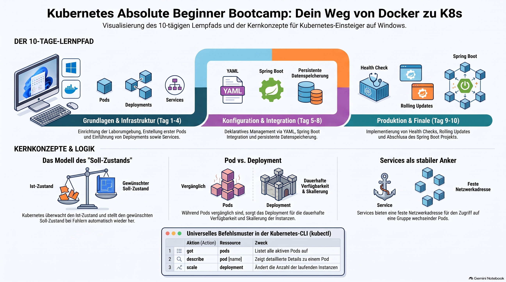

> [NOTE!]
> Dieser Text präsentiert ein strukturiertes **Bootcamp für Einsteiger**, das den praktischen Umgang mit **Kubernetes** unter Windows 11 vermittelt. Der Kurs ist in **zehn Module** unterteilt und legt den Fokus auf die Kombination von **Docker-Containern** mit **Spring Boot-Anwendungen**. Die Lernenden werden Schritt für Schritt durch die Installation der Arbeitsumgebung, die Erstellung von **Pods** und die Verwaltung von **Deployments** geführt. Ein zentrales Element ist das Verständnis des **Desired-State-Modells**, bei dem das System den gewünschten Zustand der Anwendung automatisch aufrechterhält. Fortgeschrittene Themen wie **Services** für die Netzwerkkommunikation, **YAML-Konfigurationen** und **Health Checks** runden das Programm ab. Ziel des Leitfadens ist es, durch direktes Experimentieren in der **PowerShell** ein fundiertes technisches Verständnis für die Orchestrierung moderner Software zu entwickeln.


Absolutely. And because you are on **Windows 11**, use **PowerShell**, and are currently learning **Docker and Spring Boot**, I would structure this as a real hands-on bootcamp rather than a theory course.

We will build things ourselves, break them, inspect them, and fix them.

The official Kubernetes documentation describes `kubectl` as the primary command-line interface for communicating with a cluster, and its beginner tutorial follows the same progression we'll use: deploy → explore → expose → scale → update. ([Kubernetes](https://kubernetes.io/docs/concepts/overview/kubectl/?utm_source=chatgpt.com "The kubectl command-line tool | Kubernetes"))

# ☸️ Kubernetes Absolute Beginner Bootcamp

## Your final goal

At the end of the bootcamp, you will be able to take this:

```text
Spring Boot application
        ↓
    Docker image
        ↓
       Kubernetes
```

and deploy it like this:

```text
                         Kubernetes Cluster
                                │
                         ┌──────▼──────┐
                         │ Deployment  │
                         │ 3 replicas  │
                         └──────┬──────┘
                                │
                 ┌──────────────┼──────────────┐
                 ▼              ▼              ▼
              ┌─────┐        ┌─────┐        ┌─────┐
              │ Pod │        │ Pod │        │ Pod │
              │     │        │     │        │     │
              │Java │        │Java │        │Java │
              │App  │        │App  │        │App  │
              └─────┘        └─────┘        └─────┘
                 ▲              ▲              ▲
                 └──────────────┼──────────────┘
                                │
                           ┌────▼─────┐
                           │ Service  │
                           └────┬─────┘
                                │
                              Users
```

We'll eventually add:

```text
ConfigMap
Secret
Health checks
Persistent storage
Rolling updates
Ingress
```

***

# 🗺️ Bootcamp overview

I recommend **10 modules**.

| Module | Topic                  | Main question                                  |
| ------ | ---------------------- | ---------------------------------------------- |
| 1      | Kubernetes environment | Where does Kubernetes run?                     |
| 2      | Pods                   | What is a Pod?                                 |
| 3      | Deployments            | How do I run my application reliably?          |
| 4      | Services               | How do applications communicate?               |
| 5      | YAML                   | How do I describe Kubernetes resources?        |
| 6      | Configuration          | How do I configure Spring Boot?                |
| 7      | Storage                | How do applications store data?                |
| 8      | Health & scaling       | How does Kubernetes keep applications healthy? |
| 9      | Updates                | How do I deploy a new version?                 |
| 10     | Final project          | Spring Boot + Docker + Kubernetes              |

***

# 🧰 Module 1 — Set up your Kubernetes laboratory

## Objective

At the end of Module 1 you should have:

```text
Windows 11
   │
   ├── Docker Desktop
   │
   ├── Kubernetes
   │
   └── kubectl
```

Because you're already learning Docker, I recommend using **Docker Desktop's local Kubernetes environment** for the first part of the bootcamp. Docker Desktop currently provides a local Kubernetes server/client and supports both single-node and multi-node local clusters. ([Docker Documentation](https://docs.docker.com/desktop/use-desktop/kubernetes/?utm_source=chatgpt.com "Explore the Kubernetes view | Docker Docs"))

This is a **learning environment**, not something we're pretending is a production cluster.

***

# 🧪 Exercise 1 — Check Docker

Open PowerShell.

Run:

```powershell
docker --version
```

You should get something similar to:

```text
Docker version ...
```

Then:

```powershell
docker ps
```

If Docker is working, you should see a container list.

It might simply be:

```text
CONTAINER ID   IMAGE   COMMAND   ...
```

with no containers.

That's perfectly fine.

***

# 🧪 Exercise 2 — Check kubectl

Run:

```powershell
kubectl version --client
```

`kubectl` is the primary CLI for interacting with Kubernetes. It communicates with the Kubernetes API server and can create, inspect, update, and delete Kubernetes resources. ([Kubernetes](https://kubernetes.io/docs/concepts/overview/kubectl/?utm_source=chatgpt.com "The kubectl command-line tool | Kubernetes"))

If PowerShell says:

```text
kubectl : The term 'kubectl' is not recognized...
```

then `kubectl` isn't installed or isn't on your `PATH`.

The official Kubernetes documentation provides Windows installation instructions. ([Kubernetes](https://kubernetes.io/docs/tasks/tools/?utm_source=chatgpt.com "Install Tools | Kubernetes"))

***

# 🧪 Exercise 3 — Enable Kubernetes

Open:

**Docker Desktop → Kubernetes**

Depending on your Docker Desktop version, you'll find Kubernetes through the Kubernetes view/settings. Docker's current documentation says Kubernetes can be enabled there and configured as a local standalone cluster. ([Docker Documentation](https://docs.docker.com/desktop/settings-and-maintenance/settings/?utm_source=chatgpt.com "Change your Docker Desktop settings | Docker Docs"))

Wait until Kubernetes reports that it is running.

Then come back to PowerShell.

***

# 🧪 Exercise 4 — Ask Kubernetes about itself

Run:

```powershell
kubectl get nodes
```

You should see something similar to:

```text
NAME             STATUS   ROLES           AGE   VERSION
docker-desktop   Ready    control-plane   ...   ...
```

Congratulations.

You are talking to Kubernetes.

***

# 🧠 What just happened?

Your command:

```text
kubectl get nodes
```

went approximately like this:

```text
PowerShell
    │
    │ kubectl get nodes
    ▼
  kubectl
    │
    │ Kubernetes API
    ▼
API Server
    │
    ▼
Kubernetes Cluster
```

`kubectl` isn't itself Kubernetes.

It's a **client** for Kubernetes.

That's an important distinction.

***

# 🧪 Exercise 5 — Ask Kubernetes what it knows

Try:

```powershell
kubectl get pods
```

You might see:

```text
No resources found in default namespace.
```

That's fine.

You don't have any application Pods yet.

Now:

```powershell
kubectl get deployments
```

And:

```powershell
kubectl get services
```

You may see some Kubernetes system resources, depending on your local setup.

***

# 🧠 Important command pattern

You'll notice something:

```text
kubectl get <resource>
```

For example:

```powershell
kubectl get nodes
kubectl get pods
kubectl get deployments
kubectl get services
```

You can think of it as:

```text
kubectl get
       │
       └── "Show me..."
```

***

# 🧪 Exercise 6 — Your first Pod

Now we're going to create something.

Run:

```powershell
kubectl run hello-pod --image=nginx
```

You should get something similar to:

```text
pod/hello-pod created
```

Now:

```powershell
kubectl get pods
```

You should see:

```text
NAME         READY   STATUS    RESTARTS   AGE
hello-pod    1/1     Running   0           ...
```

🎉 **You have created your first Kubernetes Pod.**

***

# 🧠 Stop here and understand this

You have:

```text
Kubernetes
    │
    ▼
   Pod
    │
    ▼
 nginx container
```

And this is the connection to Docker:

```text
Docker image
     │
     ▼
 container
     │
     ▼
   Pod
     │
     ▼
 Kubernetes
```

The Pod is the Kubernetes abstraction around the container workload.

The Kubernetes documentation describes Pods as the smallest deployable compute objects. ([Kubernetes](https://kubernetes.io/docs/concepts/?utm_source=chatgpt.com "Concepts | Kubernetes"))

***

# 🧪 Exercise 7 — Inspect your Pod

Run:

```powershell
kubectl describe pod hello-pod
```

You'll get a lot of information.

Don't try to understand everything.

Look for:

```text
Name:
Namespace:
Node:
Status:
IP:
Containers:
Image:
```

The important question is:

> **Where is my container actually running?**

You'll find the answer in the Pod information.

***

# 🧪 Exercise 8 — Look at the logs

Run:

```powershell
kubectl logs hello-pod
```

Since nginx is running, you may not see much.

That's okay.

Later, when we run your Spring Boot application, this command becomes extremely useful:

```powershell
kubectl logs <pod-name>
```

You'll see things like:

```text
Started Application in 2.341 seconds
```

or:

```text
Failed to start application
```

***

# 🧪 Exercise 9 — Get Pod information in a compact way

Run:

```powershell
kubectl get pod hello-pod -o wide
```

Now you get additional information, such as:

```text
NAME
READY
STATUS
RESTARTS
AGE
IP
NODE
```

This is a command worth remembering.

***

# 🧪 Exercise 10 — Delete your Pod

Now deliberately destroy your application.

```powershell
kubectl delete pod hello-pod
```

Then:

```powershell
kubectl get pods
```

You should get:

```text
No resources found...
```

Your application is gone.

And this teaches us something important.

***

# 🚨 Pod ≠ application management

A Pod is not normally what you use to manage an application in production.

Instead, Kubernetes gives us higher-level resources.

The first one we'll learn is:

# Deployment

Think:

```text
Pod
    ↓
"I am one running instance."

Deployment
    ↓
"I manage how many instances should exist."
```

***

# 🚀 Module 2 — Your first Deployment

Now we'll repeat the experiment, but properly.

Run:

```powershell
kubectl create deployment hello --image=nginx
```

Then:

```powershell
kubectl get deployments
```

You should see:

```text
NAME     READY   UP-TO-DATE   AVAILABLE
hello    1/1     1            1
```

And:

```powershell
kubectl get pods
```

You should see something like:

```text
NAME                     READY   STATUS
hello-xxxxxxxxxx-xxxxx   1/1     Running
```

Notice:

```text
Deployment
    │
    ▼
   Pod
```

***

# 🧠 Deployment vs Pod

This distinction is critical.

### Pod

```text
Pod
 └── Container
```

### Deployment

```text
Deployment
     │
     ▼
    Pod
```

The Deployment is responsible for creating and updating application instances. ([Kubernetes](https://kubernetes.io/docs/tutorials/kubernetes-basics/deploy-app/deploy-intro/?utm_source=chatgpt.com "Using kubectl to Create a Deployment | Kubernetes"))

***

# 🧪 Exercise 11 — Delete the Pod

Find the Pod:

```powershell
kubectl get pods
```

Copy its name.

Then:

```powershell
kubectl delete pod <pod-name>
```

Now immediately:

```powershell
kubectl get pods
```

What happens?

You should see a **new Pod** appearing.

For example:

```text
hello-abc123    Terminating
hello-def456    ContainerCreating
```

Eventually:

```text
hello-def456    Running
```

***

# 💡 This is your first "aha!" moment

You deleted the Pod.

But the application came back.

Why?

Because the Deployment says, essentially:

```text
Desired state:

I want 1 running instance.
```

Kubernetes noticed:

```text
Desired: 1
Actual: 0
```

and reacted:

```text
Create Pod
```

So:

```text
                    Deployment
                        │
                "I want 1 Pod"
                        │
                        ▼
                       Pod
```

This **desired-state/reconciliation** model is one of the central ideas of Kubernetes. Kubernetes is designed around declarative configuration and automation. ([Kubernetes](https://kubernetes.io/docs/concepts/?utm_source=chatgpt.com "Concepts | Kubernetes"))

***

# 🧪 Exercise 12 — Scale your application

Now tell Kubernetes:

> "I want three instances."

Run:

```powershell
kubectl scale deployment hello --replicas=3
```

Then:

```powershell
kubectl get pods
```

You should see:

```text
hello-xxxxx   Running
hello-yyyyy   Running
hello-zzzzz   Running
```

Your architecture is now:

```text
                 Deployment
                     │
          ┌──────────┼──────────┐
          ▼          ▼          ▼
        Pod 1      Pod 2      Pod 3
          │          │          │
        nginx      nginx      nginx
```

***

# 🧪 Exercise 13 — Scale down

Now:

```powershell
kubectl scale deployment hello --replicas=1
```

Then:

```powershell
kubectl get pods
```

Eventually you'll have:

```text
Pod 1    Running
```

***

# 🌐 Module 3 — Services

We now have three Pods, but there's a problem.

Suppose:

```text
Pod 1 → 10.1.0.10
Pod 2 → 10.1.0.11
Pod 3 → 10.1.0.12
```

What happens if Pod 2 disappears?

Its replacement may have another IP.

We don't want our clients to care.

So we introduce:

```text
Service
```

A Service provides a stable network abstraction for accessing a set of Pods.

***

# 🧪 Exercise 14 — Create a Service

First make sure we have three Pods:

```powershell
kubectl scale deployment hello --replicas=3
```

Then:

```powershell
kubectl expose deployment hello --port=80
```

Now:

```powershell
kubectl get services
```

You'll see something similar to:

```text
NAME    TYPE        CLUSTER-IP      PORT(S)
hello   ClusterIP   10.x.x.x        80/TCP
```

Your architecture is now:

```text
                    Service
                       │
             ┌─────────┼─────────┐
             ▼         ▼         ▼
           Pod 1     Pod 2     Pod 3
```

***

# 🧪 Exercise 15 — Access your Service

For local experimentation, use port forwarding:

```powershell
kubectl port-forward service/hello 8080:80
```

Leave that PowerShell window running.

Open your browser:

```text
http://localhost:8080
```

You should see the nginx welcome page.

You have now gone through:

```text
Browser
   │
   ▼
localhost:8080
   │
   ▼
kubectl port-forward
   │
   ▼
Service
   │
   ▼
Pod
   │
   ▼
nginx
```

🎉 This is your first complete Kubernetes application path.

***

# 🧹 Module 4 — Clean up

Stop the port forwarding with:

```text
Ctrl + C
```

Then delete everything we created:

```powershell
kubectl delete service hello
```

and:

```powershell
kubectl delete deployment hello
```

Check:

```powershell
kubectl get pods
```

and:

```powershell
kubectl get deployments
```

You should have returned to a clean environment.

***

# 📄 Module 5 — Kubernetes YAML

Now we change the way we work.

Until now we've used commands:

```text
kubectl create
kubectl scale
kubectl expose
```

These are useful for experimentation.

But Kubernetes is very commonly managed **declaratively** with configuration files and `kubectl apply`. The Kubernetes documentation recommends declarative management with `kubectl apply` for production workloads because configuration can be version-controlled and reproduced. ([Kubernetes](https://kubernetes.io/docs/concepts/overview/kubectl/?utm_source=chatgpt.com "The kubectl command-line tool | Kubernetes"))

We'll create:

```text
kubernetes/
    deployment.yaml
    service.yaml
```

***

# 📝 Your first `deployment.yaml`

Create a file:

```text
deployment.yaml
```

with:

```yaml
apiVersion: apps/v1
kind: Deployment

metadata:
  name: hello

spec:
  replicas: 3

  selector:
    matchLabels:
      app: hello

  template:
    metadata:
      labels:
        app: hello

    spec:
      containers:
        - name: hello
          image: nginx
          ports:
            - containerPort: 80
```

Now run:

```powershell
kubectl apply -f deployment.yaml
```

Then:

```powershell
kubectl get deployments
```

and:

```powershell
kubectl get pods
```

You should get three Pods.

***

# 🧠 Start learning to read YAML

Don't memorize it yet.

Read it from the outside inward:

```text
kind: Deployment
```

means:

> "I am defining a Deployment."

Then:

```text
metadata:
  name: hello
```

means:

> "Its name is hello."

Then:

```text
spec:
```

means:

> "Here is the desired configuration."

Then:

```text
replicas: 3
```

means:

> "I want three instances."

Then:

```text
containers:
```

means:

> "Here are the containers that should run."

And:

```text
image: nginx
```

means:

> "Use the nginx container image."

***

# 🔥 Module 6 — The big Docker → Kubernetes exercise

This is where your **Docker Bootcamp** and **Kubernetes Bootcamp** will meet.

We'll eventually have:

```text
Spring Boot project
       │
       ▼
Dockerfile
       │
       ▼
Docker image
       │
       ▼
Kubernetes Deployment
       │
       ├── Pod
       ├── Pod
       └── Pod
       │
       ▼
Kubernetes Service
       │
       ▼
Browser / curl
```

And because you're a Java/Spring Boot developer, this is the project I recommend using as our final exercise.

***

# 🏗️ Module 7 — Configuration

Next we'll learn:

```text
ConfigMap
```

For example:

```text
SPRING_PROFILES_ACTIVE=prod
```

and:

```text
DATABASE_URL=...
```

Conceptually:

```text
                 ConfigMap
                    │
                    ▼
             Spring Boot Pod
                    │
             Environment
             variables
```

Then we'll introduce:

```text
Secret
```

for sensitive configuration.

For example:

```text
DATABASE_PASSWORD
```

***

# 💾 Module 8 — Storage

This becomes important when we introduce databases.

A Pod is ephemeral.

That means you shouldn't simply assume:

```text
Pod
 │
 └── database files
```

will survive Pod replacement.

We'll learn:

```text
Pod
 │
 ▼
PersistentVolumeClaim
 │
 ▼
Persistent storage
```

Then we'll deploy something like PostgreSQL and connect Spring Boot to it.

***

# ❤️ Module 9 — Health checks

Kubernetes can ask:

> "Is my application alive?"

and:

> "Is my application ready to receive traffic?"

We'll learn:

```text
livenessProbe
readinessProbe
```

For Spring Boot this becomes particularly interesting because Spring Boot Actuator provides endpoints that can be used for health checking.

The resulting architecture becomes:

```text
                  Service
                     │
             ┌───────┼───────┐
             ▼       ▼       ▼
            Pod     Pod     Pod
             │       │       │
          Healthy Healthy Healthy
```

If a Pod isn't ready, Kubernetes can stop sending it traffic.

***

# 🔄 Module 10 — Rolling updates

Suppose you're running:

```text
my-app:1.0
```

with three Pods:

```text
Pod 1 → 1.0
Pod 2 → 1.0
Pod 3 → 1.0
```

You release:

```text
my-app:2.0
```

Kubernetes can gradually replace the old Pods.

Conceptually:

```text
1.0  1.0  1.0
 ↓
2.0  1.0  1.0
 ↓
2.0  2.0  1.0
 ↓
2.0  2.0  2.0
```

This is a **rolling update**.

If something goes wrong, we'll also learn how to roll back.

***

# 🏆 Final Project

At the end of the bootcamp, we'll build this:

```text
                         Browser
                            │
                            ▼
                       Kubernetes
                        Service
                            │
                 ┌──────────┼──────────┐
                 ▼          ▼          ▼
              Spring      Spring     Spring
               Boot        Boot       Boot
                Pod         Pod        Pod
                 │           │          │
                 └───────────┼──────────┘
                             │
                             ▼
                        PostgreSQL
                             │
                             ▼
                    Persistent Storage
```

With:

```text
Docker
Spring Boot
Kubernetes
Deployment
Service
ConfigMap
Secret
Health checks
Persistent storage
Scaling
Rolling updates
```

And we'll test it using **PowerShell/curl**, rather than Postman, which fits the way you prefer to work.

***

# 📅 Recommended study schedule

Don't try to do the whole bootcamp in one sitting.

I'd suggest:

### Day 1

**Kubernetes environment**

```text
Docker Desktop
kubectl
Cluster
Node
```

### Day 2

**Pods**

```text
Pod
Container
kubectl run
logs
describe
delete
```

### Day 3

**Deployments**

```text
Deployment
Replica
Scaling
Self-healing
```

### Day 4

**Services**

```text
Service
ClusterIP
Port forwarding
Service discovery
```

### Day 5

**YAML**

```text
apiVersion
kind
metadata
spec
labels
selectors
kubectl apply
```

### Day 6

**Docker + Kubernetes**

```text
Docker image
        ↓
Kubernetes Pod
```

### Day 7

**Spring Boot**

```text
Spring Boot
    ↓
Docker
    ↓
Kubernetes
```

### Day 8

**Configuration**

```text
ConfigMap
Secret
Environment variables
```

### Day 9

**Production basics**

```text
Health checks
Scaling
Rolling updates
Persistent storage
```

### Day 10

**Final project**

```text
Spring Boot
+
Docker
+
Kubernetes
+
PostgreSQL
```

***

# 🎯 Your first assignment

I recommend **not moving to Module 2 yet**.

Let's make this a genuine hands-on course.

For **Module 1**, run these commands in PowerShell:

```powershell
docker --version
```

```powershell
kubectl version --client
```

```powershell
kubectl get nodes
```

Then create your first Pod:

```powershell
kubectl run hello-pod --image=nginx
```

and:

```powershell
kubectl get pods
```

Finally:

```powershell
kubectl describe pod hello-pod
```

**Send me the output of those commands**, especially if anything doesn't work.

Then we'll continue with **Module 2 — Pods**, where we'll deliberately create, inspect, access, break, and delete Pods. After that we'll move into Deployments and Services.

That way you won't merely _read_ Kubernetes—you'll build an accurate mental model by actually operating it.
