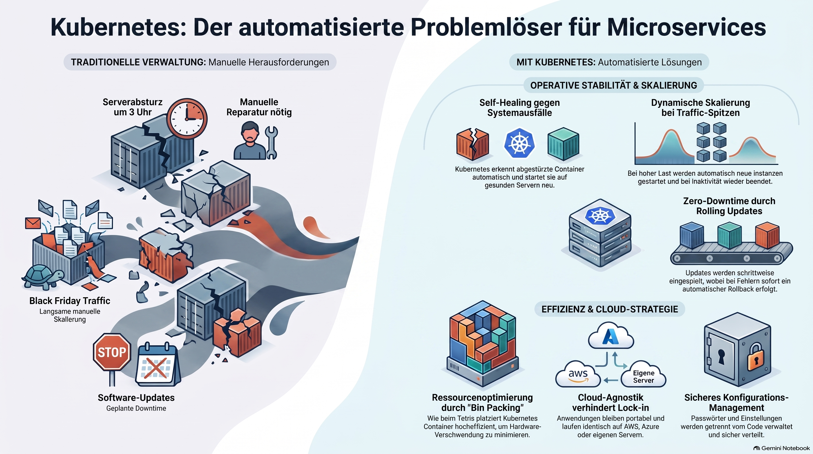

> [NOTE!]
> In der modernen Softwareentwicklung fungiert **Kubernetes** als eine Art Betriebssystem für Rechenzentren, das die Verwaltung komplexer **Container-Umgebungen** vollständig automatisiert. Der Text beschreibt, wie dieses System durch **Selbstheilung** und **automatische Skalierung** eine ständige Verfügbarkeit garantiert, selbst wenn Server ausfallen oder die Nutzerlast plötzlich ansteigt. Durch intelligente **Lastverteilung** und effiziente Ressourcenauslastung optimiert Kubernetes zudem die Betriebskosten und sorgt für eine reibungslose Vernetzung einzelner Dienste. Darüber hinaus ermöglicht die Technologie **unterbrechungsfreie Aktualisierungen** und bietet eine hohe Sicherheit bei der Verwaltung sensibler Zugangsdaten. Ein wesentlicher Vorteil ist die **Plattformunabhängigkeit**, die es Unternehmen erlaubt, ihre Anwendungen flexibel zwischen verschiedenen Cloud-Anbietern zu verschieben. Letztlich dient Kubernetes dazu, die Infrastruktur zu abstrahieren, damit sich Entwickler ganz auf die Erstellung von Programmcode konzentrieren können.

# Kubernetes as a problem solver

To understand the problems Kubernetes (K8s) solves, you first have to imagine the world of **Microservices**. Instead of one giant application, you have hundreds of small "containers" (like Docker) running different parts of your system.

Managing five containers is easy. Managing 5,000 across 100 different servers is impossible for a human. **Kubernetes is the "Operating System" for the data center** that automates this complexity.

Here are the specific problems Kubernetes solves:

### 1. High Availability (The "Self-Healing" Problem)

**The Problem:** In a traditional setup, if a server crashes at 3:00 AM, the application goes down until a human restarts it.
**The Solution:** Kubernetes constantly monitors your cluster. If a container crashes or a physical server dies, Kubernetes notices the "actual state" doesn't match the "desired state" and automatically restarts the container on a healthy server. This is called **Self-healing.**

### 2. Manual Scaling (The "Traffic Spike" Problem)

**The Problem:** If your website suddenly gets 10x the traffic (like on Black Friday), your servers might melt. Manually provisioning new servers and installing software takes too long.
**The Solution:** Kubernetes can **Auto-scale**. It monitors CPU and memory usage; when it hits a certain limit, it automatically spins up more copies (Pods) of your application. When traffic drops, it shuts them down to save money.

### 3. Service Discovery and Load Balancing

**The Problem:** In a dynamic environment, containers are constantly being created and destroyed. They get new IP addresses every time. How does the "Frontend" container find the "Backend" container if the IP keeps changing?
**The Solution:** Kubernetes provides **Service Discovery**. It gives a group of containers a single DNS name and a stable IP address. It also acts as a **Load Balancer**, distributing incoming traffic evenly across all healthy containers.

### 4. Zero-Downtime Deployments (The "Update" Problem)

**The Problem:** Traditionally, updating an app meant taking it offline, installing the new version, and turning it back on.
**The Solution:** Kubernetes allows for **Rolling Updates**. It replaces old versions of your app with new ones one-by-one. If the new version has a bug, Kubernetes can automatically **Rollback** to the previous working version instantly.

### 5. Bin Packing (The "Wasted Money" Problem)

**The Problem:** You might have five servers, but three are at 10% usage and two are at 90%. This is an inefficient use of expensive hardware.
**The Solution:** You tell Kubernetes exactly how much CPU and RAM each container needs. Kubernetes then acts like a game of **Tetris**, "packing" the containers onto your servers as efficiently as possible to ensure no hardware is wasted.

### 6. Configuration and Secret Management

**The Problem:** Hardcoding database passwords or configuration settings into your application code is a major security risk and makes the app hard to move between environments (Dev vs. Production).
**The Solution:** Kubernetes manages **Secrets** (passwords, tokens) and **ConfigMaps** (settings) separately from the application code. You can update a password in Kubernetes without ever rebuilding your container image.

### 7. Cloud Agnostic / Portability

**The Problem:** If you build your entire infrastructure using specific Amazon (AWS) or Google Cloud (GCP) tools, you are "locked in" to their platform.
**The Solution:** Kubernetes works the same way on AWS, Azure, Google Cloud, or your own on-premise servers. It provides a standard layer that makes your applications **portable**, allowing you to move between clouds without rewriting your deployment logic.

---

### Summary

If you are running a simple blog, you don't need Kubernetes. But if you are running a modern, distributed application that needs to:
*   Never go down (**Reliability**)
*   Grow with your users (**Scalability**)
*   Deploy new code 10 times a day (**Agility**)

...then Kubernetes is the tool that automates those tasks so your engineers can focus on writing code rather than fixing servers.