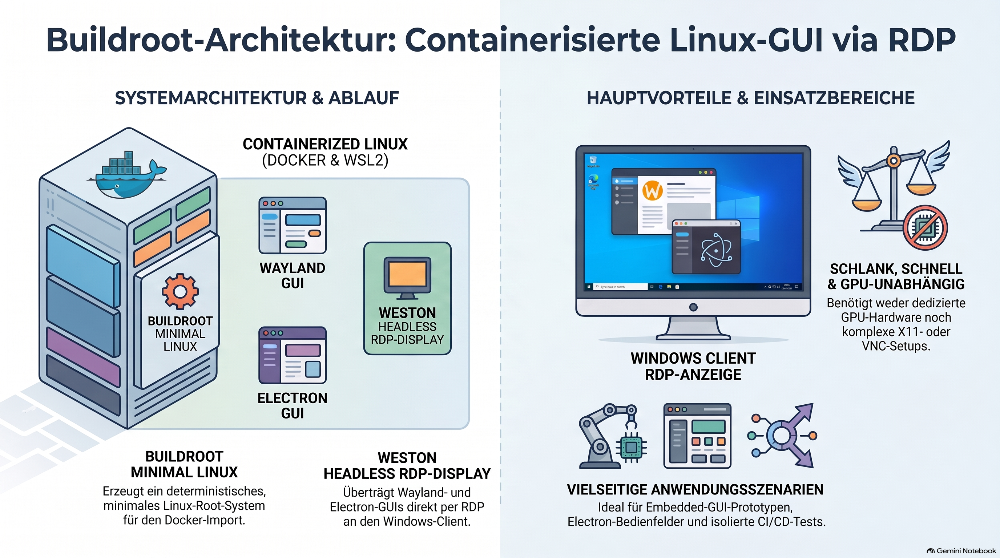
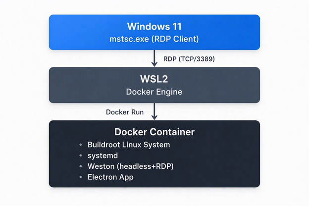

> [NOTE!]
> Karl Schmitt beschreibt eine innovative Methode, um **grafische Wayland-Anwendungen** wie Electron mithilfe von Buildroot in einem **minimalen Linux-System** innerhalb von Docker auf WSL2 auszuführen. Durch den Einsatz des **Weston-Compositors** im Headless-Modus wird die Benutzeroberfläche über einen integrierten RDP-Server direkt auf Windows übertragen, ohne dass eine GPU, X11 oder VNC erforderlich sind. Dieser Ansatz gewährleistet äußerst **wiederholbare und deterministische Builds**, wodurch eine schlanke und ressourcenschonende Umgebung für containerbasierte GUIs entsteht. Dank der modularen **externen Paketstruktur** eignet sich die Architektur hervorragend für die Entwicklung, das Testen und die Bereitstellung von eingebetteten Benutzeroberflächen. Letztendlich verbindet diese Technik maximale Portabilität mit einer **nahtlosen Windows-Integration** für moderne Softwareteams.

# 🗂️ **Buildroot Architecture**

## **1. Overview**

We created a **minimal, container‑friendly Linux system** using Buildroot, designed to run graphical Wayland applications (including Electron) inside **Docker on WSL2**, and expose the GUI to Windows via **RDP** using Weston’s built‑in headless compositor.

This approach provides:

* extremely small footprint

* deterministic builds

* reproducible system images

* seamless Windows integration

* no need for X11, VNC, or GPU passthrough

## **2. Technology Stack**

### **Buildroot**

* Generates a custom Linux root filesystem

* Includes systemd, Weston, Mesa, Electron, and custom packages

* Produces `rootfs.tar` for Docker import

* Ensures minimal, reproducible environments

### **WSL2**

* Provides a lightweight Linux kernel

* Runs Docker Engine

* Offers near‑native performance

* Integrates with Windows networking

### **Docker**

* Runs the Buildroot‑generated Linux system

* Provides isolation and portability

* Exposes RDP port to Windows

### **Weston (Wayland Compositor)**

* Runs in **headless mode**

* Includes a **built‑in RDP server**

* Eliminates need for VNC or X11

* Ideal for containerized GUI workloads

## **3. Architecture Diagram**




## **4. Buildroot System Composition**

The Buildroot configuration includes:

* **systemd** (init system)

* **Weston** (Wayland compositor)

  * headless backend

  * built‑in RDP server

* **Mesa** (software rendering)

* **Electron** (custom app)

* **Custom external packages**

* **Minimal userland**

This results in a **small, fast, GUI‑capable Linux system** suitable for containers.

## **5. Build Process**

### **Step 1 — Buildroot generates the system**

Code

```
make
```

Buildroot outputs:

* `rootfs.tar` → Docker‑ready

* `rootfs.ext2/ext4` → VM/QEMU

* systemd service structure

* Weston binaries

* Electron app directory

### **Step 2 — Import into Docker**

Code

```
docker import output/images/rootfs.tar buildroot-image
```

### **Step 3 — Run the container**

Code

```
docker run -it --privileged -p 3389:3389 buildroot-image /sbin/init
```

### **Step 4 — Start Weston headless + RDP**

Inside the container:

Code

```
weston --backend=headless-backend.so --rdp --socket=wayland-0
```

### **Step 5 — Connect from Windows**

Code

```
mstsc.exe /v:localhost:3389
```

## **6. Why Weston + RDP?**

### **Advantages**

* No GPU required

* No X11 server needed

* No VNC server needed

* Native Windows RDP client works out‑of‑the‑box

* High performance (RDP > VNC)

* Stable under Docker and WSL2

* Ideal for headless environments

### **Use Cases**

* Embedded GUI prototyping

* Electron‑based control panels

* Remote UI testing

* Lightweight development environments

* Reproducible GUI containers

## **7. External Package Architecture**

Buildroot supports custom packages via an **external tree**:

Code

```
buildroot-external/
    Config.in
    external.mk
    package/
        electron/
        hello-electron/
```

This allows:

* modular development

* version control separation

* clean integration of custom apps

* reproducible builds across teams

## **8. Operational Workflow**

### **Developer Workflow**

1. Modify external packages

2. Run Buildroot

3. Import into Docker

4. Start Weston

5. Connect via RDP

6. Test Electron or other Wayland apps

### **CI/CD Workflow**

1. Buildroot runs in CI

2. Output artifacts stored in registry

3. Docker image deployed to WSL2 or cloud

4. RDP access for QA or demos

## **9. Benefits for Teams & Management**

### **Technical Benefits**

* deterministic builds

* minimal attack surface

* reproducible environments

* GUI support without GPU

* seamless Windows integration

* extremely lightweight containers

### **Organizational Benefits**

* easier onboarding

* consistent developer environments

* predictable deployment

* simplified debugging

* reduced infrastructure complexity

## **10. Summary**

We built a **fully custom Linux system** using Buildroot, packaged it into a **Docker container**, ran it under **WSL2**, and exposed a **Wayland GUI** to Windows via **RDP** using Weston’s headless backend.

This architecture is:

* modern

* minimal

* reproducible

* portable

* ideal for embedded GUI applications

* perfectly suited for Electron‑based control interfaces
