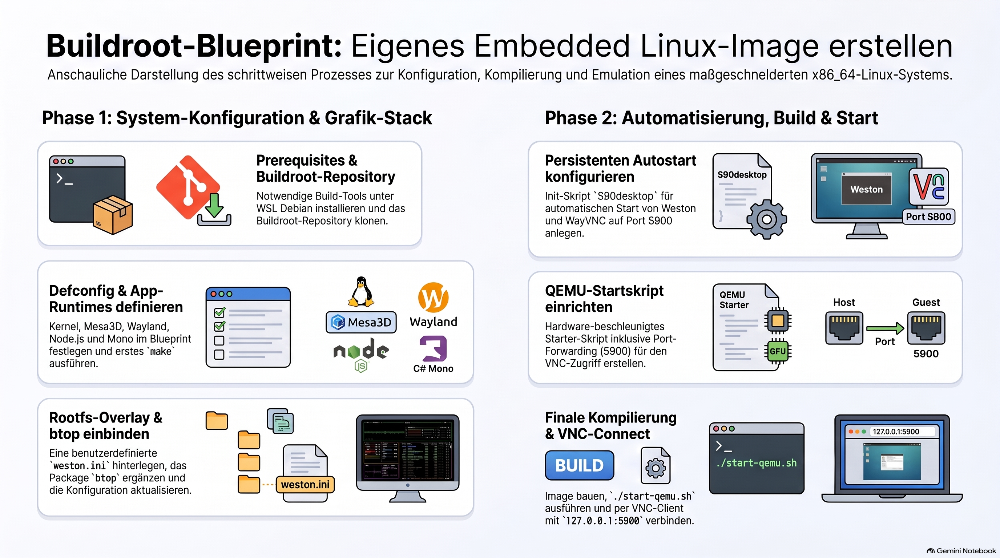

> [NOTE!]
> Der Text beschreibt eine umfassende Anleitung von Karl Schmitt zur Erstellung einer **benutzerdefinierten Linux-Distribution** mithilfe von **Buildroot** innerhalb einer WSL-Umgebung. Dabei werden wichtige Voraussetzungen installiert und ein **Advanced Client Blueprint** konfiguriert, welcher grafische Frameworks wie Wayland und Weston sowie Laufzeitumgebungen wie Node.js und Mono integriert. Zusätzliche Anpassungen umfassen das Hinzufügen des Systemmonitors **btop** sowie eines Rootfs-Overlays für automatisierte Startprozesse. Schließlich wird die Qemu-Emulation eingerichtet, um das erstellte System zu starten und über einen **VNC-Client** auf Port 5900 fernzusteuern.


# 🟦Second Configuration Blueprint 🏗️

## Install Buildroot prerequisites


Install the necessary tools inside your WSL Debian instance using a GNU Bash terminal:


```bash
sudo apt update
sudo apt upgrade -y
sudo apt install -y \
    build-essential \
    git \
    bc \
    unzip \
    python3 \
    wget \
    cpio \
    rsync \
    libncurses-dev \
    libncursesw5-dev \
    file \
    dos2unix \
    xclip \
    libelf-dev \
    qemu-system-x86 \
    qemu-utils \
    libgl1-mesa-dri \
    libvirglrenderer1 \
    virgl-server \
    libegl1 \
    libgbm1 \
    libgl1 \
    libgles2 \
    libglx-mesa0
```

## Step 1: Let's begin

Let's do it in small steps. Create a new directory and clone the Buildroot repository:

```bash
mkdir -p ~/Second_Chance/Second_Blueprint
cd ~/Second_Chance/Second_Blueprint
git clone https://github.com/buildroot/buildroot.git
cd buildroot
```

```bash
# 1. Write the advanced client blueprint to include wayvnc explicitly
cat << 'EOF' > configs/advanced_client_x86_64_defconfig
# =====================================================================
# Advanced Client Blueprint: Wayland + Weston + WayVNC + Electron + Mono
# =====================================================================

# Master Architecture Configuration Profiles
BR2_x86_64=y
BR2_x86_x86_64=y

# Core Toolchain (Standard GLIBC with full C++ support for V8/Chromium engines)
BR2_TOOLCHAIN_BUILDROOT_GLIBC=y
BR2_INSTALL_LIBSTDCPP=y
BR2_TOOLCHAIN_BUILDROOT_CXX=y

# Stable Embedded Core Init System (Bypasses Systemd Per-Package traps)
BR2_INIT_SYSV=y
BR2_ROOTFS_DEVICE_CREATION_DYNAMIC_EUDEV=y

# Linux Kernel Configuration Mapping
BR2_LINUX_KERNEL=y
BR2_LINUX_KERNEL_USE_CUSTOM_CONFIG=y
BR2_LINUX_KERNEL_CUSTOM_CONFIG_FILE="board/qemu/x86_64/linux.config"

# Graphics Framework Stack (Mesa3D serving Accelerated OpenGL ES & EGL)
BR2_PACKAGE_MESA3D=y
BR2_PACKAGE_MESA3D_GALLIUM_DRIVER_VIRGL=y
BR2_PACKAGE_MESA3D_OPENGL_EGL=y
BR2_PACKAGE_MESA3D_OPENGL_ES=y

# Wayland & Headless Weston Ecosystem Applications
BR2_PACKAGE_WAYLAND=y
BR2_PACKAGE_WESTON=y
BR2_PACKAGE_WESTON_DEFAULT_COMPOSITOR_DRM=y
BR2_PACKAGE_WESTON_SIMPLE_CLIENTS=y
BR2_PACKAGE_WESTON_DEMO_CLIENTS=y

# Remote Network Display Daemon (Kept from previous build)
# WayVNC Core System Dependencies
BR2_PACKAGE_LIBVNCSERVER=y
BR2_PACKAGE_PIXMAN=y
BR2_PACKAGE_LIBXKBCOMMON=y
BR2_PACKAGE_WAYVNC=y

# Core Utilities Framework
BR2_PACKAGE_UTIL_LINUX=y
BR2_PACKAGE_UTIL_LINUX_BINARIES=y

# =====================================================================
# The Advanced App Runtime Environment Layer
# =====================================================================
# 1. Node.js + NPM (Required to execute and build Electron packages)
BR2_PACKAGE_NODEJS=y
BR2_PACKAGE_NODEJS_NPM=y

# 2. C# Mono Open Source .NET Runtime Environment
BR2_PACKAGE_MONO=y

# Expanded Target Hard Drive Size (2GB to hold node modules and mono assemblies)
BR2_TARGET_ROOTFS_EXT2=y
BR2_TARGET_ROOTFS_EXT2_4=y
BR2_TARGET_ROOTFS_EXT2_SIZE="2G"

# Explicit Weston Rendering Backends
BR2_PACKAGE_WESTON_HEADLESS=y

EOF
```

```bash
# 2. Reload the updated configuration blueprint to synchronize the targets
make advanced_client_x86_64_defconfig
```

```bash
# 3. Launch the final compilation sequence
make
```

## Step 2: Add `btop` and the Native Wayland Terminal

```bash
# 1. Create the full missing directory path for the overlay config layout
mkdir -p board/custom_client/rootfs-overlay/etc/xdg/weston/

# 2. Now write the Weston overlay config safely
cat << 'EOF' > board/custom_client/rootfs-overlay/etc/xdg/weston/weston.ini
[core] 
backend=headless
renderer=gl
xwayland=true

[shell]
locking=false
panel-position=top

[launcher]
icon=/usr/share/weston/icon_terminal.png
path=/usr/bin/weston-terminal

# Launch btop automatically on the headless Wayland canvas
[autostart]
path=/usr/bin/weston-terminal --command=/usr/bin/btop
EOF
```

```bash
# 3. Append the btop target package symbol explicitly into our profile definition
if ! grep -q "BR2_PACKAGE_BTOP" configs/advanced_client_x86_64_defconfig; then
    echo 'BR2_PACKAGE_BTOP=y' >> configs/advanced_client_x86_64_defconfig
fi

# 4. Reload your modified defconfig blueprint to map the new btop package
make advanced_client_x86_64_defconfig
```

```bash
# 5. Trigger the compilation
make
```

Looking at your terminal logs. If you see (`ln -snf ... output/staging`), then Buildroot successfully processed all of the newly injected layers. Your custom Linux distribution now completely includes:

* The Graphics / Video Stack: Wayland, Headless Weston, and the Mesa3D accelerated `virgl` drivers.
* The Remote Connection Server: `wayvnc` compiled natively on port 5900.
* The Application Engines: Node.js (with npm) for running Electron.js, and Mono for executing your C# backend files!
* No systemd yet.

Everything is packed neatly inside your expanded `output/images/rootfs.ext4` image.

***

## 🎨 Step 3: Update the Accelerated Launcher Script

Since you are in a new directory (`Second_Blueprint`), let's create the hardware-accelerated QEMU startup script explicitly for this workspace:

```bash
cat << 'EOF' > output/images/start-qemu.sh
#!/bin/sh
IMAGE_DIR="$(dirname "$0")"

exec qemu-system-x86_64 \
    -M q35 \
    -m 2G \
    -smp 2 \
    -kernel "${IMAGE_DIR}/bzImage" \
    -drive file="${IMAGE_DIR}/rootfs.ext4",if=virtio,format=raw \
    -append "root=/dev/vda ro console=tty1 console=ttyS0 quiet" \
    -net nic,model=virtio -net user,hostfwd=tcp::5900-:5900 \
    -device virtio-vga-gl \
    -display gtk,gl=on \
    -serial stdio
EOF

chmod +x output/images/start-qemu.sh
```

_(Note: We added `-net user,hostfwd=tcp::5900-:5900`. This maps the internal container network port directly onto your local Windows machine so your VNC client can connect)._

***

## 🚀 Step 4: Configure Persistent Headless Autostart on Boot

Let's write a boot script using your Rootfs Overlay directory. This will make Weston spin up a hidden graphics canvas, launch the `wayvnc` server daemon, and verify that C# Mono is functional on startup.

Run this block in your WSL2 console:

```bash
# 1. Create the persistent overlay tracking layout paths
mkdir -p board/custom_client/rootfs-overlay/etc/init.d/

# 2. Write the automated multi-runtime execution script
cat << 'EOF' > board/custom_client/rootfs-overlay/etc/init.d/S90desktop
#!/bin/sh
case "$1" in
  start)
    echo "Initializing Headless Wayland Engine Canvas..."
    export XDG_RUNTIME_DIR=/tmp/runtime-root
    mkdir -p $XDG_RUNTIME_DIR
    chmod 700 $XDG_RUNTIME_DIR
    
    # Fire up Weston silently in the background using modern backend targets
    weston --backend=headless --width=1024 --height=768 --socket=wayland-0 &
    sleep 3
    
    echo "Exposing Graphical Environment over VNC..."
    export WAYLAND_DISPLAY=wayland-0
    wayvnc 0.0.0.0 5900 &
    sleep 1
    
    echo "Verifying App Environments..."
    echo "Mono Framework Version:" $(mono --version | head -n 1)
    echo "Node.js Platform Version:" $(node --version)
    ;;
  stop)
    echo "Tearing down system app engines..."
    killall wayvnc
    killall weston
    ;;
  *)
    echo "Usage: $0 {start|stop}"
    exit 1
esac
exit 0
EOF

chmod +x board/custom_client/rootfs-overlay/etc/init.d/S90desktop
```

***

## 📦 Step 5: Run the Final Quick Packaging Sweep

Now, link this overlay directly into your configuration system and sweep it into the image drive partition:

```bash
# Ensure the overlay is linked in your blueprint
if ! grep -q "BR2_ROOTFS_OVERLAY" configs/advanced_client_x86_64_defconfig; then
    echo 'BR2_ROOTFS_OVERLAY="board/custom_client/rootfs-overlay"' >> configs/advanced_client_x86_64_defconfig
fi
```
```bash
# Reload and merge the layout overlay files cleanly
make advanced_client_x86_64_defconfig
```
```bash
make
```

## 🖥️ Firing Up the System

Sticking with `btop` is the absolute best move for this architecture. It keeps your core filesystem fast, lightweight, and 100% reproducible, preserving every ounce of system performance for your Electron.js frontend and C# Mono backend.

Since the compilation from our previous step produced a completely ready-to-run image file, go ahead and spin up your emulator environment using the newly built target wrapper script:

```bash
./output/images/start-qemu.sh
```

Once the virtual target finishes its initialization sequences inside the QEMU window framework, open your favorite desktop VNC viewing application on your local machine and target `127.0.0.1:5900` to securely peer directly into your native, custom-wrapped headless Linux workspace canvas layout.

**Connect from Windows:** Windows Remote Desktop Connection.

Open **Remote Desktop Connection (`mstsc`)** on Windows and connect to:

`localhost:53389`
