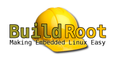

# 🗂️ Zettelkasten Batch

## **1. Buildroot as a Deterministic System Generator**

Buildroot produces minimal, reproducible Linux systems by compiling all components from source using a controlled configuration. It ensures deterministic output, small footprint, and predictable behavior across machines.

## **2. Buildroot External Tree Concept**

An external tree allows custom packages, configurations, and overlays to be maintained outside the Buildroot source tree. This supports modular development, version control separation, and team collaboration.

## **3. Systemd as Init System in Buildroot**

Systemd provides service management, logging, dependency handling, and predictable boot behavior. It is ideal for containerized environments where controlled startup sequences matter.

## **4. Weston as a Headless Wayland Compositor**

Weston can run without a physical display using the headless backend. It creates a virtual framebuffer and manages Wayland clients in a GPU‑less environment.

## **5. Weston’s Built‑In RDP Server**

Weston includes an RDP server that exposes the compositor over TCP. This enables remote GUI access using the native Windows RDP client without X11 or VNC.

## **6. Mesa llvmpipe for Software Rendering**

Mesa’s llvmpipe backend provides CPU‑based OpenGL rendering. It allows Wayland/Electron applications to run without GPU hardware.

## **7. Electron as a Wayland Client**

Electron can run as a Wayland client inside Weston. This enables modern GUI applications (dashboards, control panels) in embedded or containerized environments.

## **8. Buildroot Output Artifacts**

Buildroot produces several key artifacts:

* `rootfs.tar` for Docker

* `rootfs.ext2/ext4` for VMs

* optional kernel images These artifacts are deterministic and portable.

## **9. Docker Import of Buildroot Rootfs**

The `rootfs.tar` file can be imported directly into Docker to create a runnable container image. This avoids traditional Dockerfile builds and ensures the container matches the Buildroot system exactly.

## **10. Running Buildroot Linux Inside Docker**

The container is started with systemd as PID 1. This provides a full Linux environment inside Docker suitable for GUI workloads.

## **11. WSL2 as a Lightweight Linux Kernel**

WSL2 provides a real Linux kernel with near‑native performance. It runs Docker Engine and supports GUI workloads without virtualization overhead.

## **12. RDP Integration with Windows**

Windows connects to the container’s Weston RDP server using `mstsc.exe`. This provides low‑latency, stable GUI access without additional software.

## **13. Wayland Socket Architecture**

Wayland clients communicate with Weston through a Unix socket (e.g., `/run/wayland-0`). This architecture is simple, efficient, and well‑suited for containers.

## **14. Virtual Framebuffer Rendering**

Weston’s headless backend renders to a virtual framebuffer. This framebuffer is streamed via RDP, enabling GUI execution without a physical display.

## **15. Systemd Units for GUI Autostart**

Weston and Electron can be started automatically using systemd units. This ensures reliable startup and crash recovery inside the container.

## **16. CI/CD Integration with Buildroot**

Buildroot can run in CI pipelines to produce reproducible system images. The resulting Docker images can be deployed automatically for testing or demos.

## **17. Developer Workflow Using WSL2 + Docker**

Developers only need WSL2 and Docker to run the full GUI system. This simplifies onboarding and ensures consistent environments.

## **18. Embedded GUI Prototyping in Containers**

Running embedded GUIs inside Docker allows rapid prototyping without hardware. Electron apps can be tested and iterated quickly.

## **19. Portability of Buildroot‑Generated Systems**

The Buildroot system can run on:

* WSL2

* Docker

* VMs

* physical embedded devices This flexibility supports diverse deployment scenarios.

## **20. Strategic Value of the Architecture**

The architecture combines reproducibility, portability, and modern GUI capabilities. It reduces infrastructure complexity and accelerates development for embedded and industrial UI systems.

## **21. Wayland vs. X11 in Embedded Systems**

Wayland provides a simpler, modern rendering pipeline compared to X11. It eliminates legacy complexity, reduces overhead, and is ideal for embedded GUIs and containerized environments.

## **22. Headless Rendering in Modern Linux Systems**

Headless rendering uses virtual framebuffers instead of physical displays. It enables GUI applications to run in containers, CI pipelines, and cloud environments.

## **23. RDP as a Transport Layer for Wayland**

RDP offers efficient, low‑latency remote GUI transport. Weston’s built‑in RDP server allows Wayland compositors to be accessed remotely without additional software.

## **24. Software Rendering Advantages**

Software rendering (llvmpipe) avoids GPU dependencies. It ensures consistent behavior across hardware, virtual machines, and containers.

## **25. Buildroot’s Reproducible Toolchain**

Buildroot generates a complete cross‑toolchain deterministically. This ensures consistent builds across machines and environments.

## **26. Minimal Linux Systems for Containers**

Minimal systems reduce attack surface, startup time, and resource usage. Buildroot is ideal for producing container‑ready minimal distributions.

## **27. Systemd in Containers**

Systemd provides structured service management even inside Docker. It enables predictable startup sequences for GUI components like Weston and Electron.

## **28. Wayland Socket Lifecycle**

Wayland clients communicate through a Unix domain socket. The compositor creates this socket at startup, and clients bind to it for rendering.

## **29. Weston Backends Overview**

Weston supports multiple backends: DRM, X11, Wayland, RDP, and headless. The headless backend is optimized for virtualized and containerized environments.

## **30. Weston RDP Output Pipeline**

Weston’s RDP output converts Wayland frames into RDP bitmaps. These are streamed to remote clients using the RDP protocol.

## **31. Electron Rendering Path on Wayland**

Electron uses Chromium’s Ozone/Wayland backend. Rendering flows through Wayland → Weston → Mesa → llvmpipe → virtual framebuffer.

## **32. Docker Privileged Mode for Systemd**

Systemd requires access to cgroups and certain namespaces. Privileged mode ensures compatibility with systemd‑based containers.

## **33. WSL2 Networking Model**

WSL2 uses a lightweight VM with its own virtual network interface. Port forwarding enables Windows applications to access services inside WSL2.

## **34. Containerized GUI Testing**

Running GUIs inside containers enables automated testing pipelines. Wayland + headless + RDP is ideal for CI environments.

## **35. Buildroot Image Portability**

Buildroot images can be deployed to Docker, WSL2, QEMU, or physical devices. This flexibility supports diverse development and deployment workflows.

## **36. Separation of Concerns via External Trees**

External trees isolate custom logic from Buildroot’s core. This improves maintainability and supports team collaboration.

## **37. Deterministic GUI Environments**

Deterministic builds ensure GUI behavior is identical across machines. This is critical for embedded systems and regulated industries.

## **38. Embedded GUI Architecture Using Electron**

Electron provides a modern UI stack for embedded systems. It integrates well with Wayland and supports rapid development.

## **39. Weston as a Reference Compositor**

Weston is the reference implementation of Wayland. It is stable, lightweight, and ideal for embedded and containerized use cases.

## **40. WSL2 as a Development Platform for Embedded Linux**

WSL2 provides near‑native Linux performance on Windows. It is ideal for building and testing embedded Linux systems without dedicated hardware.

## **41. Immutable Root Filesystems in Embedded Linux**

Immutable root filesystems prevent runtime modification. Buildroot naturally produces such systems, improving reliability and reducing attack surface.

## **42. Containerized Init Systems**

Running systemd inside containers enables full service orchestration. This is essential for GUI stacks where multiple coordinated services must start in sequence.

## **43. Wayland Protocol Simplicity**

Wayland’s protocol is intentionally minimal. Clients send rendering requests; the compositor decides how and when to display them.

## **44. Compositor Responsibility in Wayland**

The compositor is the central authority in Wayland. It manages surfaces, input, rendering, and output transport (e.g., RDP).

## **45. Headless Compositors for CI Pipelines**

Headless compositors allow GUI applications to be tested without physical displays. This is ideal for automated testing environments.

## **46. Software Rendering Determinism**

Software rendering produces identical results across hardware. This is critical for reproducible GUI testing and embedded systems.

## **47. Buildroot’s Declarative Configuration Model**

Buildroot uses a declarative configuration model via Kconfig. This ensures predictable builds and clear dependency resolution.

## **48. Cross‑Compilation in Buildroot**

Buildroot generates a cross‑toolchain and compiles all packages for the target architecture. This avoids dependency on host system libraries.

## **49. Docker as a Deployment Abstraction**

Docker abstracts away host differences. Buildroot systems can run identically across Windows, Linux, and cloud environments.

## **50. WSL2 Virtualization Layer**

WSL2 uses a lightweight virtual machine with a real Linux kernel. It provides near‑native performance for container workloads.

## **51. RDP Compression and Transport Efficiency**

RDP uses efficient bitmap compression and transport protocols. This makes it ideal for remote GUI access compared to VNC or raw framebuffer streaming.

## **52. Weston’s Modular Backend Architecture**

Weston backends are modular components that define how rendering occurs. The headless backend is optimized for virtual environments.

## **53. Wayland Client Lifecycle**

Wayland clients create surfaces, attach buffers, commit frames, and wait for compositor feedback. This lifecycle is simple and efficient.

## **54. Electron’s Rendering Pipeline**

Electron uses Chromium’s rendering pipeline, which integrates with Wayland via Ozone. This enables modern web‑based UIs in embedded systems.

## **55. Systemd Target Dependencies**

Systemd targets define ordered startup sequences. GUI systems often rely on `multi-user.target` or custom targets for compositor startup.

## **56. Buildroot Package Infrastructure**

Buildroot packages follow a consistent structure: `Config.in`, `.mk` file, and optional patches. This simplifies adding custom applications.

## **57. Filesystem Layout in Buildroot Systems**

Buildroot systems follow a minimal filesystem layout: `/bin`, `/usr/bin`, `/etc`, `/lib`, `/usr/lib`. This reduces complexity and size.

## **58. Container Networking for GUI Access**

Exposing RDP over Docker’s port mapping allows GUI access from the host. This is simpler than forwarding X11 sockets or using VNC.

## **59. Wayland vs. Framebuffer Rendering**

Wayland provides compositing and window management. Framebuffer rendering is direct but lacks multi‑window or remote capabilities.

## **60. Embedded GUI Deployment Strategy**

Using Buildroot + Docker + Weston/RDP enables GUI deployment without hardware. This accelerates development, testing, and demonstration workflows.

## **61. Layered Architecture in Embedded Linux Systems**

Embedded Linux systems benefit from a layered architecture: hardware → kernel → compositor → application. Buildroot enables precise control over each layer.

## **62. Role of the Linux Kernel in GUI Systems**

The kernel provides device access, memory management, and scheduling. GUI systems rely on predictable kernel behavior for smooth rendering.

## **63. Weston’s Scene Graph**

Weston maintains a scene graph representing all surfaces. This graph determines how windows are composed and displayed.

## **64. Wayland Buffer Management**

Wayland clients allocate buffers and attach them to surfaces. The compositor decides when to display these buffers.

## **65. Buildroot’s Staging Directory**

Buildroot uses a staging directory to store intermediate build artifacts. This ensures clean separation between host tools and target binaries.

## **66. Cross‑Platform GUI Deployment via Containers**

Containers allow GUI applications to run identically across Windows, Linux, and cloud environments. Wayland + RDP makes this possible without GPU hardware.

## **67. Systemd Socket Activation**

Systemd can start services on demand when sockets are accessed. This reduces resource usage and improves responsiveness.

## **68. Weston’s Input Handling Model**

Weston abstracts input devices (keyboard, mouse, touch) through libinput. Wayland clients receive normalized input events.

## **69. Buildroot’s Patch Infrastructure**

Buildroot supports patching upstream packages via a simple directory structure. This enables customization without forking entire packages.

## **70. Docker’s Namespace Isolation**

Docker isolates processes using namespaces: PID, network, mount, IPC, UTS. This isolation allows GUI systems to run safely inside containers.

## **71. WSL2 File System Integration**

WSL2 integrates Linux and Windows filesystems. This simplifies development workflows and asset sharing.

## **72. Weston Output Abstraction**

Weston treats outputs (screens) as abstract objects. The RDP output is simply another output type.

## **73. Wayland Protocol Extensions**

Wayland supports protocol extensions for advanced features. Compositors and clients negotiate capabilities dynamically.

## **74. Buildroot’s Minimal C Library Options**

Buildroot supports multiple C libraries (glibc, musl, uClibc). Musl is often preferred for minimal, embedded systems.

## **75. Containerized Electron Applications**

Electron can run inside containers using software rendering. This enables modern UIs in isolated, reproducible environments.

## **76. Weston’s Rendering Pipeline**

Weston’s pipeline: Wayland buffers → compositor → renderer → output backend (RDP/headless).

## **77. Systemd Journal Logging**

Systemd’s journal provides structured logging. GUI systems benefit from centralized logs for debugging and monitoring.

## **78. Buildroot’s Rootfs Customization**

Buildroot allows custom overlays to modify the root filesystem. This is ideal for adding configuration files, services, or assets.

## **79. WSL2 Virtual GPU Limitations**

WSL2 supports GPU acceleration for Windows apps, but not for Linux containers. Software rendering remains the most portable solution.

## **80. Embedded GUI Scalability**

Wayland + Electron scales from small embedded devices to cloud‑hosted containers. This architecture supports both prototyping and production deployment.

## **81. Declarative vs. Imperative System Construction**

Buildroot uses a declarative model: configuration defines the final system. Docker uses an imperative model: commands define how the image is built. Combining both yields predictable yet flexible system creation.

## **82. The Role of Initrd in Embedded Systems**

Initrd provides a temporary root filesystem during boot. Buildroot systems often omit initrd for simplicity and faster startup.

## **83. Weston’s Output Timing Model**

Weston controls frame timing and presentation. Clients submit frames, but the compositor decides when they appear.

## **84. Wayland’s Security Model**

Wayland isolates clients from each other. Clients cannot read global input or other windows, improving security.

## **85. Buildroot’s Cross‑Compilation Isolation**

Buildroot isolates host tools from target tools. This prevents accidental linkage against host libraries.

## **86. Docker’s Cgroup Integration**

Docker uses cgroups to limit CPU, memory, and I/O. Systemd inside Docker interacts with these cgroups to manage services.

## **87. WSL2 Kernel Update Mechanism**

WSL2 uses a Microsoft‑maintained Linux kernel. Updates are delivered through Windows Update, ensuring consistency.

## **88. Weston’s Renderer Abstraction**

Weston supports multiple renderers (GL, Pixman). Pixman is used for software rendering in headless environments.

## **89. Wayland Surface Roles**

Surfaces can have roles: toplevel, popup, subsurface. Roles define how surfaces behave and interact with the compositor.

## **90. Buildroot’s Package Selection Philosophy**

Buildroot encourages selecting only what is needed. This reduces complexity, size, and attack surface.

## **91. Docker Volume Integration**

Docker volumes allow persistent storage outside the container. Useful for logs, configuration, or application data.

## **92. WSL2 Memory Allocation Model**

WSL2 dynamically allocates memory to the Linux VM. Memory is reclaimed when processes exit, improving efficiency.

## **93. Weston’s RDP Keyboard Mapping**

Weston maps RDP keyboard events to Wayland input events. This ensures consistent behavior across remote sessions.

## **94. Wayland Frame Callbacks**

Clients receive frame callbacks to synchronize rendering. This prevents unnecessary redraws and improves performance.

## **95. Buildroot’s Host Tools**

Buildroot builds host tools (e.g., pkg-config, qemu) in isolation. This ensures consistent behavior regardless of host OS.

## **96. Containerized Display Servers**

Running display servers inside containers isolates GUI stacks. This is useful for testing, prototyping, and multi‑tenant environments.

## **97. WSL2 GPU Limitations for Linux Containers**

WSL2 supports GPU acceleration for Linux GUI apps, but not for Docker containers. Software rendering remains the most portable solution.

## **98. Weston’s Configuration Flexibility**

Weston can be configured via `weston.ini`. This file controls outputs, input devices, keybindings, and modules.

## **99. Buildroot’s Overlay Mechanism**

Overlays allow injecting custom files into the root filesystem. Ideal for configuration files, systemd units, and application assets.

## **100. Embedded GUI Lifecycle Management**

Embedded GUIs require controlled startup, shutdown, and recovery. Systemd + Weston + Electron provides a robust lifecycle model.

