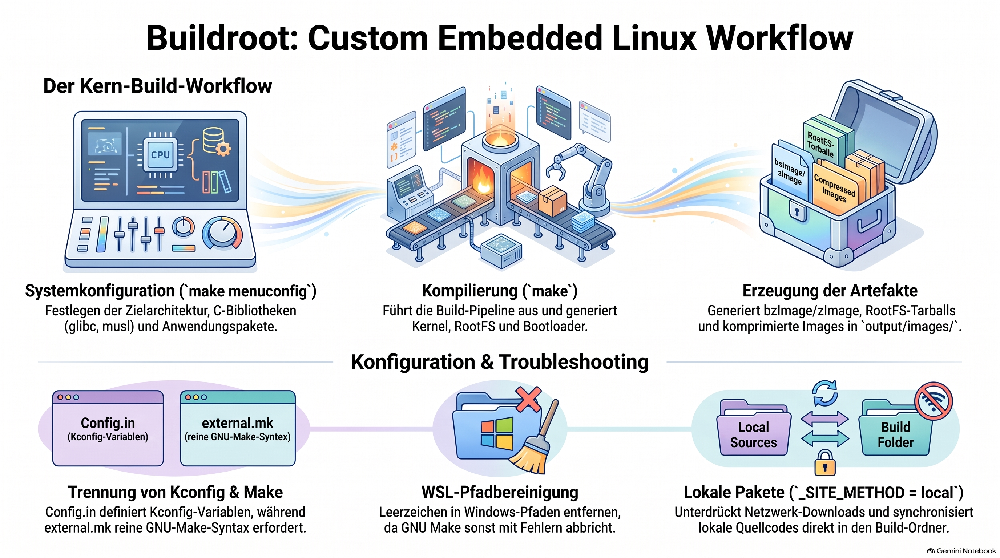
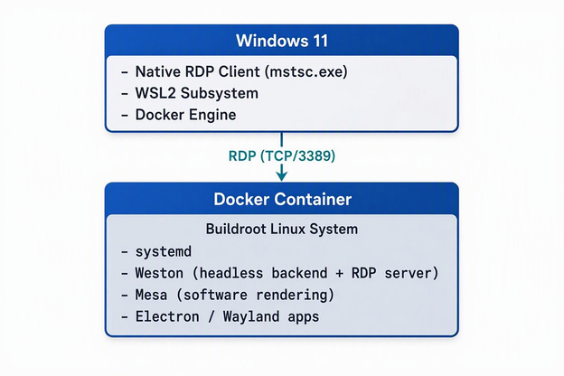
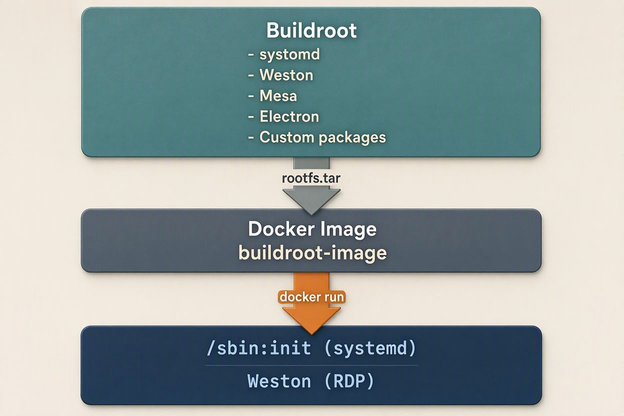

> [NOTE!]
> **Buildroot** ist ein effizientes Open-Source-Werkzeug, das die automatisierte Erstellung maßgeschneiderter **Embedded-Linux-Systeme** durch plattformübergreifende Kompilierung und Dateisystemgenerierung ermöglicht. Der reguläre Entwicklungsprozess umfasst die Installation von **Host-Abhängigkeiten**, den Abruf des Quellcodes, die interaktive Systemkonfiguration über **Kconfig** sowie den eigentlichen Kompilierungsvorgang mittels **GNU Make**. Für komplexe Anwendungsfälle lässt sich das Framework mit einer **externen Verzeichnisstruktur** erweitern, um maßgeschneiderte Softwarepakete wie Electron einzubinden. Zudem erfordert der Betrieb in einer **WSL2-Umgebung** spezielle Anpassungen des Systempfads, um Konflikte durch Windows-Verzeichnisse mit Leerzeichen zu vermeiden. Schließlich können die erstellten Buildroot-Artefakte in **Docker-Container** überführt und über einen **Weston-RDP-Server** grafisch auf einem Windows-Host dargestellt werden.


# Buildroot a Custom Embedded Linux Tool

**Buildroot** is a simple, fast, and open-source tool that automates the generation of a complete, custom embedded Linux system using a set of Makefiles and patches.

## Core Capabilities

* **Cross-Compilation:** Builds a compiler toolchain tailored to target hardware.
* **Root Filesystem:** Generates a minimal or fully customized root file system (`rootfs`).
* **Kernel & Bootloader:** Compiles the Linux kernel and packages bootloaders like U-Boot.
* **Architectures:** Supports x86, ARM, MIPS, PowerPC, and RISC-V.

## Core Build Workflow

### 1. Host Dependencies

Install required packages on the host Linux computer (e.g., `build-essential`, `git`, `libncurses-dev`).

### 2. Source Retrieval

Clone the repository to get the latest stable version:
```bash
git clone https://buildroot.net
cd buildroot
```

### 3. System Configuration
Launch the interactive configuration menu to define parameters:
```bash
make menuconfig
```
* Define target architecture (e.g., `x86_64`, `ARM`, `RISC-V`).
* Choose C libraries (e.g., `glibc`, `musl`, `uClibc-ng`).
* Select utilities and user-space packages (e.g., BusyBox, OpenSSH, Python).

### 4. Compilation
Execute the build pipeline:
```bash
make
```

### 5. Deployment Artifacts
Retrieve finalized compilation assets from the target directory:
* **Path:** `output/images/`
* **Artifacts:** `bzImage`/`zImage` (Kernel), root filesystem tarballs, or complete flashable disk images.

---

# 🗂️ **Architecture Diagrams**

## **1. High‑Level System Architecture**



## **2. Buildroot Output → Docker Pipeline**




## **3. Weston Headless + RDP Architecture**

Code

```
+-------------------------------------------+
|               Weston (Headless)           |
|-------------------------------------------|
|  Headless Backend → "Virtual Framebuffer" |
|  RDP Output → TCP/3389                    |
|  Wayland Socket → /run/wayland-0          |
+----------------------+--------------------+
                       |
                       | Wayland Protocol
                       v
+----------------------+--------------------+
|          Wayland Clients                  |
|  - Electron                               |
|  - Custom apps                            |
+-------------------------------------------+
```

## **4. Component Interaction Diagram**

Code

```
Windows RDP Client
        |
        | RDP
        v
Weston (RDP Server)
        |
        | Wayland
        v
Wayland Clients (Electron)
        |
        | Render (Mesa llvmpipe)
        v
Virtual Framebuffer (Headless Backend)
```

## **5. Full Stack Overview**

Code

```
+-----------------------------------------------------------+
|                        User Layer                         |
|  Windows 11 → RDP Client                                  |
+-----------------------------------------------------------+
|                        Access Layer                       |
|  RDP Protocol → Weston RDP Server                         |
+-----------------------------------------------------------+
|                        GUI Layer                          |
|  Weston Headless → Wayland Compositor                     |
+-----------------------------------------------------------+
|                        App Layer                          |
|  Electron → Wayland Client                                |
+-----------------------------------------------------------+
|                        Render Layer                       |
|  Mesa llvmpipe → Software Rendering                       |
+-----------------------------------------------------------+
|                        System Layer                       |
|  Buildroot Linux → systemd                                |
+-----------------------------------------------------------+
|                        Runtime Layer                      |
|  Docker on WSL2                                           |
+-----------------------------------------------------------+
```

## **6. External Package Architecture (Buildroot)**

Code

```
buildroot-external/
    Config.in
    external.mk
    package/
        electron/
            Config.in
            electron.mk
        hello-electron/
            Config.in
            hello-electron.mk
```

If you want, I can also generate:

* a **color‑coded version**,

* a **multi‑page architecture map**,

* or a **Zettelkasten atomic diagram set** (each diagram as its own note).

Just tell me what format you want next.


## 🗂️ Buildroot with External Tree

***

### 1. Context: The Root Directory Layout

When running `ls` and `ls -a` inside `~/buildroot-work/buildroot`, you are inside the core build framework.

* `.config`: Stores the absolute state of the system options (generated via `menuconfig` or `defconfig`).
* `.br-external.mk`: A cached file dynamically generated by Buildroot to declare the absolute directory paths (`_PATH`) of active external trees.
* `Config.in`: The master root configuration entry point. The terminal dump shows how Buildroot seeds environment variables (`HOSTARCH`, `BASE_DIR`) into Kconfig configuration entities.

***

### 2. Core Architectural Concept: Kconfig vs. GNU Make Separation

The initial error (`missing separator`) occurred because of a fundamental file format confusion:

| System Layer  | Orchestrator   | Primary Syntax File    | Syntax Mechanism                                |
| ------------- | -------------- | ---------------------- | ----------------------------------------------- |
| Configuration | Kconfig Engine | `Config.in`            | `source "path/to/file"` (Variables use `$VAR`)  |
| Compilation   | GNU Make       | `external.mk` / `*.mk` | `include path/to/file` (Variables use `$(VAR)`) |

#### Chronological Issues Resolving the Tree:

1. The Mismatch: `external.mk` tried to `include Config.in`. Make crashed because it cannot read Kconfig blocks (`menu ... endmenu`). Fix: Removed the `include` directive.
2. Variable Hook Limitations: In `Config.in`, line 21 shows `source "$BR2_BASE_DIR/.br2-external.in.paths"`. Buildroot sources this file to dynamically figure out path variables. When doing a fresh initialization, `$BR2_EXTERNAL_CUSTOM_PATH` evaluates as empty inside your external `Config.in` file because the dynamic paths are read _after_ parsing begins. Fix: Hardcoded the absolute path to stabilize local package hooks.

***

### 3. Environment & Operating System Constraints (WSL vs GNU Make)

## Path Character Block

* Symptom: `Your PATH contains spaces, TABs, and/or newline characters. This doesn't work.`
* Root Cause: WSL interop mounts host Windows drives (`/mnt/c/Program Files/...`) directly into the Linux environment variable `$PATH`. GNU Make handles token spacing aggressively and aborts when spaces appear inside path evaluations.
* Workaround Execution:
  ```bash
  PATH=$(echo "$PATH" | tr ':' '\n' | grep -v ' ' | grep -v '^$' | paste -sd:) make
  ```
* Permanent Remediation: Configure `/etc/wsl.conf` with `appendWindowsPath = false` under the `[interop]` bracket and drop the instance via host PowerShell using `wsl --shutdown`.

#### Working Directory Leak Block

* Symptom: `You seem to have the current working directory in your PATH environment variable.`
* Root Cause: A trailing colon (`:`) or a dot (`.`) in the `$PATH` array instructs Linux to look in the active workspace directory for bin items. Buildroot explicitly blocks this to prevent cross-contamination from malicious scripts or missing system bin shadowing.

***

### 4. Custom Package Formulation Patterns

#### Pattern A: Compressed Archives vs Binary Objects (`electron.mk`)

Buildroot's `generic-package` infrastructure assumes target packages download standard compressed tarballs (`.tar.gz`, `.tar.xz`).

* When `ELECTRON_SOURCE` targeted a `.zip` archive, Buildroot's default behavior passed it natively to `tar`, crashing with `tar: This does not look like a tar archive`.
* Remediation: Introduce an explicit `ELECTRON_EXTRACT_CMDS` definition leveraging the `unzip` command to override standard unpacking logic.

#### Pattern B: Local Application Packaging (`hello-electron.mk`)

When writing code packages locally without external mirrors:

* Defining `_SOURCE = none` flags standard network engines to try downloading an asset literally called `none`.
* Remediation: Configure `_SITE_METHOD = local`. This suppresses standard network fetches (`wget`). Instead, Buildroot automatically uses sync/mirror tools to move your `/src` contents cleanly to the package build tree `$(@D)`.
