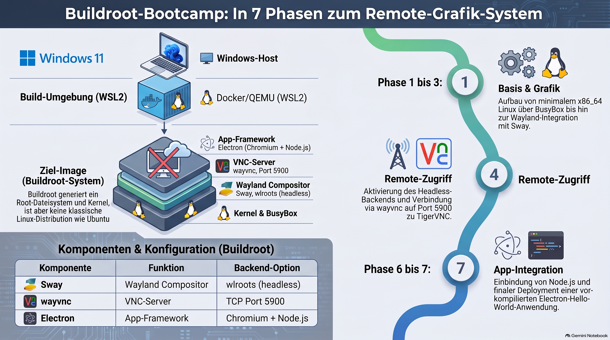

> [NOTE!]
> Die bereitgestellten Quellen beschreiben eine strukturierte **Schritt-für-Schritt-Anleitung zur Erstellung eines maßgeschneiderten Linux-Systems** mithilfe von Buildroot auf einem Windows-11-Host über WSL2. Das Hauptziel besteht darin, eine **grafische Umgebung mit Wayland, dem Sway-Compositor, Node.js und einer Electron-Anwendung** aufzubauen, die wahlweise per QEMU gebootet oder in einem Docker-Container ausgeführt werden kann. Um Komplexität zu reduzieren, wird ein inkrementeller Ansatz empfohlen, bei dem die Komponenten von einem minimalistischen Linux-Kernel über den grafischen Desktop bis hin zum **Remote-Zugriff über einen VNC-Viewer** schrittweise implementiert werden. Zudem wird geraten, das schwere Electron-Framework erst in einer späten Phase zu integrieren, um die Fehlersuche bei der Konfiguration der einzelnen Softwareschichten zu erleichtern.


# Buildroot Tutorial

Yes — and this is a **very interesting Buildroot project**. The important part is to separate the problem into layers:

```text
                    ┌─────────────────────────────┐
                    │       Windows 11 host       │
                    │                             │
                    │  ┌─────────────┐            │
                    │  │     WSL     │            │
                    │  │             │            │
                    │  │  Buildroot  │            │
                    │  │      │      │            │
                    │  │      ▼      │            │
                    │  │ Linux image │            │
                    │  │             │            │
                    │  │ Wayland     │            │
                    │  │ Sway        │            │
                    │  │ Node.js     │            │
                    │  │ Electron    │            │
                    │  └──────┬──────┘            │
                    │         │                   │
                    └─────────┼───────────────────┘
                              │
                    ┌─────────▼─────────┐
                    │      Docker       │
                    │                   │
                    │ Buildroot rootfs  │
                    │ Sway/headless     │
                    │       │           │
                    │       ▼           │
                    │    Wayland        │
                    │       │           │
                    │       ▼           │
                    │    wayvnc         │
                    │       │           │
                    │       ▼           │
                    │   TigerVNC client │
                    └───────────────────┘
```

There is one important correction to the original idea, though: **Buildroot is primarily a system/image builder, not a Linux distribution intended to be booted directly as a normal WSL distribution or Docker image.** Buildroot generates a root filesystem, kernel and potentially bootloader. The current stable series is Buildroot **2026.08.x**. ([buildroot.buildroot.org](https://buildroot.buildroot.org/downloads/manual/manual.html?utm_source=chatgpt.com "The Buildroot user manual"))

So I would build this as a **single Buildroot Linux userspace**, then provide two ways of running it:

1. **QEMU/WSL path** — boot the Buildroot Linux system.

2. **Docker path** — use the Buildroot root filesystem as a container filesystem and run Sway with a headless Wayland backend, exposing VNC.

That gives you a very nice learning project.

## 1. Our target

I'd suggest we build this incrementally:

### Phase 1 — Minimal Buildroot

```text
Buildroot
   │
   ├── BusyBox
   ├── Linux
   └── root filesystem
```

### Phase 2 — Wayland

```text
Buildroot
   │
   ├── Wayland
   ├── wlroots
   └── Sway
```

Sway is an i3-compatible Wayland compositor and is built around wlroots. Its documented dependencies include Wayland, Wayland protocols, wlroots, pango, cairo, json-c, etc. ([GitHub](https://github.com/swaywm/sway?utm_source=chatgpt.com "GitHub - swaywm/sway: i3-compatible Wayland compositor · GitHub"))

### Phase 3 — graphical application

```text
Sway
  │
  └── Wayland
       │
       └── Electron
            │
            └── Hello World
```

### Phase 4 — remote graphics

For the Docker version:

```text
Sway
 │
 ▼
wlroots headless backend
 │
 ▼
Wayland
 │
 ▼
wayvnc
 │
 ▼
TCP :5900
 │
 ▼
TigerVNC Viewer
```

This is actually cleaner than trying to make TigerVNC itself provide the Wayland display.

`wayvnc` specifically supports running against a headless Sway/Wayland session by using:

```text
WLR_BACKENDS=headless
WLR_LIBINPUT_NO_DEVICES=1
```

and then connecting `wayvnc` to the Wayland display. ([GitHub](https://github.com/any1/wayvnc/blob/master/FAQ.md?utm_source=chatgpt.com "wayvnc/FAQ.md at master · any1/wayvnc · GitHub"))

***

# 2. One important Electron distinction

There is a subtle issue here that will save you a lot of frustration.

You said:

> "We also need the node.js runtime to run an electron hello world application."

For **developing** Electron, Node.js and npm are required. But an installed Electron application does **not normally use the system Node.js runtime**.

Electron itself embeds Node.js and Chromium. The official Electron documentation explicitly points this out. ([Electron](https://www.electronjs.org/docs/latest/tutorial/tutorial-prerequisites?utm_source=chatgpt.com "Prerequisites | Electron"))

So we have two possible goals:

### A. Buildroot contains Node.js

```text
Buildroot
   │
   ├── node
   ├── npm
   └── Electron application
```

This is useful for learning and for running JavaScript tooling.

### B. Buildroot contains a packaged Electron application

```text
Buildroot
   │
   └── my-electron-app
          │
          ├── Chromium
          └── embedded Node.js
```

This is closer to how Electron applications are normally deployed.

**For your learning project, I recommend doing both eventually.**

***

# 3. Recommended project architecture

I would create:

```text
buildroot-wayland/
│
├── buildroot/
│
├── board/
│   └── mywayland/
│       ├── rootfs-overlay/
│       │   ├── etc/
│       │   │   └── sway/
│       │   │       └── config
│       │   │
│       │   └── usr/
│       │       └── bin/
│       │           ├── start-sway
│       │           └── start-vnc
│       │
│       └── post-build.sh
│
├── configs/
│   └── mywayland_x86_64_defconfig
│
├── package/
│   └── electron-hello/
│       ├── Config.in
│       ├── electron-hello.mk
│       └── src/
│           ├── package.json
│           ├── main.js
│           └── index.html
│
└── Dockerfile
```

This will also teach you an important Buildroot concept:

> **Keep your own board configuration and packages outside the Buildroot source tree wherever practical.**

***

# 4. Buildroot host

There is one significant constraint:

**Buildroot itself is designed to run on Linux.** ([buildroot.buildroot.org](https://buildroot.buildroot.org/downloads/manual/manual.html?utm_source=chatgpt.com "The Buildroot user manual"))

Since you're on Windows, WSL is an excellent build environment.

For example:

```text
Windows 11
   │
   ▼
WSL2
   │
   └── Ubuntu
        │
        └── Buildroot
```

Inside WSL:

```bash
sudo apt update

sudo apt install \
    build-essential \
    git \
    wget \
    cpio \
    unzip \
    rsync \
    bc \
    bison \
    flex \
    file \
    libncurses-dev \
    python3 \
    patch \
    perl
```

Then:

```bash
git clone https://gitlab.com/buildroot.org/buildroot.git
cd buildroot
```

For reproducibility, I'd actually use the current stable release rather than building arbitrary `master`.

***

# 5. Start with x86-64

Since your immediate targets are WSL/Docker on an ordinary Windows PC, use:

```text
Architecture:
    x86_64
```

Buildroot configuration:

```bash
make menuconfig
```

Start with:

```text
Target options
    Target Architecture
        x86_64
```

Then we progressively enable:

```text
System configuration
    ├── BusyBox
    ├── networking
    └── root filesystem overlay

Target packages
    ├── libraries
    │    └── Graphics
    │
    ├── Graphic libraries and applications
    │    ├── Wayland
    │    ├── wlroots
    │    └── Sway
    │
    ├── Networking applications
    │    └── wayvnc
    │
    └── Interpreter languages and scripting
         └── Node.js
```

The exact menu locations/options can change between Buildroot releases, so we should use the **2026.08 configuration menus on your machine** rather than relying on an older tutorial.

***

# 6. The graphical stack

This is the key conceptual part.

You aren't simply installing "a GUI".

We're constructing:

```text
                   Electron
                      │
                      ▼
                  Wayland API
                      │
                      ▼
                  Sway
                      │
                      ▼
                   wlroots
                 /          \
                /            \
          DRM/KMS             headless
             │                   │
             ▼                   ▼
       real graphics           Docker
```

For a physical Linux machine, Sway can use the DRM backend.

For Docker, we use the **headless wlroots backend**.

That means we don't need a physical GPU inside the container.

***

# 7. Docker graphics

This is the clever part of your idea.

Instead of:

```text
Docker
  │
  └── Sway
       │
       └── physical GPU
```

we use:

```text
Docker
  │
  └── Sway
       │
       └── wlroots
            │
            ▼
         headless
            │
            ▼
         Wayland
            │
            ▼
          wayvnc
            │
            ▼
         port 5900
```

Then from Windows:

```powershell
vncviewer localhost:5900
```

with TigerVNC.

This approach is specifically supported by the wayvnc documentation for headless Sway sessions. ([GitHub](https://github.com/any1/wayvnc/blob/master/FAQ.md?utm_source=chatgpt.com "wayvnc/FAQ.md at master · any1/wayvnc · GitHub"))

***

# 8. Sway configuration

Our eventual configuration can be something like:

```text
/etc/sway/config
```

with:

```text
output HEADLESS-1 resolution 1280x720

exec /usr/bin/start-electron

bindsym $mod+Return exec foot
```

For the first experiment, however, don't start Electron automatically.

First prove:

```text
Buildroot
    ↓
Wayland
    ↓
Sway
    ↓
VNC
```

Then:

```text
Sway
  ↓
terminal
```

Then:

```text
Sway
  ↓
Electron
```

This layered approach will make debugging **much** easier.

***

# 9. Starting Sway headlessly

Conceptually our startup script will eventually be:

```sh
#!/bin/sh

export WLR_BACKENDS=headless
export WLR_LIBINPUT_NO_DEVICES=1

export XDG_RUNTIME_DIR=/tmp/xdg-runtime
mkdir -p "$XDG_RUNTIME_DIR"
chmod 700 "$XDG_RUNTIME_DIR"

export WAYLAND_DISPLAY=wayland-1

sway &
```

Then:

```sh
wayvnc 0.0.0.0 5900
```

The exact Wayland display name needs to be handled carefully because Sway/wlroots can select the display number dynamically. The wayvnc FAQ also notes this distinction between `wayland-1` and older Sway versions using `wayland-0`. ([GitHub](https://github.com/any1/wayvnc/blob/master/FAQ.md?utm_source=chatgpt.com "wayvnc/FAQ.md at master · any1/wayvnc · GitHub"))

So I would **not hard-code this too early**. We can make the startup script discover the socket.

***

# 10. Electron Hello World

Our application can initially be extremely small:

```text
electron-hello/
│
├── package.json
├── main.js
└── index.html
```

`package.json`:

```json
{
  "name": "electron-hello",
  "version": "1.0.0",
  "main": "main.js",
  "scripts": {
    "start": "electron ."
  },
  "devDependencies": {
    "electron": "^latest"
  }
}
```

`main.js`:

```javascript
const { app, BrowserWindow } = require("electron");

function createWindow() {
    const window = new BrowserWindow({
        width: 800,
        height: 600
    });

    window.loadFile("index.html");
}

app.whenReady().then(createWindow);
```

`index.html`:

```html
<!DOCTYPE html>
<html>
<head>
    <meta charset="UTF-8">
    <title>Buildroot Electron</title>
</head>

<body>
    <h1>Hello from Electron!</h1>

    <p>
        Buildroot + Wayland + Sway + Electron
    </p>
</body>
</html>
```

Electron's official tutorial follows this basic application model. ([az.electronjs.org](https://az.electronjs.org/docs/latest/tutorial/tutorial-first-app?utm_source=chatgpt.com "Building your First App | Electron"))

***

# 11. But don't build Electron inside Buildroot initially

This is another important architectural decision.

Electron is **large** because it contains Chromium and Node.js.

Trying to make Buildroot compile Electron from source as our first step would turn this into a substantially larger project.

Electron's own documentation describes its Linux build as involving Chromium and a large native build environment. ([Electron](https://www.electronjs.org/docs/latest/development/build-instructions-linux?utm_source=chatgpt.com "Build Instructions (Linux) | Electron"))

Instead:

### Stage 1

Buildroot:

```text
Wayland
Sway
Node.js
wayvnc
```

Then test the environment.

### Stage 2

Develop Electron application outside Buildroot:

```text
Windows/WSL
       │
       └── npm
            │
            └── Electron
```

### Stage 3

Package the already-built Electron application into the Buildroot root filesystem.

That is a **much more manageable first project**.

***

# 12. Node.js in Buildroot

The target should eventually have:

```bash
node --version
```

and:

```bash
npm --version
```

giving something similar to:

```text
vXX.x.x
XX.x.x
```

The exact version should be selected from the Node.js package/version supported by the Buildroot release we use.

Then:

```bash
node
```

should give:

```text
>
```

and:

```javascript
console.log("Hello from Buildroot");
```

should work.

This gives us an independent test before Electron enters the picture.

***

# 13. The complete final system

Our finished system should look like this:

```text
                       Windows 11
                           │
                    ┌──────┴───────┐
                    │              │
                   WSL          Docker
                    │              │
                    │              │
              Buildroot image   Buildroot rootfs
                    │              │
                    │              │
                 Linux         Linux userspace
                    │              │
                    └──────┬───────┘
                           │
                        Wayland
                           │
                          Sway
                           │
                    ┌──────┴───────┐
                    │              │
                 Electron       wayvnc
                    │              │
                    │              │
                    └──────┬───────┘
                           │
                        Hello World
                           │
                     VNC :5900
                           │
                           ▼
                    TigerVNC Viewer
```

***

# 14. The build pipeline

I'd teach/build this as a **7-stage bootcamp**:

### Day 1 — Buildroot

```text
WSL
 ↓
Buildroot
 ↓
minimal x86_64 Linux
```

Learn:

* `menuconfig`

* `defconfig`

* root filesystem

* `output/`

* Buildroot package system

* overlays

***

### Day 2 — Linux + networking

```text
Linux
 ↓
BusyBox
 ↓
eth0
 ↓
SSH
```

Test:

```bash
ip addr
```

and:

```bash
ping ...
```

***

### Day 3 — Wayland

```text
Linux
 ↓
Wayland
```

Understand:

```text
Wayland protocol
      ≠
Wayland compositor
```

and:

```text
Sway = compositor
```

***

### Day 4 — Sway

```text
Wayland
   ↓
wlroots
   ↓
Sway
```

First launch it with a headless backend.

***

### Day 5 — VNC

```text
Sway
 ↓
headless Wayland
 ↓
wayvnc
 ↓
TCP 5900
 ↓
TigerVNC
```

At this point you'll have a **remote graphical Buildroot Linux desktop**.

***

### Day 6 — Node.js

```text
Buildroot
 ↓
Node.js
 ↓
npm
 ↓
hello.js
```

Then:

```bash
node hello.js
```

***

### Day 7 — Electron

```text
Electron
    │
    ▼
Chromium
    │
    ▼
Wayland
    │
    ▼
Sway
    │
    ▼
wayvnc
    │
    ▼
TigerVNC
```

And finally:

```text
┌────────────────────────────────────────┐
│          Buildroot Electron            │
│                                        │
│       Hello from Electron!             │
│                                        │
│  Buildroot + Wayland + Sway + Node.js  │
└────────────────────────────────────────┘
```

***

## 15. One thing I'd change in your original requirement

I would **not make "WSL" and "Docker" the same runtime target**.

Instead, define a common Buildroot configuration:

```text
                 common Buildroot
                       │
             ┌─────────┴──────────┐
             │                    │
          WSL/QEMU             Docker
             │                    │
       normal graphics        headless graphics
             │                    │
           Sway                 Sway
             │                    │
          Wayland              Wayland
                                  │
                                wayvnc
                                  │
                               TigerVNC
```

This is cleaner technically and, more importantly, it gives you a **proper Buildroot learning project** rather than a collection of hacks.

Buildroot is particularly well suited to this because it can generate the toolchain, root filesystem, kernel and bootloader as separate pieces. ([buildroot.buildroot.org](https://buildroot.buildroot.org/downloads/manual/manual.html?utm_source=chatgpt.com "The Buildroot user manual"))

And there is one nice bonus: **we can make the entire configuration reproducible with a Buildroot `defconfig` plus a rootfs overlay**, so later you can rebuild the entire Linux image with one command.

### My recommendation

Let's build it **hands-on from zero**, rather than dumping a giant `menuconfig` configuration on you.

The first milestone should be:

```text
Windows 11
   ↓
WSL2
   ↓
Buildroot 2026.08
   ↓
x86_64 Linux
   ↓
Sway
   ↓
headless Wayland
   ↓
wayvnc
   ↓
TigerVNC on Windows
```

Once that works, we add **Node.js**, and only then add the **Electron Hello World** application. This order will make it much easier to determine whether a problem comes from Buildroot, Wayland, Sway, VNC, Node.js, or Electron.
