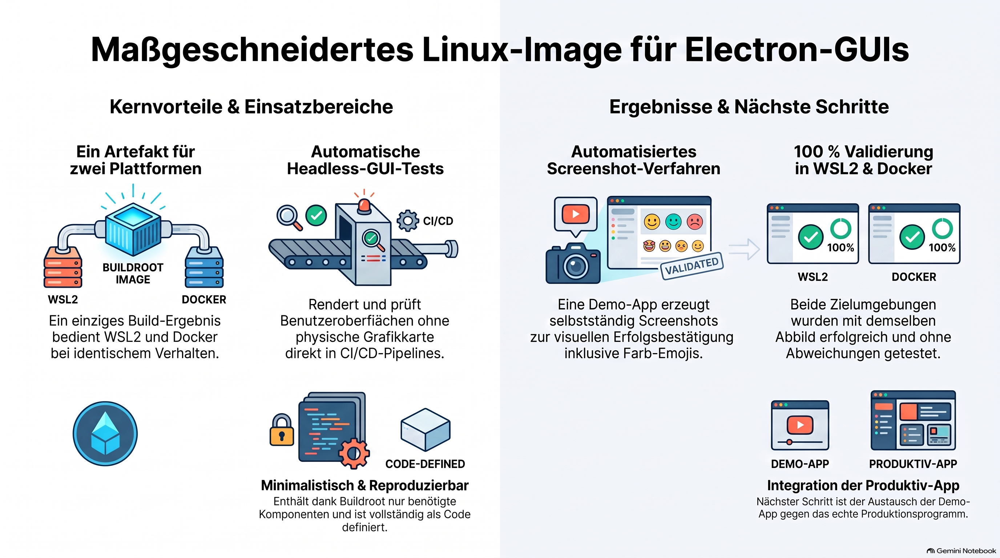

> [NOTE!]
> Karl Scmitt beschreibt die erfolgreiche Entwicklung eines maßgeschneiderten **Linux-Abbilds** auf Basis von **Buildroot**, das eine **Electron-Grafikoberfläche** ausführt. Mithilfe des **Wayland/Sway-Grafikstacks** und eines **Software-Renderings** kommt die Lösung völlig ohne physische Grafikkarte aus. Das fertige System wurde sowohl als **WSL2-Distribution** für Windows-Arbeitsplätze als auch als **Docker-Image** für Serverumgebungen erfolgreich getestet. Durch diesen Ansatz lässt sich eine Benutzeroberfläche selbst in **Headless-CI/CD-Pipelines** automatisiert überprüfen. Zünftige Schritte umfassen den Austausch der Testanwendung gegen das eigentliche **Produktionsprogramm** sowie die Integration in automatisierte Qualitätstests.

# Custom Linux Image for Electron GUIs 

**Date:** 2026-10-05
**Prepared for:** Management Stakeholders
**Status:** ✅ Complete and verified

---

## 1. What was delivered

A single, self-contained custom Linux image that runs a modern **Electron (JavaScript) desktop
application** on a lightweight **Buildroot** base, complete with the full **Wayland/Sway**
graphics stack and **Node.js** runtime. The same image is deployable in two ways:

- as a **WSL2 distribution** (for developer workstations on Windows), and
- as a **Docker image** (for CI/CD, servers, and reproducible environments).

A small **"Hello World" Electron application** is included and was used to **prove the graphics
pipeline works end-to-end** in both environments.

---

## 2. Business value

| Benefit | Explanation |
|---|---|
| **One artifact, two platforms** | A single build output serves both WSL2 and Docker, halving maintenance and guaranteeing identical behaviour across environments. |
| **Lightweight & controlled** | Buildroot produces a minimal, fully specified OS image — only what we choose is included, improving security surface and reproducibility versus a general-purpose distro. |
| **Headless GUI validation** | The image can render and self-test a GUI with **no physical display or GPU**, enabling automated UI smoke-tests in CI. |
| **Reproducible** | The entire image is defined as code (configuration + scripts), so it can be rebuilt reliably and version-controlled. |
| **Future-ready** | The same approach scales to the real production Electron application, not just the demo. |

---

## 3. How it was done (plain-language)

1. **Chose the right foundation.** Selected Buildroot's long-term-support release and
   configured it for the industry-standard compatibility profile required by Electron.
2. **Assembled the graphics + runtime stack.** Added the Wayland/Sway display system,
   software-based graphics rendering (so no GPU is needed), Node.js, and the Electron runtime.
3. **Built a self-testing demo app.** The Electron "Hello World" renders a window and
   automatically captures a screenshot of itself — a built-in, automatable proof that the
   whole pipeline functions.
4. **Produced the image and validated it twice.** Imported it as a Windows WSL2 distribution
   and built it as a Docker image; ran the self-test in both and confirmed success with
   captured screenshots.
5. **Polished the result.** Added full-colour emoji support so the UI renders exactly as
   intended.

---

## 4. Verified results

| Environment | Outcome |
|---|---|
| **WSL2 distribution** | ✅ GUI rendered successfully (self-test: **PASS**) |
| **Docker image** | ✅ GUI rendered successfully (self-test: **PASS**) |
| **Visual confirmation** | ✅ Screenshots show the fully rendered interface, including colour emoji |

Both environments were validated using the **same** image, confirming cross-platform parity.

---

## 5. Effort & timeline

- **Elapsed:** work spanned parts of two days; the single largest cost was the initial
  from-source compilation of the toolchain and runtime (unattended, ~1–1.5 hours of machine
  time). Subsequent changes used fast incremental rebuilds (minutes).
- **Human effort:** concentrated on configuration, problem-solving, and verification;
  the heavy compilation ran automatically.

---

## 6. Challenges managed (and resolved)

All issues below were diagnosed and fixed; none remain open.

| Challenge | Impact if unmanaged | Resolution |
|---|---|---|
| **Corporate VPN/network blocked downloads** | Build could not fetch components | Switched the connection method; resumed the build with no rework. |
| **Windows/Linux environment quirks** | Build tool refused to start | Applied standard environment corrections (documented). |
| **A newer OS tooling incompatibility** | Build aborted early | Switched to the compatible tool variant. |
| **One missing graphics-support library** | GUI could fail to launch | Detected proactively via dependency analysis and added it before runtime. |
| **Emoji displayed as blank boxes** | Minor cosmetic defect | Sourced and integrated the correct colour-emoji font. |

**Key takeaway:** the difficulties were primarily **environmental** (corporate network,
Windows–Linux interplay, OS tooling churn) rather than fundamental to the approach. All are
now documented so future builds avoid them.

---

## 7. Risks & considerations

- **Network dependency during build:** the first build downloads components from the internet;
  a stable connection (or an internal mirror) is recommended for repeatable builds.
- **Image size:** the image is a few hundred megabytes due to the full graphics stack and
  Electron; it can be trimmed if size becomes a constraint.
- **Software rendering:** the current image renders graphics in software (no GPU). This is
  ideal for testing/headless use; GPU acceleration would require additional work if needed for
  performance-sensitive production use.

---

## 8. Recommended next steps

1. **Swap in the real application** in place of the demo and re-run the same validation.
2. **Add the self-test to CI/CD** as an automated quality gate.
3. **Decide on an internal package mirror** to make builds independent of external networks.
4. **Optionally optimise image size** and evaluate whether on-screen (non-headless) use on
   developer desktops is desired.

---

## 9. Supporting documentation

A detailed technical deep-dive (configuration, commands, and full troubleshooting log) is
available alongside this summary:

- `D:\Summaries\Buildroot\Buildroot-Electron-Wayland-DeepDive.md`
- Project source, build scripts, Docker definition, and proof screenshots:
  `D:\Users\BKU\karlschmitt\br-electron-staging\`
- Reproducible project tree (config as code): `~/br-electron/br_electron_ext` (incl. README).
