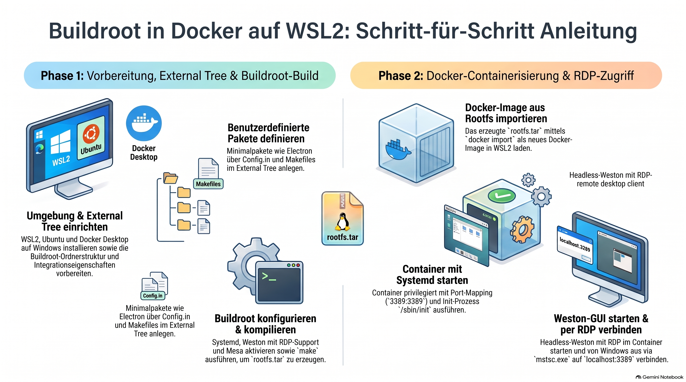
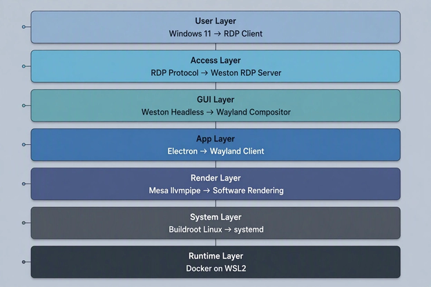
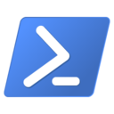
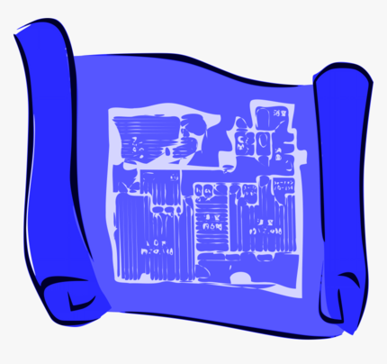
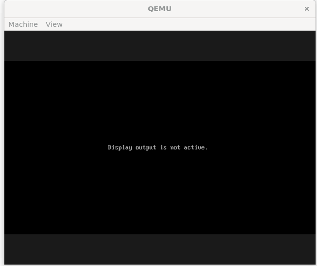
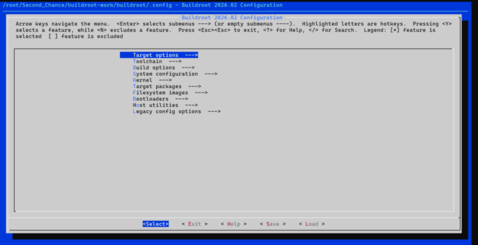
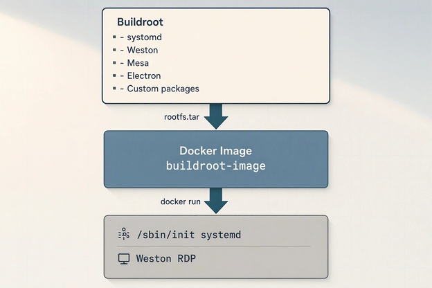
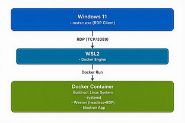

> [NOTE!]
> Dieser Leitfaden beschreibt eine reproduzierbare Anleitung zur Erstellung eines maßgeschneiderten Linux-Systems mittels **Buildroot** unter Windows mit **WSL2** und **Docker**. Zunächst wird die Entwicklungsumgebung eingerichtet und ein dedizierter Arbeitsbereich sowie ein externer Baum für benutzerdefinierte Softwarepakete wie **Electron** konfiguriert. Anschließend erfolgt das Kompilieren des gesamten Betriebssystems, dessen anschließender Import als **Docker-Image** das Ausführen des Containers mit aktiviertem **Systemd** ermöglicht. Schließlich wird der **Weston**-Kompositor im Headless-Modus gestartet, sodass über das Remotedesktop-Protokoll (**RDP**) von Windows aus auf die grafische Benutzeroberfläche zugegriffen werden kann.


# Buildroot Step‑by‑Step Tutorial 👟


### Full Stack Overview



> [NOTE!]
>  Here’s a clean, reproducible, step‑by‑step tutorial you can follow on any machine.


### 1 Prepare the environment 👩‍🏭

Set up the basic tools needed to build and run the system.

On Windows: install **WSL2** and a Linux distribution (e.g. Ubuntu or Debian), and **Docker Desktop** with WSL2 backend enabled.

* Enable WSL and Virtual Machine Platform in Windows Features

* Install a Linux distro (e.g. Ubuntu or Debian) from Microsoft Store

* Install Docker Desktop and ensure it uses the WSL2 backend

* Inside PowerShell, verify Docker works: `docker ps`

### Full “Second Chance” reset workflow for Debian 👷‍♀️



Here is the exact sequence you should run in your PowerShell terminal — clean, reproducible, and without debugging fluff.

#### **1. Export your existing Debian**

```powershell
wsl --export Debian debian.tar
```

#### **2. Unregister the old Debian**

```powershell
wsl --unregister Debian
```

#### **3. Create the folder for the new instance**

```poershell
mkdir C:\WSL\Second_Chance
```

#### **4. Import Debian as Second\_Chance**

```powershell
wsl --import Second_Chance C:\WSL\Second_Chance debian.tar --version 2
```

#### **5. Start your new instance**

```poershell
wsl -d Second_Chance
```

You now have a **fresh WSL2 Debian** named _Second\_Chance_.


### 2 Create the Buildroot workspace 💻


Organize a working directory for Buildroot and the external tree 🌳.


In your WSL Debian Bash terminal:


* Create your a Buildroot development and build environment

* Create a workspace: `mkdir -p ~/Second_Cance/buildroot-work && cd ~/Second_Chance/buildroot-work`

* Download or clone Buildroot into `buildroot/` (e.g. `git clone https://git.busybox.net/buildroot buildroot`)

* Verify: `cd buildroot && ls` shows standard Buildroot directories

#### Install Buildroot prerequisites


Inside your WSL Debian instance and GNU Bash terminal:


```bash
sudo apt update
sudo apt upgrade -y
sudo apt install -y \
    build-essential \
    git \
    bc \
    unzip \
    python3 \
    wget \
    cpio \
    rsync \
    libncurses-dev \
    libncursesw5-dev \
    file \
    dos2unix \
    xclip \
    libelf-dev \
    qemu-system-x86 \
    qemu-utils \
    libgl1-mesa-dri \ 
    libvirglrenderer1 \ 
    virgl-server \
    libegl1 \ 
    libgbm1 \ 
    libgl1 \ 
    libgles2 \ 
    libglx-mesa0 \ 
    libgl1-mesa-dri

```

This gives you a **perfect Buildroot environment**.


#### Create your workspace and clone Buildroot 🖥️


Inside your WSL Debian instance and Bash terminal:


```bash
mkdir -p ~/Second_Chance/buildroot-work
cd ~/Second_Chance/buildroot-work
git clone https://github.com/buildroot/buildroot.git
cd buildroot
```
A small script, in case you have to clone it again:
```bash
# 1. Clean out any previous broken artifact folders
rm -rf buildroot

# 2. Reconstruct the full, un-truncated repository URL using variables
URL_HOST="https://github.com"
URL_PATH="/buildroot/buildroot.git"
FULL_URL="${URL_HOST}${URL_PATH}"

# 3. Clone the actual Buildroot repository and enter it
git clone $FULL_URL --depth=1
cd buildroot
```

You might checkout a stable BuildRoot release:
```bash
git checkout 2026.02
```

#### 🟦First Configuration Blueprint 🏗️



***

## Building a Reproducible Wayland/Weston Graphic Client System in Buildroot

### Context

* Host System: Windows 11 running WSL2 (Debian Trixie distribution).
* Goal: Create a lightweight, embedded Linux client system via Buildroot capable of running a Wayland / Weston display compositor to host Electron.js GUIs.
* Remote Access: Stream the display rendering server outputs back to the Windows host seamlessly via `wayvnc` or a VNC loopback overlay.
* Core Constraint: The environment must be 100% reproducible and automated using a dedicated Buildroot `defconfig` blueprint.

***

## Architectural Evolutions and Fixes

### 1. The Per-Package Isolation and Systemd Traps (Legacy Phase)

* Problem: In modern Buildroot trees, using `systemd` alongside Per-Package Directories (`BR2_PER_PACKAGE_DIRECTORIES=y`) isolates package staging folders. During compilation, the `systemd` build space failed to pull development files (`mount.pc`/`libmount.so`) from the `util-linux` sandbox, causing permanent compilation failure loops inside Meson.
* Resolution: Abandoned `systemd` in favor of an elegant, lightweight embedded architecture to enforce reproducibility.

### 2. The Stable Embedded Design Selection

To bypass tracking bottlenecks and circular dependencies completely, we swapped out heavy desktop daemons for robust embedded design frameworks:

* Init System: `SysVinit` (`BR2_INIT_SYSV=y`) -> Fast, predictable script-based execution flow.
* Hardware Manager: `Eudev` (`BR2_ROOTFS_DEVICE_CREATION_DYNAMIC_EUDEV=y`) -> Handles hardware hotplugging natively without requiring systemd hooks.

***

## The Master Blueprint Defconfig Configuration

We froze all parameters inside a minimal configuration profile (`configs/wayland_client_x86_64_defconfig`). This eliminates manual `make menuconfig` guessing and lets any user recompile an identical root filesystem from scratch using one instruction.

## Core Blueprint Settings

```makefile
# Target Architecture Profile
BR2_x86_64=y
BR2_x86_x86_64=y

# Toolchain (Standard GLIBC with C++ capability required by Chromium/Electron)
BR2_TOOLCHAIN_BUILDROOT_GLIBC=y
BR2_INSTALL_LIBSTDCPP=y
BR2_TOOLCHAIN_BUILDROOT_CXX=y

# Core Init System Options
BR2_INIT_SYSV=y
BR2_ROOTFS_DEVICE_CREATION_DYNAMIC_EUDEV=y

# Linux Kernel Configuration
BR2_LINUX_KERNEL=y
BR2_LINUX_KERNEL_USE_CUSTOM_CONFIG=y
BR2_LINUX_KERNEL_CUSTOM_CONFIG_FILE="board/qemu/x86_64/linux.config"

# Graphics Framework Stack (Mesa3D serving Accelerated OpenGL ES & EGL)
BR2_PACKAGE_MESA3D=y
BR2_PACKAGE_MESA3D_GALLIUM_DRIVER_VIRGL=y
BR2_PACKAGE_MESA3D_OPENGL_EGL=y
BR2_PACKAGE_MESA3D_OPENGL_ES=y

# Wayland & Headless Weston Ecosystem Applications
BR2_PACKAGE_WAYLAND=y
BR2_PACKAGE_WESTON=y
BR2_PACKAGE_WESTON_DEFAULT_COMPOSITOR_DRM=y
BR2_PACKAGE_WESTON_SIMPLE_CLIENTS=y
BR2_PACKAGE_WESTON_DEMO_CLIENTS=y

# Core Utilities Framework
BR2_PACKAGE_UTIL_LINUX=y
BR2_PACKAGE_UTIL_LINUX_BINARIES=y

# Filesystem Packaging Limits
BR2_TARGET_ROOTFS_EXT2=y
BR2_TARGET_ROOTFS_EXT2_4=y
BR2_TARGET_ROOTFS_EXT2_SIZE="1G"
```

***

## Deployment & Hardware Graphics Passthrough

## 1. Host Optimization (Debian WSL2 Environment)

To allow the virtual hardware monitor layers to interact directly with the physical Windows graphics adapter via WSLg, we mapped the host-side packages explicitly:

```bash
apt-get update && apt-get install -y \
    qemu-system-x86 qemu-utils libgl1-mesa-dri \
    libvirglrenderer1 virgl-server libegl1 \
    libgbm1 libgl1 libgles2 libglx-mesa0 libelf-dev
```

## 2. High-Performance QEMU Launch Wrapper Script

We built a tailored execution script at `output/images/start-qemu.sh` to initialize the layout with dual consoles (`tty1` screen visualization + `ttyS0` serial mirror), virtualization options, and direct 3D graphics bridging:

```bash
#!/bin/sh
IMAGE_DIR="$(dirname "$0")"

exec qemu-system-x86_64 \
    -M q35 \
    -m 2G \
    -smp 2 \
    -kernel "${IMAGE_DIR}/bzImage" \
    -drive file="${IMAGE_DIR}/rootfs.ext4",if=virtio,format=raw \
    -append "root=/dev/vda ro console=tty1 console=ttyS0 quiet" \
    -net nic,model=virtio -net user \
    -device virtio-vga-gl \
    -display gtk,gl=on \
    -serial stdio
```

## 3. Active Status Verified

The base graphics driver and compositor environment were successfully verified using the virtual machine console logs:

* Graphics device linked perfectly to `/dev/dri/card0` and `/dev/dri/renderD128`.
* Acceleration pipeline registered `GL renderer: virgl (LLVMPIPE...)` via OpenGL ES 3.2 Mesa 26.1.8.

***

## Active State and Next Action Item

We are currently updating the blueprint to integrate the Node.js environment layer (`BR2_PACKAGE_NODEJS=y`) to execute Electron frameworks natively. We are also deploying an init boot service (`S90weston`) inside our Rootfs Overlay folder to transition Weston into a persistent headless VNC network stream daemon (`wayvnc`) on port `5900`.

***

Now that your Zettelkasten is updated, let me know if your current `make` run with Node.js has finished successfully, or if you need to troubleshoot any package step during this compilation phase!


## Let's begin

This blueprint only contains Buildroot plus Wayland to test your build environmet on Debian WSL:
```bash
# 1. Create your stable, reproducible defconfig blueprint file
cat << 'EOF' > configs/wayland_client_x86_64_defconfig
# QEMU x86_64 Virtual Board Target Layout Mapping
BR2_x86_64=y
BR2_x86_x86_64=y

# Toolchain (Standard GLIBC with C++ for Wayland/Electron requirements)
BR2_TOOLCHAIN_BUILDROOT_GLIBC=y
BR2_INSTALL_LIBSTDCPP=y
BR2_TOOLCHAIN_BUILDROOT_CXX=y

# Core Init System Options (SysVinit + Eudev avoids Sandbox Compilation Bugs)
BR2_INIT_SYSV=y
BR2_ROOTFS_DEVICE_CREATION_DYNAMIC_EUDEV=y

# Linux Kernel Source (Tied natively to the virtual machine board pipeline)
BR2_LINUX_KERNEL=y
BR2_LINUX_KERNEL_USE_CUSTOM_CONFIG=y
BR2_LINUX_KERNEL_CUSTOM_CONFIG_FILE="board/qemu/x86_64/linux.config"

# Graphics Framework Stack (Mesa3D serving Accelerated OpenGL ES & EGL)
BR2_PACKAGE_MESA3D=y
BR2_PACKAGE_MESA3D_GALLIUM_DRIVER_VIRGL=y
BR2_PACKAGE_MESA3D_OPENGL_EGL=y
BR2_PACKAGE_MESA3D_OPENGL_ES=y

# Wayland & Headless Weston Ecosystem Applications
BR2_PACKAGE_WAYLAND=y
BR2_PACKAGE_WESTON=y
BR2_PACKAGE_WESTON_DEFAULT_COMPOSITOR_DRM=y
BR2_PACKAGE_WESTON_SIMPLE_CLIENTS=y
BR2_PACKAGE_WESTON_DEMO_CLIENTS=y

# Core Utilities Framework
BR2_PACKAGE_UTIL_LINUX=y
BR2_PACKAGE_UTIL_LINUX_BINARIES=y

# Filesystem Packaging Target Limits (Expanded to 1GB to support assets)
BR2_TARGET_ROOTFS_EXT2=y
BR2_TARGET_ROOTFS_EXT2_4=y
BR2_TARGET_ROOTFS_EXT2_SIZE="1G"
EOF

# 2. Apply your configuration blueprint to generate the master .config
make wayland_client_x86_64_defconfig

# 3. Launch your clean compilation sequence
make
```
Create the start script ```./output/images/start-qemu.sh```:
```bash
cat << 'EOF' > output/images/start-qemu.sh
#!/bin/sh
IMAGE_DIR="$(dirname "$0")"

exec qemu-system-x86_64 \
    -M q35 \
    -m 2G \
    -smp 2 \
    -kernel "${IMAGE_DIR}/bzImage" \
    -drive file="${IMAGE_DIR}/rootfs.ext4",if=virtio,format=raw \
    -append "root=/dev/vda ro console=ttyS0 quiet" \
    -net nic,model=virtio -net user \
    -device virtio-vga-gl \
    -display gtk,gl=on \
    -serial stdio
EOF

# Make the script executable
chmod +x output/images/start-qemu.sh
```
🚀 Boot up! 

```bash
./output/images/start-qemu.sh
```

🖥️ You should see now:



📨 We need to tell the kernel to send output to _both_ the serial port and the virtual screen:
```bash
cat << 'EOF' > output/images/start-qemu.sh
#!/bin/sh
IMAGE_DIR="$(dirname "$0")"

exec qemu-system-x86_64 \
    -M q35 \
    -m 2G \
    -smp 2 \
    -kernel "${IMAGE_DIR}/bzImage" \
    -drive file="${IMAGE_DIR}/rootfs.ext4",if=virtio,format=raw \
    -append "root=/dev/vda ro console=tty1 console=ttyS0 quiet" \
    -net nic,model=virtio -net user \
    -device virtio-vga-gl \
    -display gtk,gl=on \
    -serial stdio
EOF

chmod +x output/images/start-qemu.sh
```
🛠️ Create the Weston Configuration File

```bash
cat << 'EOF' > board/custom_client/rootfs-overlay/etc/xdg/weston/weston.ini
[core]
backend=drm-backend.so
renderer=gl
xwayland=true

[shell]
locking=false
panel-position=top

[launcher]
icon=/usr/share/weston/icon_terminal.png
path=/usr/bin/weston-terminal
EOF
```
Re-Package Your Image File
```
make
```


🚀 Generate the startup script:
```bash
# 1. Create the boot script directory layout
mkdir -p board/custom_client/rootfs-overlay/etc/init.d/

# 2. Write the automated Weston startup service script
cat << 'EOF' > board/custom_client/rootfs-overlay/etc/init.d/S90weston
#!/bin/sh
case "$1" in
  start)
    echo "Starting Weston Display Server..."
    export XDG_RUNTIME_DIR=/tmp/runtime-root
    mkdir -p $XDG_RUNTIME_DIR
    chmod 700 $XDG_RUNTIME_DIR
    
    # Run Weston dynamically on the active virtual console
    weston --tty=1 --backend=drm-backend.so &
    ;;
  stop)
    echo "Stopping Weston..."
    killall weston
    ;;
  *)
    echo "Usage: $0 {start|stop}"
    exit 1
esac
exit 0
EOF

# 3. Make the startup script executable
chmod +x board/custom_client/rootfs-overlay/etc/init.d/S90weston
```
📦Re-Package the Image:
```bash
# Force the overlay variable into the defconfig if it isn't there already
if ! grep -q "BR2_ROOTFS_OVERLAY" configs/wayland_client_x86_64_defconfig; then
    echo 'BR2_ROOTFS_OVERLAY="board/custom_client/rootfs-overlay"' >> configs/wayland_client_x86_64_defconfig
fi

# Reload the configuration file blueprint and re-run make to merge the overlay
make wayland_client_x86_64_defconfig
make
```

🚀 Boot Up Agan
```bash
./output/images/start-qemu.sh
```

#### 🟦 Second Configuration Blueprint 🏗️


### 3 Create the Buildroot external tree 🌳

Set up an external tree to hold custom packages and configuration.

In WSL Debian Bash terminal:

* Go to home: `cd ~/Second_Chance`

* Create external tree: `mkdir -p ~/Second_Chance/buildroot-external/package/electron` and `mkdir -p ~/Second_Chance/buildroot-external/package/hello-electron`

* Ensure structure: `ls ~/Second_Chance/buildroot-external` should show `Config.in`, `external.mk`, `package/` after next steps

#### **External Package Architecture for Buildroot**
```
buildroot-external/
    Config.in
    external.mk
    package/
        electron/
            Config.in
            electron.mk
        hello-electron/
            Config.in
            hello-electron.mk
```

### 4 Define external tree integration files 🌳


Connect the external tree to Buildroot via Config.in and external.mk.

Edit files under `~/Second_Chance/buildroot-external`:

* Create `Config.in` with:

  * `menu "Custom external packages"`

  * `source "$BR2_EXTERNAL/package/electron/Config.in"`

  * `source "$BR2_EXTERNAL/package/hello-electron/Config.in"`

  * `endmenu`

* Create `external.mk` with:

  * `include $(BR2_EXTERNAL)/Config.in`

  * `include $(BR2_EXTERNAL)/package/electron/electron.mk`

  * `include $(BR2_EXTERNAL)/package/hello-electron/hello-electron.mk`

* Ensure files are saved without BOM and with Unix line endings (LF).

### 5 Define custom packages (Electron example)


Add minimal package definitions for custom applications.

Under `~/buildroot-external/package`:

* For `electron`:

  * `Config.in`: `config BR2_PACKAGE_ELECTRON` + `bool "electron"`

  * `electron.mk`: define version/site/install commands and end with `$(eval $(generic-package))`

* For `hello-electron`:

  * `Config.in`: `config BR2_PACKAGE_HELLO_ELECTRON` + `bool "hello-electron"`

  * `hello-electron.mk`: similar minimal package definition

* Keep these simple; they can be extended later with real sources and install logic.

### 6 Configure Buildroot to use the external tree

Tell Buildroot to include the external tree and select required components.

From `~/Second_Chance/buildroot-work/buildroot`:

* Run: `make BR2_EXTERNAL= ~/Second_Chance/buildroot-external menuconfig`

* In the menuconfig GUI, enable:

  * `systemd` as init system

  * `Weston` (Wayland compositor) with headless backend and RDP support

  * `Mesa` (software rendering)

  * Your custom packages: `electron`, `hello-electron`

* Save the configuration and exit menuconfig.

#### The following configuration GUI will show up on your screen:



### 7 Build the Linux system with Buildroot

Compile the full root filesystem and images.

From `~/buildroot-work/buildroot`:

* Run: `make`

* Wait for Buildroot to download, compile, and assemble all components

* When finished, check `output/images/` for generated artifacts

* Confirm `rootfs.tar` exists (this will be used for Docker).

#### Buildroot Output → Docker Pipeline



### 8 Create a Docker image from the Buildroot rootfs

Import the Buildroot root filesystem into Docker as an image.

From `~/buildroot-work/buildroot`:

* In WSL, run: `cd output/images`

* Import the rootfs: `docker import rootfs.tar buildroot-image`

* Verify: `docker images` shows `buildroot-image`

### 9 Run the Buildroot system in a Docker container



Start the container with systemd and expose RDP to Windows.

In WSL terminal:

* Run: `docker run -it --privileged -p 3389:3389 buildroot-image /sbin/init`

* This starts systemd inside the container

* Keep this terminal open; it is the running Buildroot system.

### 10 Start Weston headless with RDP and connect from Windows


Launch the Wayland compositor and access the GUI via RDP.

Inside the running container and on Windows:

* In the container shell, start Weston:

  * `weston --backend=headless-backend.so --rdp --socket=wayland-0`

* On Windows, open the RDP client:

  * Run `mstsc.exe`

  * Connect to `localhost:3389`

* You now see the Buildroot Wayland desktop; Electron or other apps can be started as Wayland clients.

## Summary

Following these steps, you:

* Build a custom, minimal Linux system with Buildroot (including systemd, Weston, Mesa, and custom packages).

* Package it as a Docker image using `rootfs.tar`.

* Run it inside Docker on WSL2 with systemd.

* Start Weston in headless mode with RDP output.

* Connect from Windows via the native RDP client to interact with the GUI and any Wayland/Electron applications.

This sequence is reproducible on any machine with WSL2 and Docker available.
