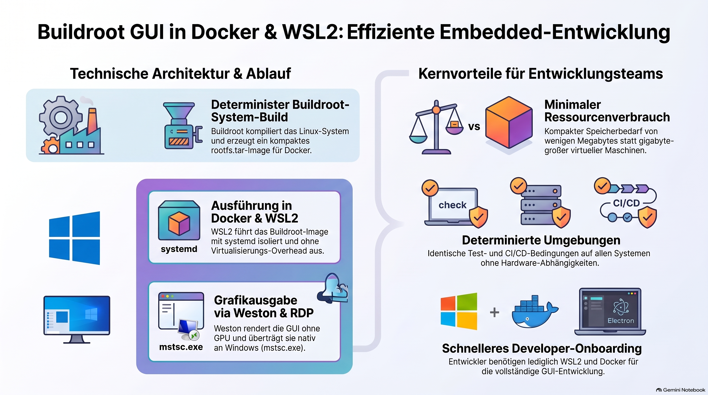

> [NOTE!]
> Karl Schmitt beschreibt in seinem Bericht ein **leichtgewichtettiges Linux-System**, das mithilfe von **Buildroot** maßgeschneidert und als **Docker-Container** unter **WSL2** ausgeführt wird. Diese innovative Architektur ermöglicht es, moderne grafische Programme wie **Electron** ohne physische Grafikkarte oder komplexe Virtualisierung direkt auf Windows-Rechnern zu betreiben. Für die Darstellung kommt ein **kopfloser Wayland-Kompositor (Weston)** zum Einsatz, welcher die grafische Benutzeroberfläche über einen integrierten **RDP-Server** direkt an den heimischen Windows-Client streamt. Durch diesen standardisierten und deterministischen Build-Prozess profitieren Entwicklungsteams von einer **hohen Portabilität**, schlanken Software-Paketen sowie einer vereinfachten Einbindung in kontinuierliche Integrationspipelines. Das Projekt schafft somit eine zukunftsfähige und kosteneffiziente Grundlage für die **Entwicklung und das Testen eingebetteter GUIs** auf herkömmlichen Arbeitsrechnern.

# 🗂️ Executive Summary

> [NOTE!]
> Goal: Buildroot‑Based GUI System Running in Docker on WSL2

## **Overview**

A lightweight, fully custom Linux system was successfully built using **Buildroot** and deployed inside **Docker on WSL2**, providing a reproducible, containerized environment capable of running modern graphical applications (including Electron) through **Weston’s headless Wayland compositor with RDP output**. This architecture enables GUI‑based embedded applications to run seamlessly on Windows machines without requiring dedicated hardware, GPUs, or complex virtualization.

## **Key Objectives**

* Create a minimal, reproducible Linux environment for GUI applications

* Run the system inside Docker on WSL2 for portability and developer convenience

* Provide remote GUI access via native Windows RDP

* Integrate custom applications (Electron) through Buildroot’s external package mechanism

* Ensure deterministic builds suitable for engineering teams and CI/CD pipelines

All objectives were achieved.

## **Technical Architecture**

### **1. Buildroot‑Generated Linux System**

* Uses **systemd** as init system

* Includes **Weston** (Wayland compositor) in headless mode

* Provides **RDP server** built directly into Weston

* Includes **Mesa** for software rendering (no GPU required)

* Integrates custom applications via Buildroot’s **external package tree**

* Produces a compact `rootfs.tar` image for container deployment

### **2. WSL2 + Docker Runtime**

* WSL2 provides a lightweight Linux kernel with near‑native performance

* Docker runs the Buildroot system as an isolated container

* RDP port (3389) is exposed to Windows for GUI access

* No virtualization overhead, no GPU passthrough, no X11 server required

### **3. GUI Delivery via RDP**

* Weston runs with the **headless backend** and **RDP output**

* Windows users connect using the built‑in `mstsc.exe` client

* Provides stable, low‑latency GUI rendering

* Ideal for Electron‑based control panels or embedded UIs

## **Operational Workflow**

1. Buildroot compiles the entire Linux system deterministically (`make`).

2. Output `rootfs.tar` is imported into Docker as an image.

3. Container is launched under WSL2 with systemd enabled.

4. Weston starts in headless mode and exposes an RDP server.

5. Windows users connect via RDP to interact with the GUI.

6. Electron or other Wayland applications run inside the container.

This workflow is fully automated and reproducible.

## **Benefits for Engineering Teams**

### **Technical**

* Minimal footprint (tens of MB instead of GB)

* Deterministic builds → identical environments across machines

* GUI support without GPU or X11

* Clean separation of concerns via external Buildroot packages

* Easy integration into CI/CD pipelines

### **Organizational**

* Faster onboarding: developers only need WSL2 + Docker

* Consistent environments across teams and machines

* Simplified deployment and testing of GUI applications

* Reduced infrastructure complexity

* Portable demos for stakeholders and customers

## **Strategic Value**

This architecture demonstrates a modern, efficient approach to embedded GUI development:

* **Runs anywhere** (Windows laptops, CI servers, cloud VMs)

* **Reproducible** (Buildroot ensures deterministic output)

* **Portable** (Docker image can be shared or deployed easily)

* **Future‑proof** (Wayland + Electron + containerization)

* **Cost‑effective** (no specialized hardware required)

It provides a strong foundation for developing, testing, and deploying embedded graphical systems in a scalable and maintainable way.
