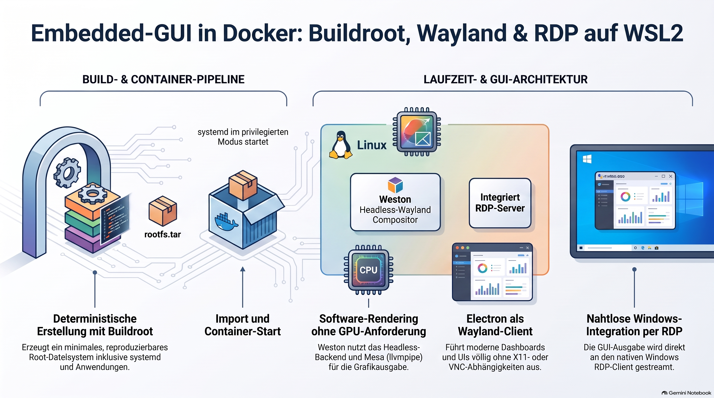

> [NOTE!]
> Karl Schmitt beschreibt eine innovative Methode zur Erstellung und Ausführung eines **maßgeschneiderten Linux-Systems**, das mithilfe von **Buildroot** generiert wird. Diese minimalistische Umgebung läuft containerisiert in **Docker** unter **WSL2**, wodurch moderne grafische Anwendungen wie **Electron** problemlos auf Windows-Rechnern ausgeführt werden können. Da keine physische Grafikkarte oder ein X11-Server nötig ist, übernimmt der **Weston-Compositor** im Headless-Modus die visuelle Darstellung. Die Verbindung zum Windows-Host erfolgt effizient über einen integrierten **RDP-Server**, der die Benutzeroberfläche direkt auf den Bildschirm streamt. Insgesamt bietet diese Architektur eine **hohe Reproduzierbarkeit**, einen geringen Ressourcenbedarf sowie eine ideale Lösung für die moderne und containerbasierte Softwareentwicklung.

# 🗂️ Technical Deep‑Dive

> [NOTE!]
> Goal: Buildroot‑Generated Wayland/RDP System Running in Docker on WSL2

## **1. Introduction**

Karl Schmitt provides a detailed technical overview of a custom Linux system built using **Buildroot**, deployed inside **Docker** on **WSL2**, and capable of running modern GUI applications (including Electron) via **Weston’s headless Wayland compositor with RDP output**.

The system is designed for:

* reproducibility

* minimal footprint

* containerized GUI execution

* seamless Windows integration

* embedded‑style application development

# **2. System Architecture Overview**

## **2.1 High‑Level Architecture**

Code

```
+-----------------------------------------------------------+
|                       Windows 11                          |
|  - WSL2 subsystem                                         |
|  - Docker Engine                                          |
|  - RDP Client (mstsc.exe)                                 |
+-------------------------------+---------------------------+
                                |
                                | RDP (TCP/3389)
                                |
+-------------------------------v---------------------------+
|                     Docker Container                      |
|  Buildroot Linux System                                   |
|  - systemd                                                 |
|  - Weston (headless backend + RDP server)                 |
|  - Mesa (software rendering)                              |
|  - Electron application                                   |
+-----------------------------------------------------------+
```

### **Key Characteristics**

* No GPU required (software rendering via Mesa)

* No X11 server required

* No VNC server required

* Native Windows RDP client provides GUI access

* Fully reproducible Buildroot‑generated root filesystem

# **3. Buildroot System Composition**

## **3.1 Core Components**

The Buildroot configuration includes:

### **systemd**

* Provides a modern init system

* Enables service management for Weston and custom apps

* Supports container‑friendly boot sequences

### **Weston (Wayland compositor)**

* Runs with the **headless backend**

* Provides a built‑in **RDP server**

* Ideal for containerized GUI environments

* Eliminates need for GPU passthrough

### **Mesa (llvmpipe)**

* Software‑based OpenGL rendering

* Ensures GUI apps run without hardware acceleration

### **Electron**

* Packaged via Buildroot’s external tree

* Runs as a Wayland client inside Weston

* Suitable for dashboards, control panels, and embedded UIs

### **Custom External Packages**

Buildroot external tree structure:

Code

```
buildroot-external/
    Config.in
    external.mk
    package/
        electron/
        hello-electron/
```

This allows modular development and clean separation of custom application logic.

# **4. Build Pipeline**

## **4.1 Buildroot Build Process**

The entire system is built using:

Code

```
make
```

Buildroot performs:

1. Cross‑toolchain generation

2. Compilation of all selected packages

3. Assembly of the root filesystem

4. Integration of systemd units

5. Installation of Weston, Mesa, Electron

6. Creation of final images under `output/images/`

### **Primary Output**

* `rootfs.tar` → Docker‑ready

* `rootfs.ext2/ext4` → VM/QEMU

* Optional kernel image (if enabled)

# **5. Containerization Model**

## **5.1 Docker Image Creation**

The Buildroot‑generated root filesystem is imported directly:

Code

```
docker import output/images/rootfs.tar buildroot-image
```

This produces a minimal, deterministic container image.

## **5.2 Container Execution**

The container is started with systemd:

Code

```
docker run -it --privileged -p 3389:3389 buildroot-image /sbin/init
```

### Why `--privileged`?

* systemd requires cgroups

* Weston needs access to `/dev` namespaces

* RDP server requires socket permissions

# **6. Wayland + RDP Runtime Model**

## **6.1 Weston Headless Mode**

Inside the container:

Code

```
weston --backend=headless-backend.so --rdp --socket=wayland-0
```

### Responsibilities:

* Creates a virtual framebuffer

* Runs Wayland compositor without GPU

* Exposes RDP server on port 3389

* Manages Wayland clients (Electron, etc.)

## **6.2 Windows RDP Integration**

Windows connects using:

Code

```
mstsc.exe /v:localhost:3389
```

### Benefits:

* Native Windows client

* Low latency

* High stability

* No additional software required

# **7. Application Execution Model**

## **7.1 Electron on Wayland**

Electron runs as a Wayland client inside Weston:

* Uses Mesa llvmpipe for rendering

* No X11 dependencies

* No GPU required

* Suitable for embedded dashboards

## **7.2 Systemd Autostart**

Electron and Weston can be managed via systemd units:

Code

```
/etc/systemd/system/weston.service
/etc/systemd/system/electron.service
```

This enables:

* automatic startup

* crash recovery

* logging via journald

# **8. Reproducibility & CI/CD Integration**

## **8.1 Deterministic Builds**

Buildroot ensures:

* identical output across machines

* pinned versions

* reproducible toolchains

* minimal dependency footprint

## **8.2 CI/CD Pipeline**

Typical workflow:

1. Buildroot runs in CI

2. `rootfs.tar` stored as artifact

3. Docker image built automatically

4. Deployed to WSL2 or cloud

5. RDP access for QA, demos, or automated testing

# **9. Engineering & Organizational Benefits**

## **Technical**

* Minimal system footprint

* No GPU or X11 required

* Clean Wayland architecture

* Deterministic builds

* Easy container deployment

* Stable GUI via RDP

## **Organizational**

* Faster onboarding

* Consistent developer environments

* Portable demos for stakeholders

* Reduced infrastructure complexity

* Clear separation of system layers

# **10. Summary**

This system demonstrates a modern, efficient approach to embedded GUI development:

* **Buildroot** provides a reproducible, minimal Linux system

* **Docker** provides portability and isolation

* **WSL2** provides near‑native Linux performance on Windows

* **Weston headless + RDP** provides a stable GUI pipeline

* **Electron** provides a flexible application platform

The result is a **lightweight, deterministic, GUI‑capable Linux environment** that runs seamlessly on Windows machines and integrates cleanly into modern development workflows.

If you want, I can also prepare:

* a **diagram‑only architecture note**

* a **Zettelkasten atomic note set (20+ cards)**

* a **slide‑deck version**

* a **developer onboarding guide**

Just tell me which format you want next.
