# Git Rebase Tutorial with Visual Studio Code

This tutorial shows you how to use **Git Rebase inside VS Code** using both:

* the **Visual Studio Code UI**
* the integrated **terminal**
* optional conflict resolution tools

You will learn:

1. What rebase is
2. Why developers use it
3. How to rebase a feature branch onto `main`
4. How to solve conflicts in VS Code
5. How to continue, abort, and finish a rebase safely

---

# 1. What Is Git Rebase?

`git rebase` moves your branch commits onto a new base commit.

Instead of creating a merge commit, rebase rewrites history so the branch appears to have started from the latest `main`.


---

## Before Rebase

```text
main:     A---B---C
               \
feature:        D---E
```

`main` received new commit `C`.


---

## After Rebase

```text
main:     A---B---C
                   \
feature:            D'---E'
```

Your feature commits are replayed on top of `C`.

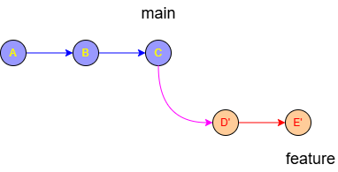

---

# 2. Why Use Rebase?

Benefits:

* Cleaner history
* Fewer unnecessary merge commits
* Easier pull requests
* Easier code review
* Common in professional teams

---

# 3. Setup Example

Imagine:

```bash
main
```

and

```bash
feature/test
```

You want to update `feature/login` with the newest changes from `main`.

### Open a sandbox project on GitHub

I will use my sandbox on [GitHub](https://github.com/):

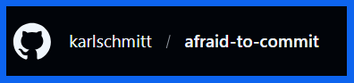

Let's add a test HTML file using the 🔗 [template](https://www.freecodecamp.org/news/html-starter-template-a-basic-html5-boilerplate-for-index-html/) from free code camp:


Choose the option create new file:

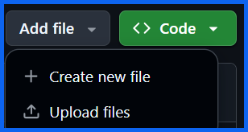

Create the test HTML:

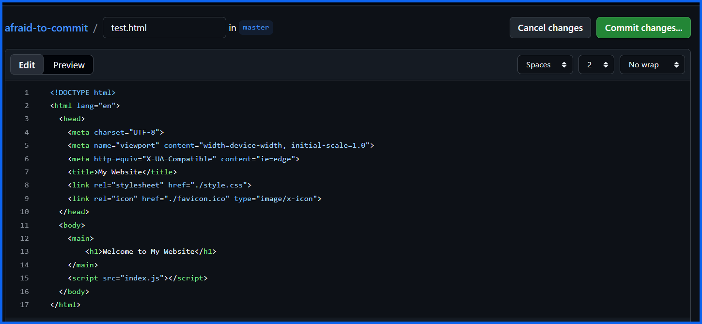

Let's commit revision "A":

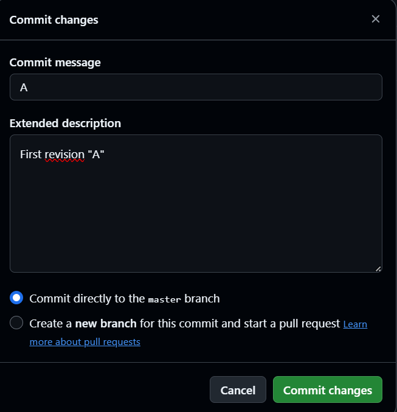

Commit the changes by pressing the green "Commit changes" button:

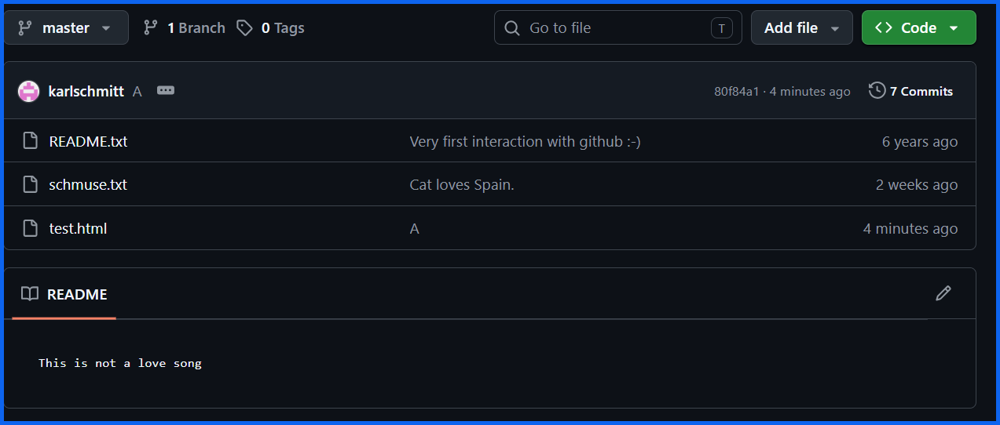

Now you can see the HTML test file in the toplevel directory of the GitHub reository. 

In case you get stuck feel free to ask GitHub Copilot for help: 

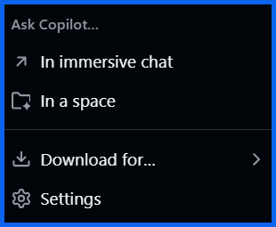

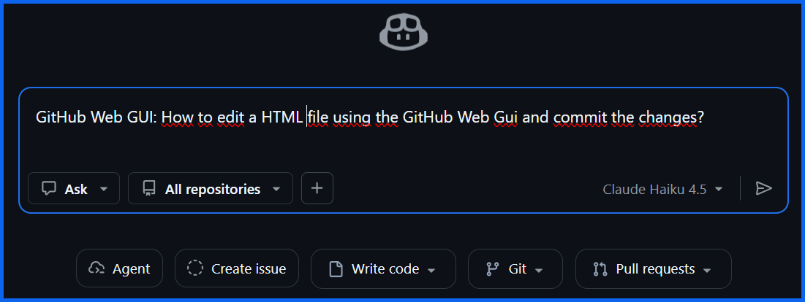

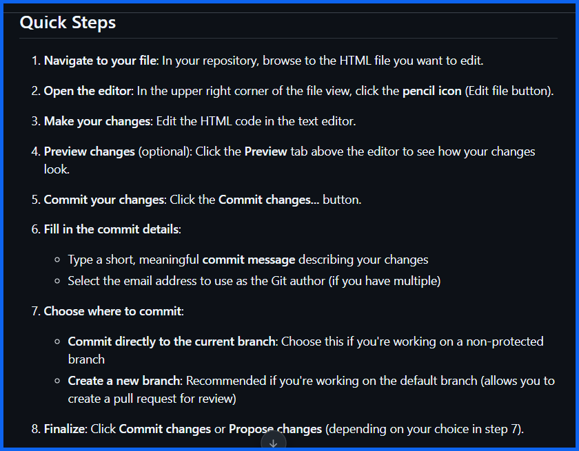

1. Klick on the test.html file it will open the Web editor
2. Klick on the pencile icon on the right and select "in place"
3. Now you can edit the file
4. Change the HTML <title> tag
5. Change the HTML <h1> tag to the string "First changes in main branch"
6. Add an ordered list <ol> with three list items <li>
7. And commit the changes as revision "B"

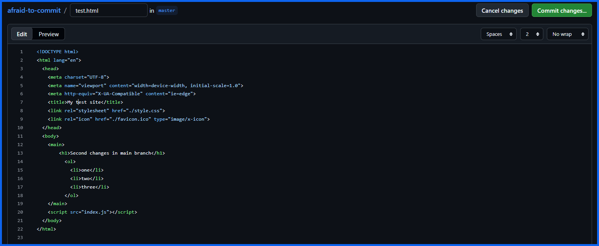

Let's commit those changes on the main branch as revision "B":

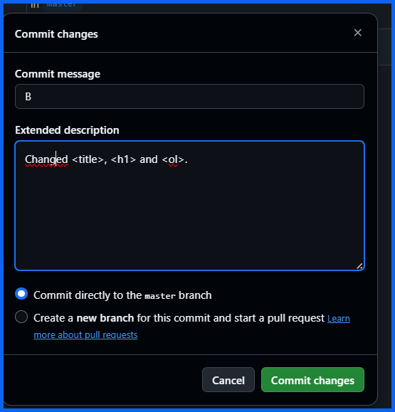

Now we have two revisions on the GitHub main branch:
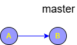

We can create the _"feature/test"_ branch now on GitHub, and we are done with the initial setting:

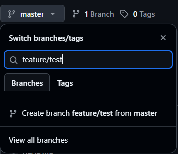


Eventually you can create a directory locally and clone your repository into it :
```powershell
mkdir D:\playground\git-rebase-with-powershell-and-vsc
cd D:\playground\git-rebase-with-powershell-and-vsc
git clone git@github.com:karlschmitt/afraid-to-commit.git
```

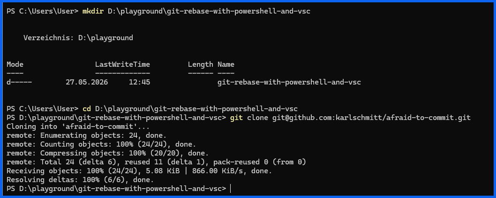

After typing ```git status``` Git reminds me of some housekeeping:

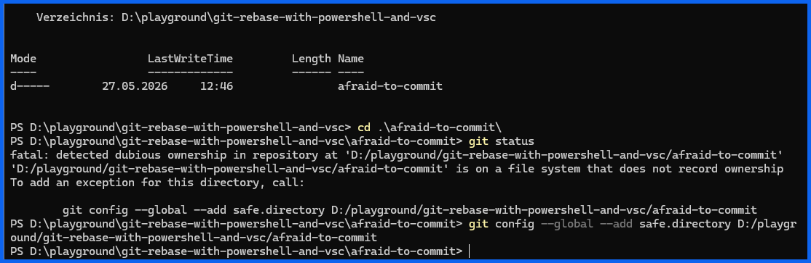

---

# 4. Open the Project in VS Code


Open your repository in:

[Visual Studio Code](https://code.visualstudio.com?utm_source=chatgpt.com)

In the repository directory you can type ```code .```:

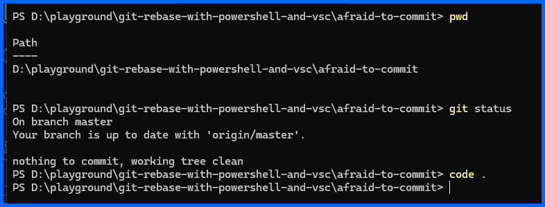

Visual Studio Code asks for trust and we say "yes":

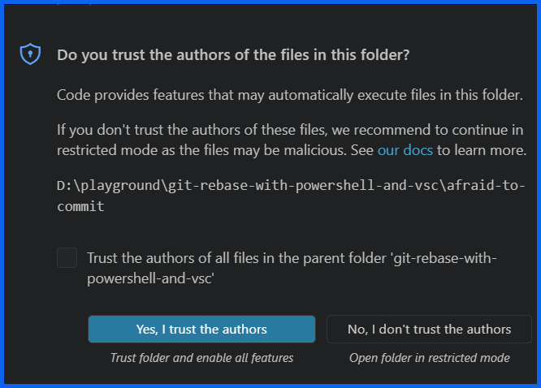

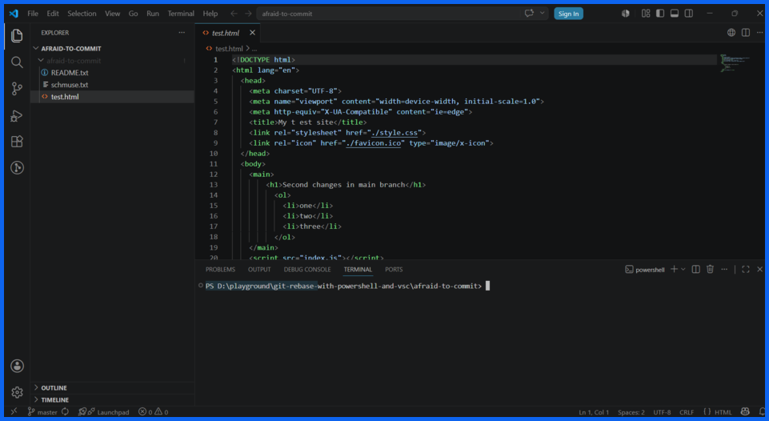

---

# 5. Check Current Branch

Open the VS Code terminal:

```text
Terminal → New Terminal
```

Run:

```bash
git branch
```

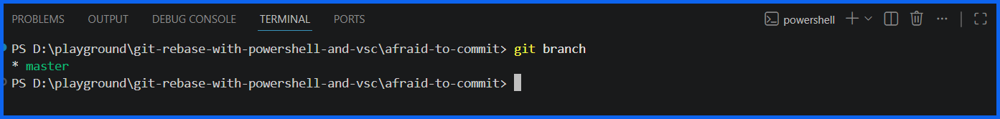

In this case only master is visible, on GitHub there is also _featue/test_:

```text
   feature/test
*  master
```

The `*` shows your current branch.

---

# 6. Fetch Latest Changes and change both branches

Always fetch first:

```bash
git fetch origin
```

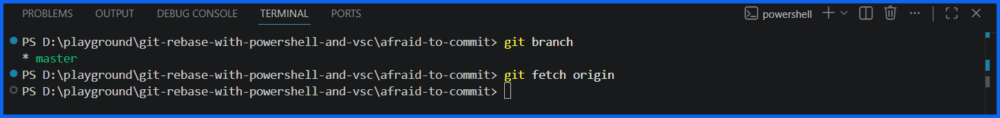

This updates remote references.
Let's create the _feature/test_ branch locally:

### Now let's change locally in the branch _feature/test_
```powershell
git switch -c feature/test
```

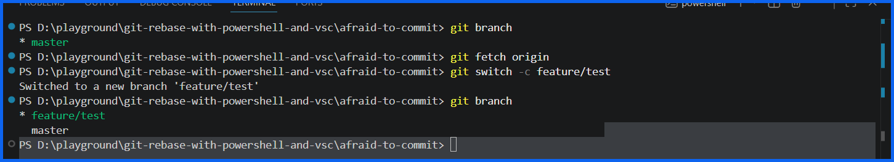

Now let's change the HTML test file and commit the changes:

1. Change the <title> of the test.html file, and commit as "C"
2. Change <h1> of the the test.html file, and commit as "D"
3. Change the <ol> of the test.html file,  and commit as "E"
4. And "Sync" with GitHub

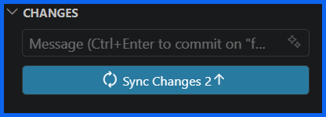

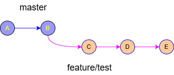

### Now let's change remotly in the branch _master_


---

# 7. Start the Rebase

While on your feature branch:

```bash
git rebase origin/main
```

OR if your local `main` is updated:

```bash
git rebase main
```

---

# 8. What Happens During Rebase?

Git takes your commits one by one:

```text
D
E
```

and reapplies them on top of `main`.

---

# 9. Successful Rebase

If there are no conflicts:

```text
Successfully rebased and updated refs/heads/feature/login
```

Done.

---

# 10. Handling Rebase Conflicts in VS Code

Sometimes Git cannot automatically merge files.

You will see:

```text
CONFLICT (content): Merge conflict in app.ts
```

VS Code becomes extremely helpful here.

---

# 11. Open the Source Control Panel

Click:

```text
Source Control Icon
```

or press:

```text
Ctrl + Shift + G
```

Conflicted files appear there.

---

# 12. VS Code Conflict Editor

Click a conflicted file.

VS Code shows options like:

* Accept Current Change
* Accept Incoming Change
* Accept Both Changes
* Compare Changes

---

## Example Conflict

```ts
<<<<<<< HEAD
const api = "v2";
=======
const api = "v1";
>>>>>>> commit-hash
```

VS Code provides buttons instead of manually editing markers.

---

# 13. Resolve the Conflict

Choose the correct code.

Then save the file.

---

# 14. Stage the Resolved File

After fixing:

```bash
git add app.ts
```

Or use the `+` button in Source Control.

---

# 15. Continue the Rebase

Run:

```bash
git rebase --continue
```

Git continues replaying commits.

You may repeat this process several times.

---

# 16. Abort the Rebase

If everything becomes messy:

```bash
git rebase --abort
```

This restores the branch to its original state.

Very useful.

---

# 17. Skip a Commit

Sometimes one commit is unnecessary:

```bash
git rebase --skip
```

Usually rare for beginners.

---

# 18. Interactive Rebase (Very Important)

Interactive rebase lets you:

* rename commits
* squash commits
* reorder commits
* delete commits

---

## Start Interactive Rebase

Example:

```bash
git rebase -i HEAD~3
```

This means:

> "Interactively edit the last 3 commits."

---

# 19. VS Code Opens the Rebase Editor

You might see:

```text
pick a1b2c3 Added login form
pick d4e5f6 Fixed button color
pick g7h8i9 Cleanup
```

---

# 20. Common Interactive Commands

Change `pick` to:

| Command | Meaning                         |
| ------- | ------------------------------- |
| pick    | keep commit                     |
| reword  | rename message                  |
| squash  | combine commits                 |
| fixup   | combine without keeping message |
| drop    | remove commit                   |

---

# 21. Squashing Commits Example

Before:

```text
pick a1 Add login
pick b2 Fix typo
pick c3 Fix button
```

Change to:

```text
pick a1 Add login
squash b2 Fix typo
squash c3 Fix button
```

Result:

```text
One clean commit
```

Very common workflow.

---

# 22. Finish Interactive Rebase

Save and close the editor.

VS Code usually opens another editor for the final commit message.

Save again.

Done.

---

# 23. Rebase Using VS Code GUI

Modern versions of VS Code support Git actions from the interface.

Open Command Palette:

```text
Ctrl + Shift + P
```

Search:

```text
Git: Rebase Branch
```

Then choose:

* current branch
* target branch (`main`)

VS Code runs the rebase for you.

---

# 24. Force Push After Rebase

Because rebase rewrites history:

```bash
git push --force-with-lease
```

Use:

```bash
--force-with-lease
```

instead of plain `--force`.

Safer.

---

# 25. Important Rule

Avoid rebasing shared public branches unless your team expects it.

Safe targets:

* personal feature branches
* local cleanup before pull requests

---

# 26. Recommended Beginner Workflow

## Daily Workflow

```bash
git checkout main
git pull

git checkout feature/login
git rebase main
```

Resolve conflicts if needed.

[Handling Rebase Conflicts](../Handling_Rebase_Conflicts.md)

Then:

```bash
git push --force-with-lease
```

---

# 27. Helpful VS Code Extensions

Useful Git extensions:

* [GitLens](https://marketplace.visualstudio.com/items?itemName=eamodio.gitlens&utm_source=chatgpt.com)
* [Git Graph](https://marketplace.visualstudio.com/items?itemName=mhutchie.git-graph&utm_source=chatgpt.com)

They visualize rebases and commit history very nicely.

---

# 28. Beginner Practice Exercise

Create a practice repository:

```bash
mkdir git-rebase-demo
cd git-rebase-demo

git init
```

Create branches and commits intentionally.

Then practice:

* rebasing
* conflicts
* squashing
* aborting

This is the fastest way to learn.

[Git rebase mini practce exercise](./Git_rebase_mini_practce_exercise.md)

---

# 29. Essential Commands Cheat Sheet

```bash
git fetch origin
git rebase main
git rebase origin/main

git rebase --continue
git rebase --abort
git rebase --skip

git rebase -i HEAD~3

git push --force-with-lease
```

---

# 30. Mental Model

Think of rebase as:

> "Move my work onto the newest version of the project."

Git copies your commits and reapplies them elsewhere.

That is why commit hashes change during rebase.

---

# Recommended Next Topics

After learning rebase, study:

1. `git merge`
2. `git cherry-pick`
3. `git reflog`
4. `git stash`
5. advanced conflict resolution
6. pull request workflows
7. Git branching strategies

A very useful next tool for rebasing is:

[Official Git Documentation — git rebase](https://git-scm.com/docs/git-rebase?utm_source=chatgpt.com)
