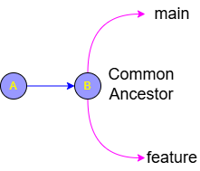
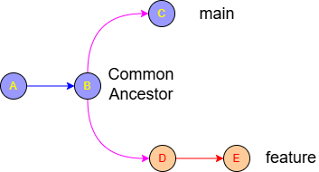

# Git common ancestor

In Git, the **common ancestor** (technically called the **merge base**) is the most recent commit that two different branches share. 

Think of it as the "fork in the road"—it is the last point in time where the history of both branches was exactly the same.

---

### 1. Visualizing the Common Ancestor

Imagine you are working on a project. You create a `feature` branch from `main` at **Commit B**.

```text
          (main)
         /
A --- B 
       \
        (feature)
```
At this specific moment, **Commit B** is the common ancestor.



Now, work happens on both branches:
1. You add commits **D** and **E** to `feature`.
2. Someone else adds commit **C** to `main`.

```text
        C (main)
       /
  A --- B  <-- COMMON ANCESTOR
       \
        D --- E (feature)
```

Even though both branches have moved forward, **Commit B** remains the common ancestor because it is the "youngest" commit that appears in the history of both branches.




---

### 2. Why is it vital for Rebase?

The common ancestor is the "starting line" for the rebase process. When you run `git rebase main` while on the `feature` branch, Git uses the common ancestor to perform three steps:

1.  **Identification:** Git looks back to find the common ancestor (**B**).
2.  **Isolation:** Git identifies all commits on your current branch that happened *after* that ancestor (**D** and **E**).
3.  **Relocation:** Git takes those unique commits (**D, E**) and prepares to move them to the current tip of the target branch (**C**).

Without a common ancestor, Git wouldn't know which commits belong to your feature and which ones are already part of the main project.

---

### 3. What happens if there is no common ancestor?

This is rare in standard workflows, but it can happen if you try to rebase or merge two branches from two entirely different projects that were never connected.

If Git cannot find a common ancestor, you will get an error:
> `fatal: refusing to merge unrelated histories`

---

### 4. How to find the common ancestor manually

If you ever want to see exactly which commit Git considers the common ancestor between two branches, you can use the `merge-base` command:

```bash
git merge-base main feature
```
This will output the **SHA (hash)** of the common ancestor commit.

### Summary

The **common ancestor** is the point of divergence. It tells Git: *"This is where these two branches stopped being the same. Everything after this point on the feature branch is what needs to be moved during a rebase."*