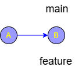
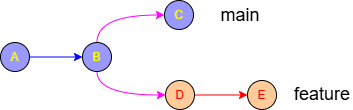
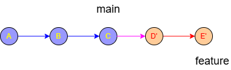

# Diverged Path

In Git, a **diverged path** occurs when two branches that share a common ancestor have both moved forward with their own unique commits.

Because both branches have "new" information that the other doesn't have, Git can no longer simply "fast-forward" (slide the pointer) one b ranch to the tip of the other. They have gone in different directions, like a fork in a road.

---

### 1. The Visual Representation
Imagine you are working on a `feature` branch that you started from `main`.

**At the start:**
Both branches are at the same point.
```text
A --- B (main)(feature)
```



**The divergence:**
1. You make two commits (**D** and **E**) on your `feature` branch.
2. Meanwhile, a teammate merges work into `main`, creating commit **C**.

The path now looks like this:
```text
        C (main)
       /
  A --- B 
       \
        D --- E (feature)
```
The branches have **diverged** at commit **B**. 
Commit **B** is the "==Common Ancestor==."



---

### 2. When do you see this?

You will most commonly encounter the "diverged" warning in two scenarios:

#### Scenario A: Local vs. Remote

You try to `git push`, but Git rejects it, saying:
> *"Your branch and 'origin/main' have diverged, and have 1 and 1 different commits each, respectively."*

This means you committed something locally, but someone else pushed a different commit to the server while you were working.

#### Scenario B: Feature vs. Base
You want to bring the latest changes from `main` into your `feature` branch. Because both branches have new work, the paths are diverged.

---

### 3. How Rebase Handles a Diverged Path
When you use **Rebase** to resolve a diverged path, you are essentially saying: *"Take my unique changes, temporarily set them aside, move my starting point to the tip of the other branch, and then apply my changes back on top."*

Using the diagram above, if you are on `feature` and run `git rebase main`:

1.  Git finds the common ancestor (**B**).
2.  It takes your commits (**D, E**) and saves them to a temporary area.
3.  It moves your `feature` branch pointer to the current tip of `main` (**C**).
4.  It applies your commits (**D, E**) one by one onto **C**.

**The Resulting Path:**
```text
A --- B --- C (main) --- D' --- E' (feature)
```

 

> [!NOTE]
> D and E become D' and E' because they are technically new commits with new hashes.*

---

### 4. Rebase vs. Merge for Divergence

*   **Merge:** Creates a new "Merge Commit" that joins the two paths together. It preserves the history of the divergence.
*   **Rebase:** Rewrites the history so it looks like a straight line. It eliminates the "diverged path" by making it appear as if you started your work only after the other branch was finished.

### Summary
A **diverged path** means:
*   You have commits the other branch doesn't have.
*   The other branch has commits you don't have.
*   History is no longer linear and requires either a **Merge** or a **Rebase** to sync.