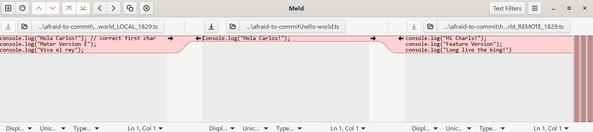

To select specific lines from one file to another during a merge, 
you need to use Meld as your Git merge tool.
Git's native `cherry-pick` command applies entire commits, 
but Meld allows line-by-line editing.

## Phase 1: Start the Merge and Launch Meld

When a conflict occurs during a merge, launch the visual interface:

1. Run `git mergetool`.
2. Meld will open a three-pane window.

## Phase 3: Select Specific Lines (Left to Right)

In the three-pane Meld view, your files are arranged standardly: \[6]

* Left Pane (LOCAL): Your current branch changes.
* Middle Pane (BASE): The common ancestor. This file will become your final merged output.
* Right Pane (REMOTE): The changes from the branch you are merging in.

To cherry-pick specific lines from the left pane to the right/middle:

* Scroll to the conflicted line (marked in red or blue).
* Hold the `Ctrl` key (Windows/Linux) or `Command` key (Mac).
* Click the arrow (`->`) next to the **specific line** in the left pane.
* The arrow will insert that **specific line** into the middle pane without overwriting the rest of the block.
* Alternatively, right-click the line block to choose Copy left or Merge left.

## Phase 4: Save and Commit

1. Save the changes in the middle pane (`Ctrl + S`).
2. Close Meld.
3. Run `git merge --continue` or `git commit` in your terminal to finish.

To help tailor this, let me know:

* What operating system are you running?
* Are you resolving a standard merge or a git rebase conflict?
* Do you want to automatically delete the backup `.orig` files Git creates after merging?

