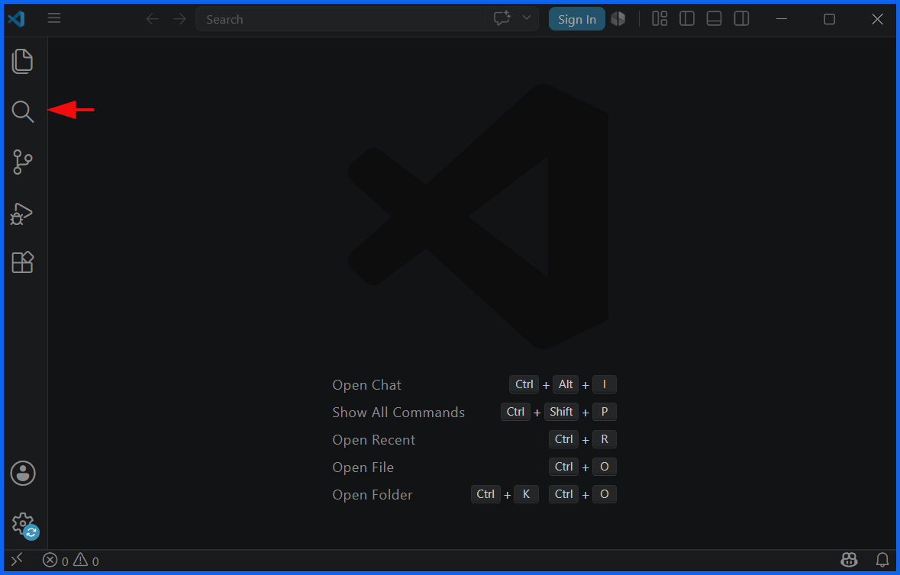

# Search in Visual Studio Code

To search in [Visual Studio Code](https://code.visualstudio.com/), use the global search shortcut `Ctrl + Shift + F` (Windows/Linux) or `Cmd + Shift + F` (macOS) to find text across your entire workspace.

The application offers several highly optimized search methods tailored to what you need to find.

## 1. Search Text Within the Current File

If you only need to find code or text inside the document you are currently looking at, use the standard [VS Code Basic Editing](https://code.visualstudio.com/docs/editing/codebasics) features:

* Open Find box: Press `Ctrl + F` (Windows) or `Cmd + F` (macOS).
* Quick Tip: Highlight a word first, then press the shortcut to auto-populate the search field.

## 2. Search Text Across All Files (Global Search)

To search your entire project codebase:

* Open Search Panel: Press `Ctrl + Shift + F` or `Cmd + Shift + F`.
* Click Instead: Select the Magnifying Glass icon in the Activity Bar on the far left side.
* Pro-tip: Double-cligck any word in your editor, then press the shortcut to instantly find it everywhere without typing.

## 3. Advanced Filtering & Scoping Options

When using Global Search, you can expand the arrow or ellipsis (`...`) under the input box to access advanced filters:

* Match Case (`Aa`): Enforces case-sensitive matching.
* Match Whole Word (`|ab|`): Prevents matching partial words (e.g., searching "in" won't bring up "inside").
* Use Regular Expressions (`.*`): Allows complex pattern matching using regex syntax.
* Files to Include: Restricts the search to specific folders or extensions (e.g., `src/, *.js`).
* Files to Exclude: Ignores specific paths like `node_modules/` or build artifacts. \[1, 10, 12, 13, 14]

## 4. Search and Find Files by Name

If you are looking for a specific file rather than the text inside it, use the [VS Code Code Navigation](https://code.visualstudio.com/docs/editing/editingevolved) toolkit: \[15, 16]

* Open Quick Open: Press `Ctrl + P` (Windows) or `Cmd + P` (macOS).
* Type Name: Begin typing the file name to see an instant list of matching files.
* Use Wildcards: Use the `*` symbol to bridge parts of a name you cannot remember. \[2, 15, 17, 18, 19]

## 5. Search for Functions, Methods, or Symbols \[20]

To jump straight to a specific class or function layout without browsing code lines: \[21, 22]

* In current file: Press `Ctrl + Shift + O` (Windows) or `Cmd + Shift + O` (macOS).
* Across workspace: Press `Ctrl + T` (Windows) or `Cmd + T` (macOS). \[2, 21, 23, 24, 25]

[A deep dive on find in files, replace, search editors and more!](https://www.youtube.com/watch?v=Uc4I4ByUe0A), YouTube · Code 2020 · 2022 M04 20

If you are trying to narrow down a specific issue, tell me:

* Are you looking to replace text simultaneously across your files?
* Do you need help formatting a regular expression (Regex) for a complex pattern? \[26]

I can provide the exact steps or expressions to make your workflow faster.

\[1] [https://www.youtube.com](https://www.youtube.com/watch?v=ZHraF8IGX-M)

\[2] [https://stackoverflow.com](https://stackoverflow.com/questions/45440198/how-search-for-method-in-vscode)

\[3] [https://www.youtube.com](https://www.youtube.com/watch?v=ekeQVsHpuDk)

\[4] [https://www.wearedevelopers.com](https://www.wearedevelopers.com/en/magazine/200/vs-code-shortcuts)

\[5] [https://code.visualstudio.com](https://code.visualstudio.com/docs/editing/codebasics)

\[6] [https://www.youtube.com](https://www.youtube.com/shorts/2ruyJcYLIc0)

\[7] [https://www.youtube.com](https://www.youtube.com/watch?v=Uc4I4ByUe0A)

\[8] [https://www.reddit.com](https://www.reddit.com/r/vscode/comments/92uvqt/use_only_one_key_binding_to_get_search_text_under/)

\[9] [https://jsmanifest.com](https://jsmanifest.com/21-vscode-shortcuts-to-code-faster-and-funner)

\[10] [https://www.youtube.com](https://www.youtube.com/watch?v=KquNgY_8YaM)

\[11] [https://www.youtube.com](https://www.youtube.com/watch?v=YNDNz06eqZ8\&t=12)

\[12] [https://www.youtube.com](https://www.youtube.com/watch?v=V0r4Zh2pbns\&t=5)

\[13] [https://wasabigeek.com](https://wasabigeek.com/blog/reading-a-ruby-gem-with-vscode/)

\[14] [https://www.rapiddg.com](https://www.rapiddg.com/article/tools-trade-vs-code-search)

\[15] [https://code.visualstudio.com](https://code.visualstudio.com/docs/editing/editingevolved)

\[16] [https://learn.microsoft.com](https://learn.microsoft.com/en-us/visualstudio/ide/visual-studio-search?view=visualstudio)

\[17] [https://www.joeltok.com](https://www.joeltok.com/posts/2024-04-search-file-in-vscode/)

\[18] [https://www.youtube.com](https://www.youtube.com/watch?v=EfYvp2GEXuY)

\[19] [https://www.sitepoint.com](https://www.sitepoint.com/visual-studio-code-keyboard-shortcuts/)

\[20] [https://devblogs.microsoft.com](https://devblogs.microsoft.com/visualstudio/introducing-a-new-way-to-search-your-code-and-visual-studio-features/)

\[21] [https://superuser.com](https://superuser.com/questions/1777301/how-to-list-search-files-with-a-certain-name)

\[22] [https://umarfarooquekhan.medium.com](https://umarfarooquekhan.medium.com/10-essential-vs-code-shortcuts-to-boost-your-coding-productivity-540e224378eb)

\[23] [https://stackoverflow.com](https://stackoverflow.com/questions/76026977/how-to-list-all-symbols-in-current-file-and-search-one-from-the-list-in-visual-s)

\[24] [https://tinytip.co](https://tinytip.co/tips/vscode-symbol-navigation/)

\[25] [https://www.youtube.com](https://www.youtube.com/watch?v=qecJN08PuB4)

\[26] [https://www.hulkapps.com](https://www.hulkapps.com/blogs/shopify-hub/mastering-how-to-search-in-shopify-code-a-comprehensive-guide-for-developers-and-merchants)
