# Git mini rebase practice exercise

### Create demo git repo:

```bash
mkdir git-rebase-demo
cd git-rebase-demo

git init
```
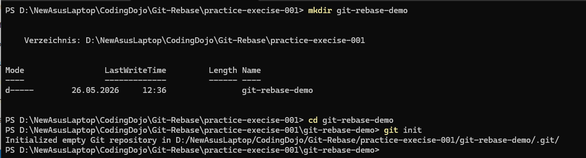


### Create commits on main branch:

```bash
echo "A" > file.txt
git add .
git commit -m "A"

echo "B" >> file.txt
git commit -am "B"
```

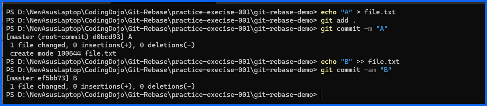

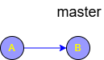

### Create feature branch:

```bash
git checkout -b feature
```

Add commits:

```bash
echo "Feature 1" >> file.txt
git commit -am "C"
# or
git commit -am "Feature 1"
```

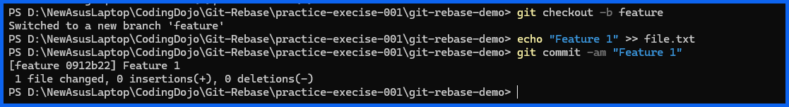

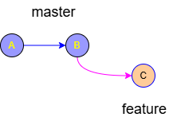

### Return to main/master:

Sometimes the main branch is called master. 
```bash
git checkout main
# or
git checkout master
```
Add more commits on the main/master branch:
```bash
echo "Main update" >> file.txt
# or
echo "Master update" >> file.txt
git commit -am "D"
# or
git commit -am "D"
```
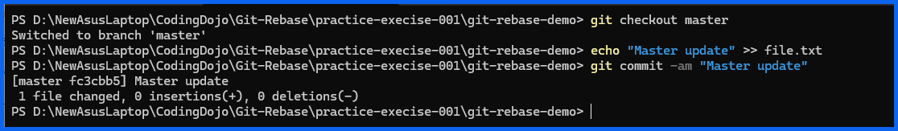

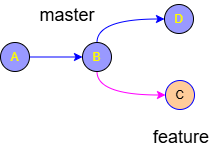

### Now rebase master onto feature:
```bash
git checkout feature
git rebase main
# or
git rebase master
```
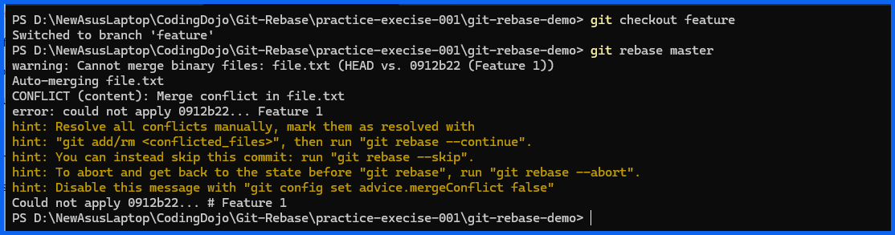

Now lets look at the ```git status``` report, here you can see a conflict:
```powershell
git status
```
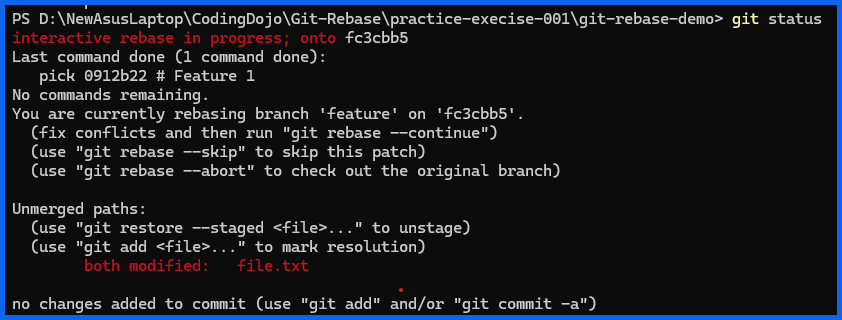

Fixing the conflict using Neovim:
```powershell
nvim file.txt
```

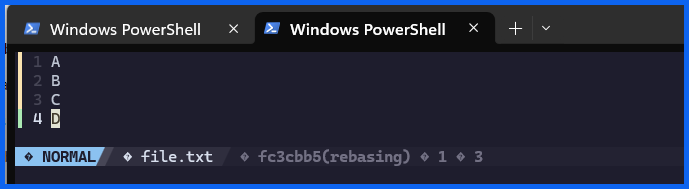

Now let's continue the rebase:
```powershell
git add file.txt
git rebase --continue
```
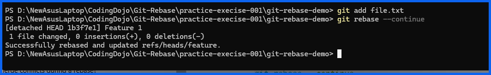

Let's do a final ```git status```:

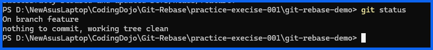

Perfect beginner exercise.

***
