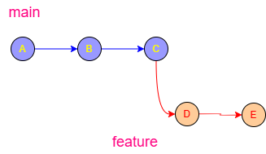
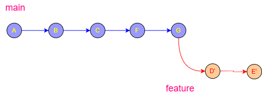

# Git Rebase Tutorial 📚

`git rebase` is one of the most useful — and most misunderstood — Git commands.

It helps you:

* keep a clean commit history

* move your work onto newer commits

* avoid unnecessary merge commits

* edit/squash/reorder commits before sharing them


General information about Git rebase can be found:  [Git rebase ...](https://git-scm.com/docs/git-rebase)

Here you can learn about Git rebase:

1. [Learn git rebase ...](https://www.gitkraken.com/learn/git/git-rebase)
2. [Again learn git rebase ...](https://intellipaat.com/blog/git-rebase/)
3. [Gitlab learn git rebase ...](https://docs.gitlab.com/topics/git/git_rebase/)
4. [Cherry pick and rebase ...](https://dojofive.com/blog/the-git-cherry-pick-and-git-rebase-interactive-combo/)

***

# 1. What Is Rebase?


Git rebase is a command that moves or "replays" a sequence of commits from one branch onto a new base commit.

Instead of combining two branches with a "merge commit," rebasing rewrites the project history so that your changes appear to have been built sequentially on top of the latest work from another branch (like main).


#### Why Use Rebase?

* Clean History: It creates a linear, straight-line path of commits that is much easier to read than a "spaghetti" history of merges.
* Avoid Merge Commits: It prevents the "Merge branch 'main' into 'feature'" commits that often clutter logs.
* Polished Commits: You can use "interactive rebase" (git rebase -i) to squash small fixes into one clean commit or reword old messages.
* Simpler Conflict Resolution: Conflicts are resolved one commit at a time during the replay, rather than all at once in a massive merge.

------------------------------
### How It Works

   1. Detach: Git temporarily "parks" your unique commits in a safe place.
   2. Reset: Your branch is reset to match the latest state of the target branch (e.g., main).
   3. Replay: Git takes your parked commits and applies them one-by-one onto the new tip of the branch.
   4. Rewrite: Because the base has changed, Git creates brand new commits with different IDs (hashes).

------------------------------
### ⚠️ The Golden Rule of Rebasing

Never rebase commits that you have already pushed to a public/shared branch.

Since rebase rewrites history by creating new commit IDs, anyone else working on that branch will see their history as diverged and broken. 

Only rebase local branches that only you are working on.

| Feature | Git Merge | Git Rebase |
|---|---|---|
| History | Preserves exact chronological history | Creates a clean, linear history |
| Traceability | Keeps "Merge commits" as context | No extra merge commits; looks like a straight line |
| Risk | Safe and non-destructive | Riskier; rewrites history (use only locally) |

------------------------------
If you'd like, I can show you:

* The exact commands to run for a standard rebase.
* How interactive rebase works for "squashing" commits.
* How to fix conflicts if the rebase stops halfway. [22] 


---

Imagine this history:

```text
main
A---B---C

feature
     \
      D---E
```



Meanwhile, `main` receives new commits:
```text
main
A---B---C---F---G

feature
     \
      D---E
```


You want your feature branch to look like it started from `G`.

With rebase:

```bash
git checkout feature
git rebase main
```

Git rewrites your commits (`D`, `E`) onto the latest `main`.

Result:

```text
main
A---B---C---F---G

feature
                 \
                  D'---E'
```



Notice:

* `D'` and `E'` are NEW commits

* history becomes linear

* no merge commit is created


***

# 2. Merge vs Rebase

[Git merge versus rebase ](./Atoms/Git_merge_versus_rebase.md)

***

# 3. Basic Rebase Workflow

## Step 1 — Switch to your branch

1. [Learn git branching in a nutchell: ](https://git-scm.com/book/en/v2/Git-Branching-Branches-in-a-Nutshell)
2. [What is git checkout?](https://www.gitkraken.com/learn/git/tutorials/what-is-git-checkout)
3. [git checkout versus switch](https://graphite.com/guides/git-checkout-vs-switch)
4. [Just git checkout](https://www.codecademy.com/resources/docs/git/checkout) 

Switch or checkout thats here the question:
```bash
git checkout feature
```

The `git checkout` command is primarily used to switch between different versions of a project, such as branches or specific commits. When you run it, Git updates the files in your working directory to match the state of the target version and moves the `HEAD` pointer to that location.

***

## Key Capabilities

* Switching Branches: Navigates to an existing branch (e.g., `git checkout feature-login`).
* Creating Branches: Uses the `-b` flag to create and switch to a new branch in one step (`git checkout -b new-feature`).
* Restoring Files: Reverts a specific file to a previous state without changing the rest of the project.
* Navigating History: Moves the environment to a specific past commit or tag to inspect old code.

## Modern Alternatives

In Git version 2.23 and later, `git checkout` has been split into two more specific commands to reduce confusion:

* `git switch`: Dedicated exclusively to switching and creating branches.
* [`git restore`](https://git-scm.com/docs/git-checkout): Dedicated exclusively to reverting changes in files.

💡 Pro Tip: Use `git checkout -` to instantly toggle back to the previous branch you were on.

***

If you'd like, I can help you with:

* Resolving conflicts that prevent a checkout
* Understanding detached HEAD state
* Comparing changes between two different branches


## Step 2 — Update main

```bash
git checkout main
git pull
```

Running those two commands in sequence ensures your local version of the `main` branch is identical to the latest version on the remote server (like GitHub).

## 1. `git checkout main`

* Switches your active workspace to the `main` branch.
* Updates your files to match whatever is currently stored in your local `main` history.
* Moves the HEAD pointer to the `main` branch.

## 2. `git pull`

* Fetches new changes from the remote repository (usually `origin`).
* Merges those changes into your local `main` branch automatically.
* Updates your code with the most recent work pushed by teammates.

***

## ⚠️ Important Note

If you have unsaved changes in your files that haven't been committed, `git checkout main` might fail with an error. To fix this, you can:

* Commit your work first.
* Stash your work using `git stash`.
* Discard your changes using `git restore .`.

***

## Step 3 — Rebase feature onto main

```bash
git checkout feature
git rebase main
```
>[!NOTE]
> Git now replays your commits on top of `main`.

These two commands are used to _move your work from a feature branch so that it starts on top of the newest code in_ `main`. This creates a clean, linear project history.

### 1. `git checkout feature`

* Switches you onto your specific work branch (named `feature`).
* Sets the context so that the following command knows which branch needs to be updated.

### 2. `git rebase main`

* Lifts your commits from the `feature` branch and sets them aside.
* Applies the new updates from `main` to your branch first.
* Replays your commits one by one on top of those new updates.

***

### 💡 Why do this instead of merging?

* Clean History: It avoids the "clutter" of extra merge commits in your log.
* No "Train Tracks": The project history looks like a straight line rather than a web of crossing lines.
* Easier Reviews: It makes it look like you started your feature today, even if you actually started it a week ago.

***

### ⚠️ Common Risks

* Conflicts: You may have to resolve code conflicts for each commit as it is "replayed."
* Rewriting History: Never rebase a branch that other people are also working on, as it changes commit IDs and can break their local setup.

***

# 4. Handling Rebase Conflicts

[Handling Rebase Conflicts](./Images/Handling_Rebase_Conflicts.md)

## Step 1 — Open conflicted files

Git marks onflicts like this:

```text
<<<<<<< HEAD
new code from main
=======
your feature code
>>>>>>> feature
```

>[!NOTE]
> Edit the file manually.


Conflicted files are _files where Git cannot automatically decide which code to keep during the rebase process_.

Because a rebase applies your changes one commit at a time, a conflict happens when your changes and the changes from the `main` branch overlap on the exact same lines of code.

***

#### Why Conflicts Happen During Rebase

* Overlapping Edits: You changed line 10 in `style.css` on your branch, but someone else also changed line 10 on the `main` branch.
* File Deletions: You edited a file that was completely deleted in the `main` branch.
* Structural Changes: A file was moved or renamed in one branch but edited in the other.

#### 🔍 How they look in the code

Git marks the problem area with "Conflict Markers":

```text
<<<<<<< HEAD
(The code currently in the main branch)
=======
(The code you wrote in your commit)
>>>>>>> your-commit-message
```

#### 🛠️ The Rebase Resolution Flow

Unlike a merge (where you fix everything at once), a rebase might stop multiple times. \[11, 12]

1. Git Pauses: The rebase stops at the specific commit where the conflict exists.
2. You Fix: You open the file, remove the markers, and choose the correct code.
3. You Stage: Run `git add <file-name>` to mark it as resolved.
4. You Continue: Run `git rebase --continue`.
5. Repeat: If your next commit also has a conflict, Git will pause again. \[13, 14, 15, 16, 17]

***

#### 💡 Pro Tip

If the conflicts are too **overwhelming**, you can run `git rebase --abort` to instantly **teleport back* to exactly how things were before you started the rebase.

***

If you're looking at a conflict right now, I can help with:

* The command to see which files are conflicted
* How to use a merge tool (like VS Code) to fix them
* Deciding between "ours" (main) or "theirs" (feature) changes

***

## Step 2 — Mark resolved

```bash
git add app.js
```
Marking as resolved is _the specific action where you tell Git, "I have manually fixed the code conflicts in this file, and it is now ready to be committed_."

In a rebase, Git cannot move forward to the next commit until every conflicted file is marked as resolved.

***

#### How to Mark a File Resolved

There isn't a button labeled "Mark Resolved" in the command line; instead, you use the standard staging command:

1. Edit the file: Remove the `<<<<<<<`, `=======`, and `>>>>>>>` markers.

2. Save: Keep the code you want.

3. Run the command: `git add <filename>`

   * This "stages" the file.
   * Git interprets this action as the signal that the conflict is gone.

#### The Rebase Handshake

Once you have used `git add` for all conflicted files in that specific step, you must complete the "handshake" by running:

```powershell
git rebase --continue
```

Git will then take those resolved changes, create the new commit, and move on to the next commit in your sequence.

***

#### 💡 Common Confusion

* Do NOT use `git commit`: During a rebase, you should generally avoid running `git commit` manually. Using `git rebase --continue` handles the commit creation for you.
* Check your progress: If you aren't sure if you marked everything, run `git status`. Resolved files will be under "Changes to be committed," while unresolved ones stay under "Unmerged paths."

***

If you're stuck in a loop, let me know:

* Are you getting an error saying "you still have unmerged files"?
* Do you want to know how to skip a commit instead of resolving it?
* Are you using a code editor like VS Code to click the "Accept Incoming" buttons?


***

## Step 3 — Continue rebase

```powershell
git rebase --continue
```

***

## Abort rebase

If things go badly:

```bash
git rebase --abort
```

Everything returns to the previous state.

***

# 5. Interactive Rebase (The Superpower)

Interactive rebase lets you:

* squash commits

* rename commits

* reorder commits

* remove commits

* split commits

***

## Start interactive rebase

Rebase the last 3 commits:

```bash
git rebase -i HEAD~3
```

Git opens an editor:

```text
pick a1b2 First commit
pick c3d4 Second commit
pick e5f6 Third commit
```

***

# 6. Interactive Rebase Commands

## pick

Keep commit unchanged.

```text
pick a1b2 Add login page
```

***

## reword

Change commit message.

```text
reword a1b2 Add login page
```

***

## squash

Combine commit with previous one.

```text
pick   a1b2 Add login page
squash c3d4 Fix typo
```

Result:

* one cleaner commit

***

## fixup

Like squash, but discards commit message.

```text
pick  a1b2 Add login page
fixup c3d4 Fix typo
```

***

## drop

Delete a commit.

```text
drop a1b2 Temporary debug logs
```

***

# 7. Squashing Example

Before:

```text
Add navbar
Fix navbar typo
Fix CSS
Fix spacing
```

After interactive rebase:

```text
Add navbar component
```

Much cleaner for pull requests.

***

# 8. Rebase Onto Another Branch

You can move a branch to a completely different base.

```bash
git rebase --onto new-main old-main feature
```

Advanced but powerful.

***

# 9. Golden Rule of Rebase

## NEVER rebase public/shared commits

Bad:

```bash
git push
git rebase
git push --force
```

This rewrites history other people may already use.

***

## Safe places to rebase

Good:

* local feature branches

* before opening PRs

* cleaning commits before pushing

***

# 10. Force Push After Rebase

Because commits changed:

```bash
git push --force-with-lease
```

Prefer:

```bash
--force-with-lease
```

instead of plain:

```bash
--force
```

It is safer.

***

# 11. Useful Rebase Commands

## Continue

```bash
git rebase --continue
```

***

## Abort

```bash
git rebase --abort
```

***

## Skip problematic commit

```bash
git rebase --skip
```

***

## Rebase current branch onto main

```bash
git rebase main
```

***

# 12. Visual Example

## Before

```text
main:
A---B---C

feature:
     \
      D---E
```


***

## After `git merge main`

```text
A---B---C---F
     \      \
      D---E--M
```

***

## After `git rebase main`

```text
A---B---C---F---D'---E'
```

***

# 13. Recommended Beginner Workflow

For personal feature branches:

```bash
git checkout main
git pull

git checkout feature
git rebase main
```

Then:

```bash
git push --force-with-lease
```

ONLY if the branch was already pushed.

***

# 14. Understanding HEAD~3

```bash
HEAD~1
```

\= previous commit

```bash
HEAD~3
```

\= three commits back

Useful with interactive rebase:

```bash
git rebase -i HEAD~5
```

***

# 15. Real-World Example

You made these commits:

```text
Add form
Fix typo
Debug output
Remove debug output
Fix CSS
```

Interactive rebase can turn this into:

```text
Add user form UI
```

This makes team history far easier to read.

***

# 16. Rebase Cheat Sheet


## Basic rebase

```bash
git rebase main
```

***

## Interactive rebase

```bash
git rebase -i HEAD~5
```

***

## Continue after conflicts

```bash
git rebase --continue
```

***

## Abort

```bash
git rebase --abort
```

***

## Safe force push

```bash
git push --force-with-lease
```

***

# 17. When To Use Rebase

Use rebase when:

* updating feature branches

* cleaning commits

* preparing pull requests

* keeping history linear

Avoid rebase when:

* commits are already shared publicly

* multiple developers depend on the branch

***

## 18. Recommended Learning Path

Practice in this order:

1. [Basic rebase](./Atoms/basic_rebas.md)

2. [Conflict resolution](./Atoms/Git-rebase_conflict resolution.md)

3. Interactive rebase

4. Squash/fixup

5. Reordering commits

6. Advanced `--onto`

***

# 19. Mini Practice Exercise

[Git rebase mini practce exercise](./Git_rebase_mini_practce_exercise.md)

# 20. Most Important Takeaway

Rebase does NOT “move commits.”

Instead it:

1. copies commits

2. replays them elsewhere

3. creates NEW commit hashes

That is why rebasing shared history is dangerous.

---

## 21. Git rebase using VSC

[Git rebase using VSC](./Git-rebase_using_VSC.md)
***

Fell free to follow the white rabit::

* a **Git Rebase Bootcamp:**  🔗 [Bootcamp](./Git_Rebase_Bootcamp.md) ⛺

* an **Interactive Rebase Deep Dive**

* a **visual conflict-resolution tutorial**

* a **Merge vs Rebase guide**  🔗 [merge versus rebase](./Atoms/Git_merge_versus_rebase.md) ⚖️

* a **Git branching workflow tutorial**

* a **Git for Angular/React developers guide**
