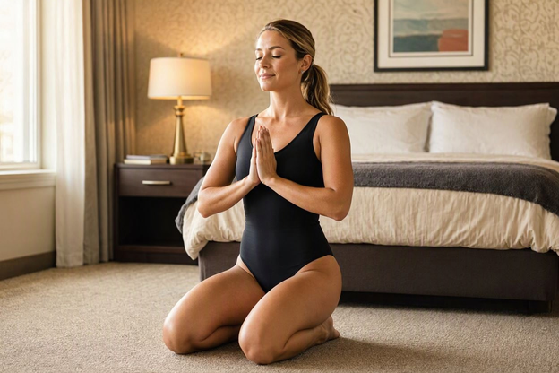

# Hotel Room Exercise

1. Wall Squat
2. Body Weight Squats [Bild](./Images/Bare_foot_fitness_girl_in_leotard_and_does_body_weight_squat.png)
3. Incline Push-Ups [Bild](./Images/Bare_foot_fitness_girl_in_leotard_and_doing_incline_push-ups.png)
4. Heel-to-toe rocking [Video](https://youtu.be/__sQFrrCwog)
5. Stretch The Hip Flexor [Video](https://www.youtube.com/shorts/ZQXGUfGmgKc?feature=share)
6. Standing March
7. Standing Hip Circles
8. Cat Cow
9. Bird Dog
10. Fire Hydrant
11. Clamshell [Video](https://youtu.be/2d-QyEv4EnA) 
12. Supine Twist
13. Double leg lift
14. Criss cross
15. The 100
16. Oil Rigger [Video](https://youtu.be/xuN5smwD1vU) Bild
17. Planks with leg lifts
18. Reverse Crunches [Bild](./Images/Bare_foot_fitness_girl_in_leotard_stands_hip_width_apart.png)
19. Glute Bridge
20. Side-lying clam

## Useful Links

- 5-Minute Daily Workout to Feel Stronger, Move Better & Stand Taller [Video](https://youtu.be/cRyHz0eYc1c)
- Morning Stretch Routine For Beginners [Video](https://youtu.be/g_7do0jG5NM)
- 

