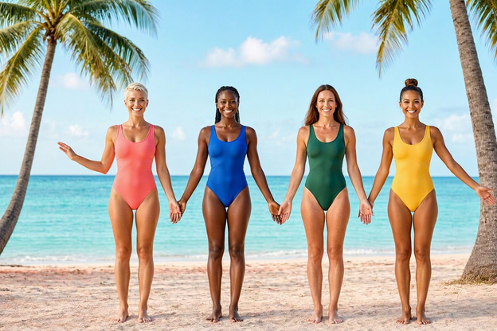

1. Aufstehen und [Hände](https://youtu.be/2G6pHQJEbWQ) ausschütteln. [Bild](./Images/Bare_foot_fitness_girl_wearing_leotard_Aufstehen_und_Haende_auschuetteln.png)
2. [Schulter](https://youtu.be/lnXSq-zW_Q0) nach hinten kreisen lassen. [Bild](./Images/Bare_foot_fitness_girl_in_leotard_stands_hip_width_apart_and_circles_their_sholder.png)
3. [Arme](https://youtu.be/NJQjeNK7gtQ) nach links und rechts ausbreiten und kreisen lassen.[Bild](./Images/Bare_foot_fitness_girl_in_leotard_stands_hip_width_apart_with_arms_circeling.png)
4. [Arme](https://youtu.be/lnXSq-zW_Q0) nach vorne und hinten pendeln lassen. [Bild](./Images/Bare_foot_fitness_girl_in_leotard_stands_hip_width_apart_waving_arms_for_and_back.png)
5. [Arme](https://youtu.be/mlZIDpp7DeM) pendeln lassen und Oberkörper dreht sich nach den Seiten
6. [Walk in Place](https://youtu.be/WykJoIt9GLM)
7.[ High knees](https://youtu.be/tx5rgpDAJRI)
8. [Calf Raises](https://youtu.be/-tJSMx4n6-g), ein Bein hinter das ander geschlungen und mit dem anderen auf die Zehnspitzen.
9. [Standing diagonal leg raises](https://youtu.be/6b1hu6iSqok)
10. [Squat](https://www.youtube.com/shorts/MoyeW6_eYok?feature=share) Kniebeugen.
11. [Reverse Lunges](https://www.youtube.com/watch?v=xrPteyQLGAo) von der Tischkante aus.
12. [Streaching](https://www.youtube.com/shorts/rlMwCYa02d4?feature=share) Arme strecken, eine Hand streckt sich, die ander greift ums Handgelenk
