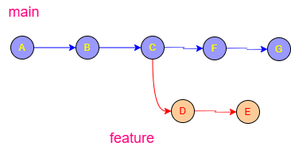
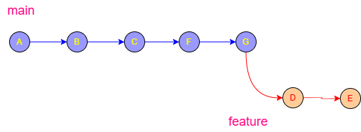
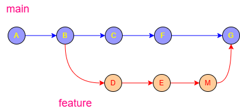
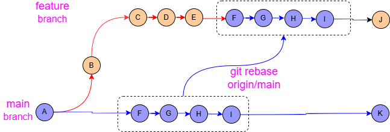
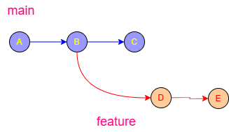
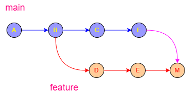

# Git Rebase Tutorial

`git rebase` is one of the most useful — and most misunderstood — Git commands.

It helps you:

* keep a clean commit history

* move your work onto newer commits

* avoid unnecessary merge commits

* edit/squash/reorder commits before sharing them


General information about Git rebase can be found:  [Git rebase ...](https://git-scm.com/docs/git-rebase)

Here you can learn about Git rebase:

1. [Learn git rebase ...](https://www.gitkraken.com/learn/git/git-rebase)
2. [Again learn git rebase ...](https://intellipaat.com/blog/git-rebase/)
3. [Gitlab learn git rebase ...](https://docs.gitlab.com/topics/git/git_rebase/)
4. [Cherry pick and rebase ...](https://dojofive.com/blog/the-git-cherry-pick-and-git-rebase-interactive-combo/)

***

# 1. What Is Rebase?


Git rebase is a command that moves or "replays" a sequence of commits from one branch onto a new base commit.

Instead of combining two branches with a "merge commit," rebasing rewrites the project history so that your changes appear to have been built sequentially on top of the latest work from another branch (like main).


#### Why Use Rebase?

* Clean History: It creates a linear, straight-line path of commits that is much easier to read than a "spaghetti" history of merges.
* Avoid Merge Commits: It prevents the "Merge branch 'main' into 'feature'" commits that often clutter logs.
* Polished Commits: You can use "interactive rebase" (git rebase -i) to squash small fixes into one clean commit or reword old messages.
* Simpler Conflict Resolution: Conflicts are resolved one commit at a time during the replay, rather than all at once in a massive merge.

------------------------------
### How It Works

   1. Detach: Git temporarily "parks" your unique commits in a safe place.
   2. Reset: Your branch is reset to match the latest state of the target branch (e.g., main).
   3. Replay: Git takes your parked commits and applies them one-by-one onto the new tip of the branch.
   4. Rewrite: Because the base has changed, Git creates brand new commits with different IDs (hashes).

------------------------------
### ⚠️ The Golden Rule of Rebasing

Never rebase commits that you have already pushed to a public/shared branch.

Since rebase rewrites history by creating new commit IDs, anyone else working on that branch will see their history as diverged and broken. 

Only rebase local branches that only you are working on.

| Feature [2, 3, 4, 11, 14, 19, 20, 21] | Git Merge | Git Rebase |
|---|---|---|
| History | Preserves exact chronological history | Creates a clean, linear history |
| Traceability | Keeps "Merge commits" as context | No extra merge commits; looks like a straight line |
| Risk | Safe and non-destructive | Riskier; rewrites history (use only locally) |

------------------------------
If you'd like, I can show you:

* The exact commands to run for a standard rebase.
* How interactive rebase works for "squashing" commits.
* How to fix conflicts if the rebase stops halfway. [22] 


---

Imagine this history:

```text
main
A---B---C

feature
     \
      D---E
```


Meanwhile, `main` receives new commits:
```text
main
A---B---C---F---G

feature
     \
      D---E
```


You want your feature branch to look like it started from `G`.

With rebase:

```bash
git checkout feature
git rebase main
```

Git rewrites your commits (`D`, `E`) onto the latest `main`.

Result:

```text
main
A---B---C---F---G

feature
                 \
                  D'---E'
```



Notice:

* `D'` and `E'` are NEW commits

* history becomes linear

* no merge commit is created

***

# 2. Merge vs Rebase

Here you can learn about merge versus rebase:
1. [Learn about Merge versus Rebase ...](https://shiftmag.dev/rebase-over-merge-4014/)
2. [Again learn about Merge versus Rebase ...](https://zapier.com/blog/git-rebase-vs-merge/)

## Merge

```bash
git merge main
```

Creates:

```text
A---B---C---F---G
     \         /
      D---E---M
```


Advantages:

* preserves exact history

* safe for shared branches

Disadvantages:

* messy history over time

***

## Rebase

```bash
git rebase main
```

Creates:

```text
A---B---C---F---G---D'---E'
```


Advantages:

* clean linear history

* easier to read logs

* great before pull requests

Disadvantages:

* rewrites commit history

***

# 3. Basic Rebase Workflow

## Step 1 — Switch to your branch

1. [Learn git branching in a nutchell: ](https://git-scm.com/book/en/v2/Git-Branching-Branches-in-a-Nutshell)
2. [What is git checkout?](https://www.gitkraken.com/learn/git/tutorials/what-is-git-checkout)
3. [git checkout versus switch](https://graphite.com/guides/git-checkout-vs-switch)
4. [Just git checkout](https://www.codecademy.com/resources/docs/git/checkout) 

Switch or checkout thats here the question:
```bash
git checkout feature
```

The `git checkout` command is primarily used to switch between different versions of a project, such as branches or specific commits. When you run it, Git updates the files in your working directory to match the state of the target version and moves the `HEAD` pointer to that location.

***

## Key Capabilities

* Switching Branches: Navigates to an existing branch (e.g., `git checkout feature-login`).
* Creating Branches: Uses the `-b` flag to create and switch to a new branch in one step (`git checkout -b new-feature`).
* Restoring Files: Reverts a specific file to a previous state without changing the rest of the project.
* Navigating History: Moves the environment to a specific past commit or tag to inspect old code.

## Modern Alternatives

In Git version 2.23 and later, `git checkout` has been split into two more specific commands to reduce confusion:

* `git switch`: Dedicated exclusively to switching and creating branches.
* [`git restore`](https://git-scm.com/docs/git-checkout): Dedicated exclusively to reverting changes in files. \[11, 14]

💡 Pro Tip: Use `git checkout -` to instantly toggle back to the previous branch you were on.

***

If you'd like, I can help you with:

* Resolving conflicts that prevent a checkout
* Understanding detached HEAD state
* Comparing changes between two different branches


## Step 2 — Update main

```bash
git checkout main
git pull
```

Running those two commands in sequence ensures your local version of the `main` branch is identical to the latest version on the remote server (like GitHub).

## 1. `git checkout main`

* Switches your active workspace to the `main` branch.
* Updates your files to match whatever is currently stored in your local `main` history.
* Moves the HEAD pointer to the `main` branch.

## 2. `git pull`

* Fetches new changes from the remote repository (usually `origin`).
* Merges those changes into your local `main` branch automatically.
* Updates your code with the most recent work pushed by teammates.

***

## ⚠️ Important Note

If you have unsaved changes in your files that haven't been committed, `git checkout main` might fail with an error. To fix this, you can:

* Commit your work first.
* Stash your work using `git stash`.
* Discard your changes using `git restore .`.

***

## Step 3 — Rebase feature onto main

```bash
git checkout feature
git rebase main
```
>[!NOTE]
> Git now replays your commits on top of `main`.

These two commands are used to _move your work from a feature branch so that it starts on top of the newest code in_ `main`. This creates a clean, linear project history.

## 1. `git checkout feature`

* Switches you onto your specific work branch (named `feature`).
* Sets the context so that the following command knows which branch needs to be updated.

## 2. `git rebase main`

* Lifts your commits from the `feature` branch and sets them aside.
* Applies the new updates from `main` to your branch first.
* Replays your commits one by one on top of those new updates.

***

## 💡 Why do this instead of merging?

* Clean History: It avoids the "clutter" of extra merge commits in your log.
* No "Train Tracks": The project history looks like a straight line rather than a web of crossing lines.
* Easier Reviews: It makes it look like you started your feature today, even if you actually started it a week ago.

***

## ⚠️ Common Risks

* Conflicts: You may have to resolve code conflicts for each commit as it is "replayed."
* Rewriting History: Never rebase a branch that other people are also working on, as it changes commit IDs and can break their local setup.

***

# 4. Handling Rebase Conflicts

>[!NOTE]
>Sometimes Git cannot automatically replay a commit.

You may see a ==CONFLICT==:

```text
CONFLICT (content): Merge conflict in app.js
```
Merge conflicts occur during a rebase for the same reason they do during a merge: _two different commits changed the same line of code in the same file, and Git doesn't know which version to keep_. 

>[!IMPORTANT]
>However, rebase handles conflicts differently than a standard merge.

### 1. Sequential Application 

While a **merge** *combines* the final state of two branches at once, a **rebase** takes your commits and *reapplies* them one by one on top of the new base.



* **Conflict Trigger**: If your first commit changes a line that was also changed in the "new base" (the target branch), Git pauses.
* **Repeating Conflicts**: You might have to resolve the same conflict multiple times if several of your commits touch that same line.

>[!NOTE]
>In a Git rebase, **Sequential Application** refers to the _==step-by-step==_ process where Git takes your individual commits and **"re-plays"** them one at a time onto the new base.

Instead of combining everything at once (like a merge), Git treats your work like a **movie reel**, _==frame by frame==_.

***

### How it Works

* Step 1: **==Lifting==**: Git identifies the commits unique to your branch and temporarily moves them to a "holding area."
* Step 2: **==Resetting==**: Your branch "teleports" to the latest commit of the target branch (e.g., `main`).
* Step 3: **==Replaying==**: Git takes the first commit you made, applies it to the new `main`, and creates a new commit ID. Then it takes the second, and so on.

### ⚓ The Importance of Sequence

* **==Conflict Resolution==**: If a conflict occurs, Git pauses at the specific commit that caused the problem. You fix it, then tell Git to `continue`.
* **==Atomic History==**: Because commits are applied one by one, the logical flow of your work is preserved, even though the "starting point" of your branch has changed.
* **==New Identities==**: Even if the code is the same, each re-applied commit gets a new SHA (ID) because its "parent" commit is now different.

***

### ⚠️ Potential Hurdles

* **==Multiple Conflicts==**: You might have to fix the same conflict multiple times if it exists across several of your sequential commits.
* **==Squashing==**: You can choose to "squash" these sequential commits into one single commit during the process to keep history even cleaner.

***

If you're currently stuck in a rebase, let me know:

* Are you being asked to resolve conflicts repeatedly?
* Do you want to know how to skip a specific commit during the sequence?
* Are you trying to use interactive rebase (`-i`) to rewrite that sequence?


\[1] [https://medium.com](https://medium.com/@haroldfinch01/whats-the-difference-between-git-merge-and-git-rebase-5aa33a485dfc)

\[2] [https://dzone.com](https://dzone.com/articles/understanding-git)

\[3] [https://medium.com](https://medium.com/@1809157_26884/git-merge-vs-rebase-ea941fd5eef7)

\[4] [https://medium.com](https://medium.com/yavar/understanding-git-merge-and-rebase-0c6d65f4ec6b)

\[5] [https://praneethreddybilakanti.medium.com](https://praneethreddybilakanti.medium.com/3-git-branching-55ff1ca8af0d)

\[6] [https://codingitwrong.com](https://codingitwrong.com/2021/09/08/small-commits-and-the-power-of-git-bisect.html)

\[7] [https://www.geeksforgeeks.org](https://www.geeksforgeeks.org/git/how-to-use-git-rebase/)

\[8] [https://codesignal.com](https://codesignal.com/learn/courses/advanced-git-features/lessons/understanding-rebasing-in-git)

\[9] [https://dev.to](https://dev.to/vaib/git-branching-strategies-a-deep-dive-into-rebasing-vs-merging-when-to-use-what-14ja)

\[10] [https://man7.org](https://man7.org/linux/man-pages/man1/git-rebase.1.html)

\[11] [https://codingnomads.com](https://codingnomads.com/git-rebase)

\[12] [https://www.kodeco.com](https://www.kodeco.com/books/advanced-git/v2.0/chapters/4-demystifying-rebasing)

\[13] [https://dev.to](https://dev.to/joemsak/git-rebase-explained-and-eventually-illustrated-5hlb)

\[14] [https://tutorial.gitlabpages.inria.fr](https://tutorial.gitlabpages.inria.fr/git/03-linear-git-project/)

\[15] [https://docs.microfocus.com](https://docs.microfocus.com/doc/397/2020.11.ng/workinggit)

\[16] [https://www.codecademy.com](https://www.codecademy.com/article/how-to-use-git-rebase)

\[17] [https://www.ibm.com](https://www.ibm.com/docs/en/z-devops-guide?topic=use-git-branching-model-mainframe-development)


### 2. Rewriting History

Rebase technically "rewrites" history by creating brand-new commits with different IDs (hashes).

* Because Git is effectively "replay-ing" your work on a new foundation, it checks for compatibility at every single step.
* If you previously resolved a conflict in a merge, rebase may force you to do it again because it ignores that past merge resolution.

In Git, Rewriting History means _changing the record of how, when, or in what order commits were made_. When you rebase, you aren't just moving code; you are technically deleting old commits and creating brand-new ones. \[1, 2, 3, 4, 5]

***

#### Why it is considered "Rewriting"

* New Parentage: A commit’s identity (SHA-1 hash) is partially based on the commit that came before it. By changing the "base" (the parent), the commit's identity changes.
* New IDs: Even if the code changes are identical, the Commit Hash (e.g., `a1b2c3d`) will be completely different after a rebase.
* Linearizing: It makes the history look like a straight line, hiding the fact that you were working on a separate branch for days. \[6, 7, 8, 9, 10]

#### 🛠️ What you can change

During a rebase (especially an interactive one), you can:

* Edit: Change the code within a specific past commit.
* Reword: Change a typo in an old commit message.
* Squash: Combine five small commits into one clean "feature" commit.
* Drop: Completely delete a commit you no longer want. \[12, 13, 14, 15, 16]

***

#### 🛑 The Golden Rule

Never rewrite history on a public branch.

If you rebase a branch that others have already pulled to their computers:

* Their version of history will conflict with your "new" version.
* It causes massive "merge headaches" for the team.
* You will be forced to use `git push --force`, which can overwrite teammates' work. \[18, 19, 20, 21, 22]

***

If you need to move forward, I can explain:

* How to force push safely using `--force-with-lease`
* How to use interactive rebase (`git rebase -i`)
* What to do if you accidentally rewrote history on the wrong branch


\[1] [https://namastedev.com](https://namastedev.com/blog/advanced-git-strategies-rebasing-merging-and-history-rewriting/)

\[2] [https://www.linkedin.com](https://www.linkedin.com/pulse/understanding-git-rebase-kiran-u-kamath-1hp2c)

\[3] [https://medium.com](https://medium.com/devlink-tips/git-rebase-isnt-scary-you-just-never-had-it-explained-right-18cb866ce0a2)

\[4] [https://code.tutsplus.com](https://code.tutsplus.com/rewriting-history-with-git-rebase--cms-23191t)

\[5] [https://www.augmentedmind.de](https://www.augmentedmind.de/2024/04/07/ultimate-git-guide-for-developers/)

\[6] [https://dev.to](https://dev.to/abbeyperini/gitpanic-interactive-rebase-48fe)

\[7] [https://githowto.com](https://githowto.com/git_basics)

\[8] [https://www.biteinteractive.com](https://www.biteinteractive.com/understanding-git-merge/)

\[9] [https://gist.github.com](https://gist.github.com/jherax/6a756503065e991197e70e8feb319128)

\[10] [https://support.atlassian.com](https://support.atlassian.com/bitbucket-cloud/docs/maintain-a-git-repository/)

\[11] [https://www.graphapp.ai](https://www.graphapp.ai/engineering-glossary/git/commit-ish-also-committish)

\[12] [https://dev.to](https://dev.to/d4vsanchez/rebasing-in-git-to-maintain-history-s-health-310c)

\[13] [https://www.aleksandrhovhannisyan.com](https://www.aleksandrhovhannisyan.com/blog/undoing-changes-in-git/)

\[14] [https://thoughtbot.com](https://thoughtbot.com/blog/git-interactive-rebase-squash-amend-rewriting-history)

\[15] [https://www.heise.de](https://www.heise.de/en/news/Git-2-54-experiments-with-changing-commit-history-11265809.html)

\[16] [https://labex.io](https://labex.io/tutorials/git-how-to-rewrite-git-commit-history-with-rebase-411498)

\[17] [https://dev.to](https://dev.to/vaib/git-branching-strategies-a-deep-dive-into-rebasing-vs-merging-when-to-use-what-14ja)

\[18] [https://www.linkedin.com](https://www.linkedin.com/pulse/understanding-git-rebase-kiran-u-kamath-1hp2c)

\[19] [https://medium.com](https://medium.com/yavar/understanding-git-merge-and-rebase-0c6d65f4ec6b)

\[20] [https://dev.to](https://dev.to/vaib/git-branching-strategies-a-deep-dive-into-rebasing-vs-merging-when-to-use-what-14ja)

\[21] [https://dev.to](https://dev.to/d4vsanchez/rebasing-in-git-to-maintain-history-s-health-310c)

\[22] [https://thoughtbot.com](https://thoughtbot.com/blog/git-interactive-rebase-squash-amend-rewriting-history)


### 3. Diverged Path

Conflicts often happen when your branch has **"diverged"** significantly from the main branch.

>[!NOTE]
>If someone else changed a function name in `main` and you called that same function in your feature branch, [Git](https://github.com/) will flag this as a conflict during rebase.

A **==Diverged Path==** occurs when two versions of the same branch have different commit histories that are no longer compatible.

In the context of a rebase, this happens because you have rewritten history locally, while the original history still exists on the remote server (like GitHub).

#### Why it Happens

* Local Change: You rebase your `feature` branch. This creates new commits with new IDs.
* Remote Record: The remote server still has your old commits with the original IDs.
* The Conflict: Git looks at both and sees they started at the same point but traveled in different "directions." It can't figure out which one is the "truth" without help. \[6, 7, 8, 9, 10]

#### 🚩 How You’ll Know

If you try to run a standard `git push` after a rebase, Git will reject it with an error like: \[11, 12, 13]

* `[rejected] feature -> feature (non-fast-forward)`
* `Updates were rejected because the tip of your current branch is behind its remote counterpart.` \[14, 15]

#### 🛠️ How to Fix the Path

Since you intentionally changed the history, you have to tell the server to replace its old path with your new one:

* The "Hammer": `git push --force` (Overwrites the remote branch entirely).
* The "Safety Valve": `git push --force-with-lease` (Only overwrites if no one else has added new work to the remote branch). \[16, 17, 18, 19, 20]

***

#### ⚠️ The Risk

If a teammate pulled your `feature` branch before you rebased, their local path is now "diverged" from the server. When they try to pull, they will get a mess of duplicate commits and merge conflicts. \[21, 22, 23]

***

To help you clear this up, let me know:

* Are you seeing a "non-fast-forward" error right now?
* Are other people working on this same branch?
* Do you want the command to undo the rebase and go back to the old path?


\[1] [https://dev.to](https://dev.to/lotanna_obianefo/mastering-git-for-production-branching-merging-squash-strategies-every-engineer-should-know-5flp)

\[2] [https://www.geeksforgeeks.org](https://www.geeksforgeeks.org/git/what-to-do-when-git-branch-has-diverged/)

\[3] [https://refine.dev](https://refine.dev/blog/git-merge-vs-rebase/)

\[4] [https://github.com](https://github.com/android-password-store/Android-Password-Store/issues/1231)

\[5] [https://rse.shef.ac.uk](https://rse.shef.ac.uk/blog/2020-06-23-git-rebase-vs-merge/)

\[6] [https://medium.datadriveninvestor.com](https://medium.datadriveninvestor.com/git-rebase-vs-git-merge-ec3300f49dbd)

\[7] [https://unstop.com](https://unstop.com/blog/git-rebase-vs-merge)

\[8] [https://medium.com](https://medium.com/@basecs101/do-you-know-the-difference-between-git-merge-and-git-rebase-800983738b60)

\[9] [https://seantrane.com](https://seantrane.com/posts/merging-strategies-in-github-19015/)

\[10] [https://set.kuleuven.be](https://set.kuleuven.be/voorkennis/ximerademo/ximera-downloads/handout_pdf/git/gitConcepts.pdf)

\[11] [https://www.augmentedmind.de](https://www.augmentedmind.de/2024/04/07/ultimate-git-guide-for-developers/)

\[12] [https://learn.microsoft.com](https://learn.microsoft.com/en-us/azure/devops/repos/git/rebase?view=azure-devops)

\[13] [https://www.codemag.com](https://www.codemag.com/article/1105101/Git-for-Subversion-Users)

\[14] [https://hades.github.io](https://hades.github.io/2010/01/git-your-friend-not-foe-vol-2-branches)

\[15] [https://www.kodeco.com](https://www.kodeco.com/books/advanced-git/v2.0/chapters/8-centralized-workflow)

\[16] [https://dev.to](https://dev.to/milu_franz/git-explained-an-in-depth-comparison-18mk)

\[17] [https://tms-outsource.com](https://tms-outsource.com/blog/posts/what-is-git-rebase/)

\[18] [https://dev.to](https://dev.to/vaib/git-branching-strategies-a-deep-dive-into-rebasing-vs-merging-when-to-use-what-14ja)

\[19] [https://dev.to](https://dev.to/maxwell_dev/the-git-rebase-introduction-i-wish-id-had)

\[20] [https://medium.com](https://medium.com/@artem.redia/mastering-git-for-teams-0ded8b0c0792)

\[21] [https://medium.com](https://medium.com/@tomascdmota/git-rebase-vs-merge-as-a-junior-dev-d09ca2a2ea0b)

\[22] [https://dev.to](https://dev.to/jessekphillips/rebase-and-merge-don-t-mix-4aj)

\[23] [https://codingnomads.com](https://codingnomads.com/git-rebase)


***

#### 💡 Common Rebase Commands

If you hit a conflict, Git will pause and wait for you to:

* Fix the files: Open the file, keep the code you want, and remove conflict markers.
* `git add <file>`: Stage the fixed file.
* `git rebase --continue`: Move on to the next commit in your branch.
* `git rebase --abort`: Completely cancel the rebase and go back to how things were. \[1, 5, 14, 15, 16]

Would you like to know how to avoid these conflicts in the first place, or should we look at how to squash commits to make rebasing easier?


\[1] [https://www.youtube.com](https://www.youtube.com/watch?v=OXtdxHTh2oY\&t=32)

\[2] [https://docs.github.com](https://docs.github.com/articles/about-merge-conflicts)

\[3] [https://www.aviator.co](https://www.aviator.co/blog/rebase-vs-merge-pros-and-cons/)

\[4] [https://docs.gitlab.com](https://docs.gitlab.com/topics/git/git_rebase/)

\[5] [https://www.youtube.com](https://www.youtube.com/watch?v=DkWDHzmMvyg\&t=105)

\[6] [https://algomaster.io](https://algomaster.io/learn/git/rebase-conflicts)

\[7] [https://stackoverflow.com](https://stackoverflow.com/questions/34298273/does-git-rebase-create-more-conflicts-than-git-merge)

\[8] [https://jhall.io](https://jhall.io/archive/2024/01/10/when-rebasing-is-better-than-merging/)

\[9] [https://stackoverflow.com](https://stackoverflow.com/questions/31401754/why-does-the-same-conflict-reappear-when-i-use-git-rebase)

\[10] [https://www.reddit.com](https://www.reddit.com/r/git/comments/1dzafey/merge_vs_rebase/)

\[11] [https://dev.to](https://dev.to/bitethecode/git-tutorials-understanding-of-rebase-and-merge-2cg4)

\[12] [https://graphite.com](https://graphite.com/guides/git-merge-rebase-differences-benefits)

\[13] [https://medium.com](https://medium.com/@annxsa/mastering-git-merge-and-rebase-to-avoid-code-conflicts-in-2026-3baa7e86010c)

\[14] [https://docs.github.com](https://docs.github.com/en/get-started/using-git/resolving-merge-conflicts-after-a-git-rebase)

\[15] [https://graphite.com](https://graphite.com/guides/git-rebase-conflicts)

\[16] [https://docs.github.com](https://docs.github.com/en/get-started/using-git/resolving-merge-conflicts-after-a-git-rebase)

***

## Step 1 — Open conflicted files

Git marks ==conflicts== like this:

```text
<<<<<<< HEAD
new code from main
=======
your feature code
>>>>>>> feature
```

>[!NOTE]
> Edit the file manually.


==Conflicted files== are _files where Git cannot automatically decide which code to keep during the rebase process_.

Because a rebase applies your changes one commit at a time, a conflict happens when your changes and the changes from the `main` branch overlap on the exact same lines of code.

***

#### Why Conflicts Happen During Rebase

* Overlapping Edits: You changed line 10 in `style.css` on your branch, but someone else also changed line 10 on the `main` branch.
* File Deletions: You edited a file that was completely deleted in the `main` branch.
* Structural Changes: A file was moved or renamed in one branch but edited in the other.

#### 🔍 How they look in the code

Git marks the problem area with "Conflict Markers":

```text
<<<<<<< HEAD
(The code currently in the main branch)
=======
(The code you wrote in your commit)
>>>>>>> your-commit-message
```

#### 🛠️ The Rebase Resolution Flow

Unlike a merge (where you fix everything at once), a rebase might stop multiple times. \[11, 12]

1. Git Pauses: The rebase stops at the specific commit where the conflict exists.
2. You Fix: You open the file, remove the markers, and choose the correct code.
3. You Stage: Run `git add <file-name>` to mark it as resolved.
4. You Continue: Run `git rebase --continue`.
5. Repeat: If your next commit also has a conflict, Git will pause again. \[13, 14, 15, 16, 17]

***

#### 💡 Pro Tip

If the conflicts are too **==overwhelming==**, you can run `git rebase --abort` to instantly **==teleport back==* to exactly how things were before you started the rebase.

***

If you're looking at a conflict right now, I can help with:

* The command to see which files are conflicted
* How to use a merge tool (like VS Code) to fix them
* Deciding between "ours" (main) or "theirs" (feature) changes \[19, 20, 21, 22]


\[1] [https://codingnomads.com](https://codingnomads.com/git-merge-conflict-how-to-resolve-merge-conflict-in-git)

\[2] [https://docs.rocketpy.org](https://docs.rocketpy.org/en/latest/development/conflicts.html)

\[3] [https://www.kodeco.com](https://www.kodeco.com/books/advanced-git/v2.0/chapters/4-demystifying-rebasing)

\[4] [https://code.tutsplus.com](https://code.tutsplus.com/rewriting-history-with-git-rebase--cms-23191t)

\[5] [https://www.freecodecamp.org](https://www.freecodecamp.org/news/git-under-the-hood/)

\[6] [https://unstop.com](https://unstop.com/blog/merge-in-git)

\[7] [https://medium.com](https://medium.com/@emishokunbi/why-merge-conflicts-happen-why-theyre-so-annoying-and-how-to-fix-them-908109d71903)

\[8] [https://dev.to](https://dev.to/lovestaco/git-rebase-a-practical-guide-175p)

\[9] [https://habtesoft.medium.com](https://habtesoft.medium.com/when-paths-diverge-mastering-merge-conflicts-in-git-part-13-ffbde7a45ace)

\[10] [https://oneuptime.com](https://oneuptime.com/blog/post/2026-01-24-git-merge-conflict-errors/view)

\[11] [https://www.reddit.com](https://www.reddit.com/r/git/comments/1r7acqy/sharing_my_method_for_resolving_multiple_git/)

\[12] [https://oneuptime.com](https://oneuptime.com/blog/post/2026-01-24-git-rebase-vs-merge-strategies/view)

\[13] [https://algomaster.io](https://algomaster.io/learn/git/rebase-conflicts)

\[14] [https://dev.to](https://dev.to/vaib/git-branching-strategies-a-deep-dive-into-rebasing-vs-merging-when-to-use-what-14ja)

\[15] [https://blog.devgenius.io](https://blog.devgenius.io/git-confused-me-for-years-until-i-found-this-simple-guide-a45223bebb40)

\[16] [https://blog.mergify.com](https://blog.mergify.com/resolve-git-merge-conflicts/)

\[17] [https://www.kodeco.com](https://www.kodeco.com/books/advanced-git/v2.0/chapters/4-demystifying-rebasing)

\[18] [https://capmation.com](https://capmation.com/blog/insight-blog-fixing-mistakes-and-resolving-conflicts-with-git)

\[19] [https://unstop.com](https://unstop.com/blog/merge-in-git)

\[20] [https://haydar-ai.medium.com](https://haydar-ai.medium.com/learning-how-to-git-merging-branches-and-resolving-conflict-61652834d4b0)

\[21] [https://frontendmasters.com](https://frontendmasters.com/courses/everything-git/)

\[22] [https://www.thinktecture.com](https://www.thinktecture.com/en/tools/demystifying-git-rebase/)

***

## Step 2 — Mark resolved

```bash
git add app.js
```
Marking as resolved is _the specific action where you tell Git, "I have manually fixed the code conflicts in this file, and it is now ready to be committed_."

In a rebase, Git cannot move forward to the next commit until every conflicted file is marked as resolved.

***

#### How to Mark a File Resolved

There isn't a button labeled "Mark Resolved" in the command line; instead, you use the standard staging command:

1. Edit the file: Remove the `<<<<<<<`, `=======`, and `>>>>>>>` markers.

2. Save: Keep the code you want.

3. Run the command: `git add <filename>`

   * This "stages" the file.
   * Git interprets this action as the signal that the conflict is gone.

#### The Rebase Handshake

Once you have used `git add` for all conflicted files in that specific step, you must complete the "handshake" by running:

```powershell
git rebase --continue
```

Git will then take those ==resolved changes==, create the ==new commit==, and move on to the next commit in your sequence.

***

#### 💡 Common Confusion

* Do NOT use `git commit`: During a rebase, you should generally avoid running `git commit` manually. Using `git rebase --continue` handles the commit creation for you.
* Check your progress: If you aren't sure if you marked everything, run `git status`. Resolved files will be under "Changes to be committed," while unresolved ones stay under "Unmerged paths."

***

If you're stuck in a loop, let me know:

* Are you getting an error saying "you still have unmerged files"?
* Do you want to know how to skip a commit instead of resolving it?
* Are you using a code editor like VS Code to click the "Accept Incoming" buttons?


***

## Step 3 — Continue rebase

```powershell
git rebase --continue
```

***

## Abort rebase

If things go badly:

```bash
git rebase --abort
```

Everything returns to the previous state.

***

# 5. Interactive Rebase (The Superpower)

Interactive rebase lets you:

* squash commits

* rename commits

* reorder commits

* remove commits

* split commits

***

## Start interactive rebase

Rebase the last 3 commits:

```bash
git rebase -i HEAD~3
```

Git opens an editor:

```text
pick a1b2 First commit
pick c3d4 Second commit
pick e5f6 Third commit
```

***

# 6. Interactive Rebase Commands

## pick

Keep commit unchanged.

```text
pick a1b2 Add login page
```

***

## reword

Change commit message.

```text
reword a1b2 Add login page
```

***

## squash

Combine commit with previous one.

```text
pick   a1b2 Add login page
squash c3d4 Fix typo
```

Result:

* one cleaner commit

***

## fixup

Like squash, but discards commit message.

```text
pick  a1b2 Add login page
fixup c3d4 Fix typo
```

***

## drop

Delete a commit.

```text
drop a1b2 Temporary debug logs
```

***

# 7. Squashing Example

Before:

```text
Add navbar
Fix navbar typo
Fix CSS
Fix spacing
```

After interactive rebase:

```text
Add navbar component
```

Much cleaner for pull requests.

***

# 8. Rebase Onto Another Branch

You can move a branch to a completely different base.

```bash
git rebase --onto new-main old-main feature
```

Advanced but powerful.

***

# 9. Golden Rule of Rebase

## NEVER rebase public/shared commits

Bad:

```bash
git push
git rebase
git push --force
```

This rewrites history other people may already use.

***

## Safe places to rebase

Good:

* local feature branches

* before opening PRs

* cleaning commits before pushing

***

# 10. Force Push After Rebase

Because commits changed:

```bash
git push --force-with-lease
```

Prefer:

```bash
--force-with-lease
```

instead of plain:

```bash
--force
```

It is safer.

***

# 11. Useful Rebase Commands

## Continue

```bash
git rebase --continue
```

***

## Abort

```bash
git rebase --abort
```

***

## Skip problematic commit

```bash
git rebase --skip
```

***

## Rebase current branch onto main

```bash
git rebase main
```

***

# 12. Visual Example

## Before

```text
main:
A---B---C

feature:
     \
      D---E
```



***

## After `git merge main`

```text
A---B---C---F
     \      \
      D---E--M
```

***

## After `git rebase main`

```text
A---B---C---F---D'---E'
```

***

# 13. Recommended Beginner Workflow

For personal feature branches:

```bash
git checkout main
git pull

git checkout feature
git rebase main
```

Then:

```bash
git push --force-with-lease
```

ONLY if the branch was already pushed.

***

# 14. Understanding HEAD~3

```bash
HEAD~1
```

\= previous commit

```bash
HEAD~3
```

\= three commits back

Useful with interactive rebase:

```bash
git rebase -i HEAD~5
```

***

# 15. Real-World Example

You made these commits:

```text
Add form
Fix typo
Debug output
Remove debug output
Fix CSS
```

Interactive rebase can turn this into:

```text
Add user form UI
```

This makes team history far easier to read.

***

# 16. Rebase Cheat Sheet

## Basic rebase

```bash
git rebase main
```

***

## Interactive rebase

```bash
git rebase -i HEAD~5
```

***

## Continue after conflicts

```bash
git rebase --continue
```

***

## Abort

```bash
git rebase --abort
```

***

## Safe force push

```bash
git push --force-with-lease
```

***

# 17. When To Use Rebase

Use rebase when:

* updating feature branches

* cleaning commits

* preparing pull requests

* keeping history linear

Avoid rebase when:

* commits are already shared publicly

* multiple developers depend on the branch

***

# 18. Recommended Learning Path

Practice in this order:

1. Basic rebase

2. Conflict resolution

3. Interactive rebase

4. Squash/fixup

5. Reordering commits

6. Advanced `--onto`

***

# 19. Mini Practice Exercise

Create demo repo:

```bash
mkdir git-rebase-demo
cd git-rebase-demo

git init
```

Create commits:

```bash
echo "A" > file.txt
git add .
git commit -m "A"

echo "B" >> file.txt
git commit -am "B"
```

Create branch:

```bash
git checkout -b feature
```

Add commits:

```bash
echo "Feature 1" >> file.txt
git commit -am "Feature 1"
```

Return to main:

```bash
git checkout main
```

Add more commits:

```bash
echo "Main update" >> file.txt
git commit -am "Main update"
```

Now rebase:

```bash
git checkout feature
git rebase main
```

Perfect beginner exercise.

***

# 20. Most Important Takeaway

Rebase does NOT “move commits.”

It:

1. copies commits

2. replays them elsewhere

3. creates NEW commit hashes

That is why rebasing shared history is dangerous.

---

You can perform a Git rebase in Visual Studio Code using either the built-in Source Control menu or specialized extensions like [GitLens](https://marketplace.visualstudio.com/items?itemName=eamodio.gitlens) for a more visual experience.

### Standard Method (Built-in)

VS Code has native support for basic rebasing through the command palette or the Source Control view.

1. Checkout the branch you want to rebase (e.g., your feature branch).
2. Open the Source Control view (`Ctrl+Shift+G`).
3. Click the three dots (...) at the top of the Source Control panel.
4. Select Branch > Rebase Branch....
5. Choose the target branch (e.g., `main` or `master`) you want to rebase onto. \[6, 7, 8]

***

## Interactive Rebase with GitLens \[1]

For complex tasks like squashing, dropping, or reordering commits, the GitLens extension provides a dedicated visual editor. \[9]

1. Install GitLens from the VS Code Marketplace. \[10, 11]

2. Enable the Interactive Rebase Editor via the Command Palette (`Ctrl+Shift+P` > `GitLens: Enable Interactive Rebase Editor`). \[12]

3. Start the rebase by typing `git rebase -i <branch-name>` in the integrated terminal. \[13, 14]

4. A visual UI will open where you can:

   * Drag and drop to reorder commits.
   * Change actions (Pick, Squash, Drop, Reword) using dropdown menus. \[1, 15, 16, 17]

5. Click Start Rebase to execute the changes. \[1, 13]

[VS Code tips — Interactive rebase editor from the GitLens ...](https://www.youtube.com/watch?v=P5p71fguFNI), YouTube · Code 2020 · 2020 M12 16

***

## Handling Conflicts

If Git encounters conflicts during the rebase, VS Code will pause and alert you. \[18, 19, 20, 21]

* Resolve files: Open the conflicted files and use the Merge Editor to pick changes.
* Continue: Once resolved, stage the files (`+` icon) and click Continue in the rebase banner or run `git rebase --continue` in the terminal.
* Abort: If things go wrong, select Abort Rebase from the command palette or run `git rebase --abort`. \[1, 22, 23, 24, 25]

***

💡 Pro Tip: After a successful rebase, you will likely need to perform a Force Push (`git push --force-with-lease`) to update your remote branch, as the commit history has been rewritten. \[6, 25]

Would you like help with resolving specific merge conflicts or learning how to squash commits manually?


\[1] [https://blog.delpuppo.net](https://blog.delpuppo.net/why-i-love-gitlens-in-my-vscode-interactive-rebase)

\[2] [https://www.techielass.com](https://www.techielass.com/how-to-push-code-from-vs-code-to-github/)

\[3] [https://www.linkedin.com](https://www.linkedin.com/learning/using-git-with-visual-studio-code/gitlens)

\[4] [https://simplanova.com](https://simplanova.com/blog/guidelines-for-partners-git-with-vs-code/)

\[5] [https://stackoverflow.com](https://stackoverflow.com/questions/51381826/git-rebase-in-visual-studio-code)

\[6] [https://docs.fivem.net](https://docs.fivem.net/docs/contributing/git/rebase-guide/)

\[7] [https://code.visualstudio.com](https://code.visualstudio.com/docs/sourcecontrol/quickstart)

\[8] [https://stackoverflow.com](https://stackoverflow.com/questions/65153013/how-to-fetch-all-branches-and-tags-in-visual-studio-git)

\[9] [https://www.youtube.com](https://www.youtube.com/watch?v=P5p71fguFNI)

\[10] [https://www.gitkraken.com](https://www.gitkraken.com/blog/revamp-your-code-reviews-with-gitlens)

\[11] [https://docs.superoffice.com](https://docs.superoffice.com/contribute/tutorial.html)

\[12] [https://github.com](https://github.com/gitkraken/vscode-gitlens/discussions/1260)

\[13] [https://dev.to](https://dev.to/colbygarland/using-vs-code-to-git-rebase-1lc)

\[14] [https://www.youtube.com](https://www.youtube.com/watch?v=3o_01F04bZ4)

\[15] [https://stuartleeks.com](https://stuartleeks.com/posts/working-with-git-rebase-in-visual-studio-code/)

\[16] [https://blog.delpuppo.net](https://blog.delpuppo.net/why-i-love-gitlens-in-my-vscode-interactive-rebase)

\[17] [https://marketplace.visualstudio.com](https://marketplace.visualstudio.com/items?itemName=WMBGmbH.intellij-git-ext)

\[18] [https://learn.microsoft.com](https://learn.microsoft.com/en-us/azure/devops/repos/git/rebase?view=azure-devops)

\[19] [https://www.datacamp.com](https://www.datacamp.com/tutorial/git-rebase)

\[20] [https://www.gitkraken.com](https://www.gitkraken.com/learn/git/problems/git-interactive-rebase)

\[21] [https://medium.com](https://medium.com/novumlogic/git-pull-rebase-or-merge-resolving-diverged-branch-made-easy-%EF%B8%8F-%EF%B8%8F-e1b83a99f254)

\[22] [https://www.reddit.com](https://www.reddit.com/r/devops/comments/wm17jc/git_rebase/)

\[23] [https://www.youtube.com](https://www.youtube.com/watch?v=T1puiPJgP_0)

\[24] [https://git-scm.com](https://git-scm.com/book/en/v2/Appendix-A:-Git-in-Other-Environments-Git-in-Visual-Studio-Code)

\[25] [https://learn.microsoft.com](https://learn.microsoft.com/de-de/azure/devops/repos/git/rebase?view=azure-devops)


***

If you'd like, I can also provide:

* a **Git Rebase Bootcamp (7 days)**

* an **Interactive Rebase Deep Dive**

* a **visual conflict-resolution tutorial**

* a **Merge vs Rebase guide**

* a **Git branching workflow tutorial**

* a **Git for Angular/React developers guide**
