# Git and Meld Tutorial: Handling Merge and Rebase Conflicts

**Meld** is an excellent visual merge tool for Git because it lets you compare files side-by-side and choose which changes to keep.

This tutorial covers:

1. Understanding conflicts

2. Handling merge conflicts

3. Handling rebase conflicts

4. Configuring Meld

5. Real-world examples

6. Useful commands

***

# 1. Why Conflicts Happen

Suppose you have:

```text
master
 |
 +---- A ---- B
               \
feature         C ---- D
```

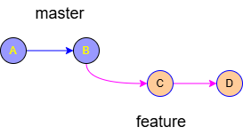

Both branches modify the same line, here an example:

**master branch ** 🌳

```typescript
const url = "https://www.ecosia.org/";
```

**feature branch** 🦆

```typescript
const url = "https://duckduckgo.com";
```

Git cannot decide automatically which version should survive.

```powershell
git status
```

Result:

```text
CONFLICT (content): Merge conflict
```

***

# 2. Configure Meld as Git Merge Tool

## Linux

```bash
sudo apt install meld
```

## Windows

Install Meld from:

```text
https://meldmerge.org
```

Configure Meld for Git:

```bash
git config --global merge.tool meld
git config --global mergetool.meld.path "C:/Program Files/Meld/Meld.exe"
git config --global mergetool.keepBackup false
```
Verify:
```bash
git config --get merge.tool
```

Expected:
```text
meld
```
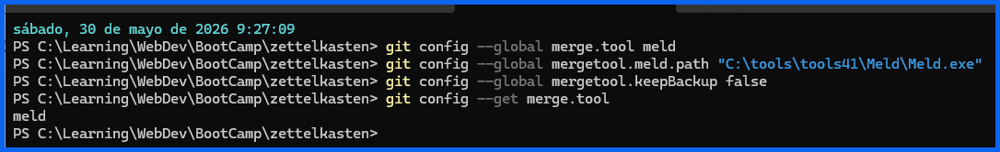
***

# 3. Merge Conflict Tutorial

## Create examle TypeScript file on GitHub

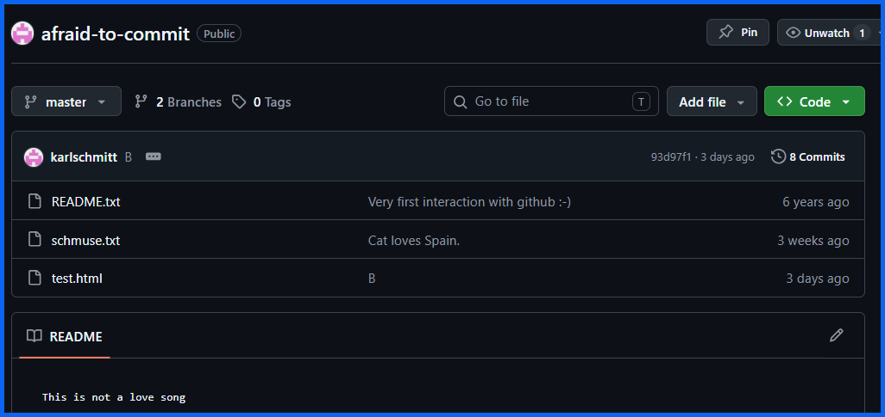

### Add type script «hello world» file

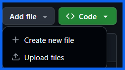

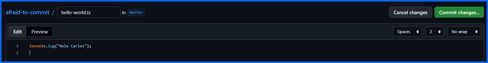

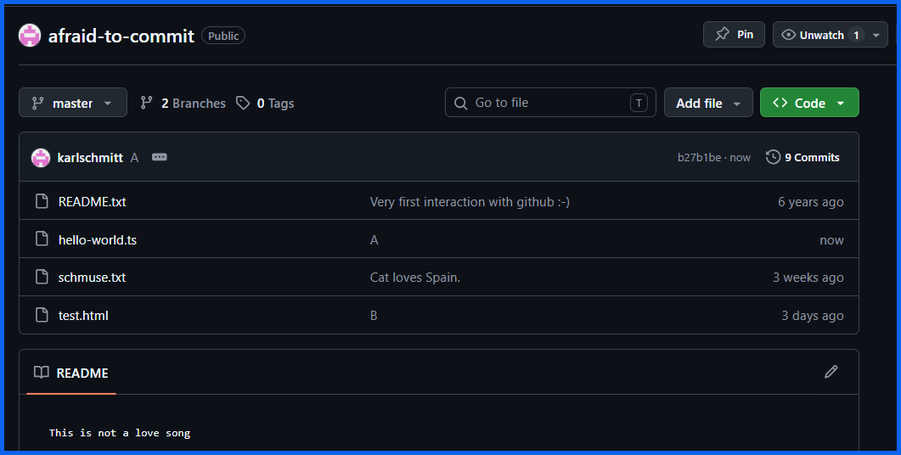

### Let's edit the file to create revision «B»

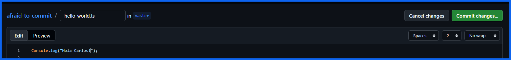

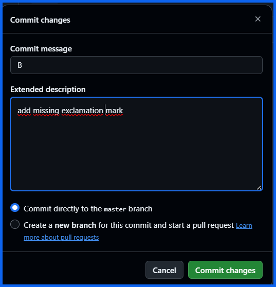

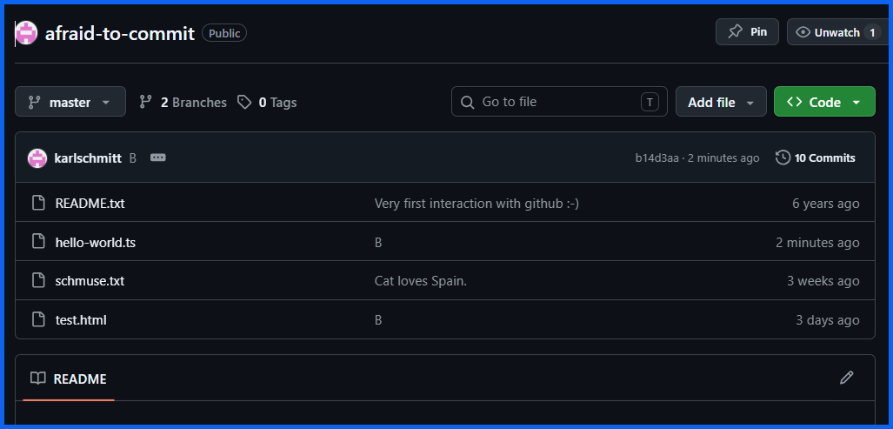

### Now we have the following situation on GitHub:


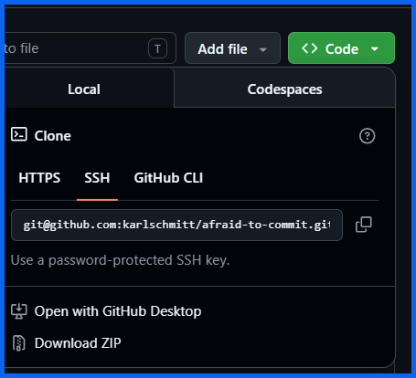

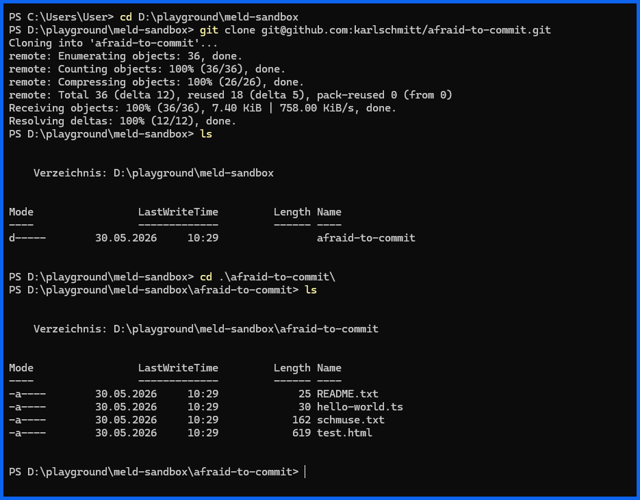

## Create a conflicting example

On Windows you might have to add this exception:

```powershell
git config --global --add safe.directory D:/playground/meld-sandbox/afraid-to-commit
```
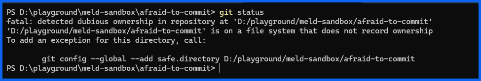

Create a new feature branch:

```powershell
git checkout -b feature
```
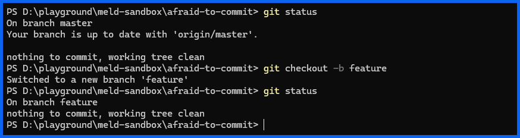

### Let's change the type script file:

```powershell
nvim .\hello-world.ts
```

Modify the typescript file:
```typescript
console.log("Feature Version");
```
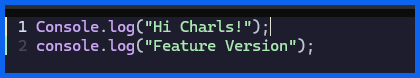

Commit the changes to the feature branch 👩‍🏭:
```powershell
git add .
git commit -m "C"
```
There is a syntax error 😈 in the firstline. Let“s correct it and add anther line:

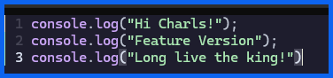

Again commit the changes to the feature branch👩‍🏭:
```powershell
git add .
git commit -m "D"
```

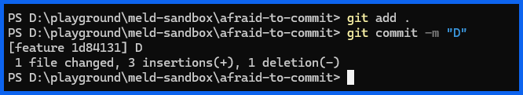

Now we have two revisions «C» and «D» in the feature branch:


Switch back to the master branch:

```bash
git checkout master
```

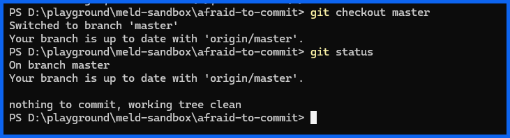

List the content of the master branch:

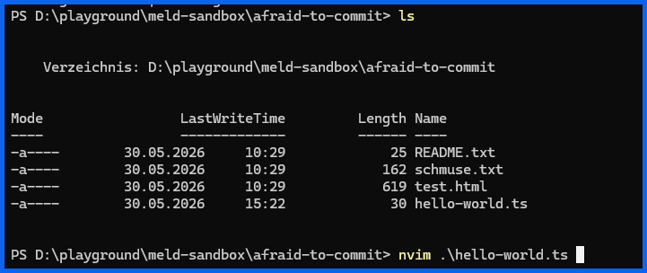

Modify same lines:

```typescript
console.log("Hola Carlos!"); // correct first char
console.log("Master Version E");
console.log("Viva el rey"); 
```

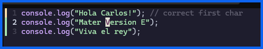

Commit:

```bash
git add .
git commit -m "E"
git push
```
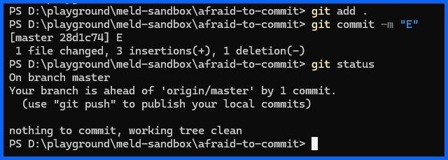

Now we have the following situation:

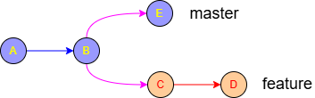

Let“s merge feature onto master::

```bash
git merge feature
```

🚨 Git tries an auto merge, and informs us about a conflict 💥:

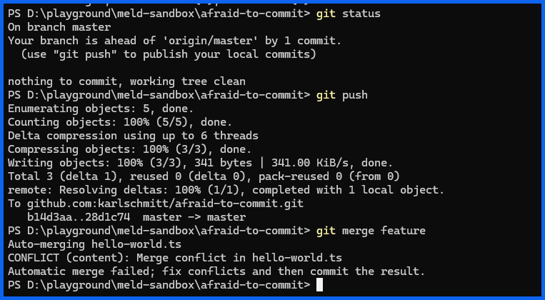
```text
Auto-merging hello-world.ts
CONFLICT (content): Merge conflict in hello-world.ts
```
***

# 4. Inspect Conflict 🚨

Let's look what ```git status``` says:

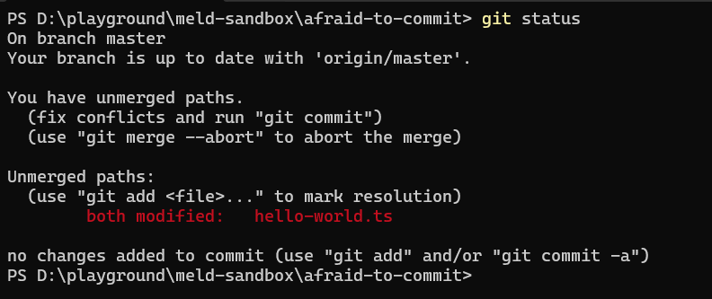

💥 Yes we have a conflict!

Open the TypeScript file:
```typescript
<<<<<<< HEAD
console.log("Hola Carlos!"); // correct first char
console.log("Master Version E");
console.log("Viva el rey"); 
=======
console.log("Hi Charls!");
console.log("Feature Version");
console.log("Long live the king!")
>>>>>>> feature
```
🔬 Let's prick into the file:

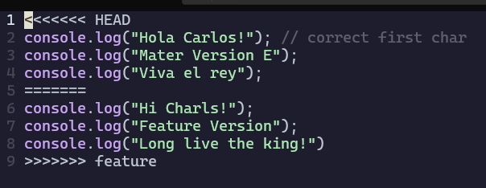

✨Meaning:
```text
<<<<<<< HEAD
Current branch

=======
Separator

>>>>>>> feature
Incoming branch
```
***

# 5. Start Meld to resolve the merge conflict 

Our situation now:
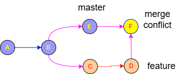

To start meld, please run:
```bash
git mergetool
```

Meld opens:


Typical layout:

```text
LEFT        BASE      RIGHT
Master      Common    Feature
```

or

```text
LOCAL     MERGED    REMOTE
```

depending on Git versions.

***

# 6. Resolve in Meld

Buttons typically allow:

```text
← Use Left
→ Use Right
```

Accept right:

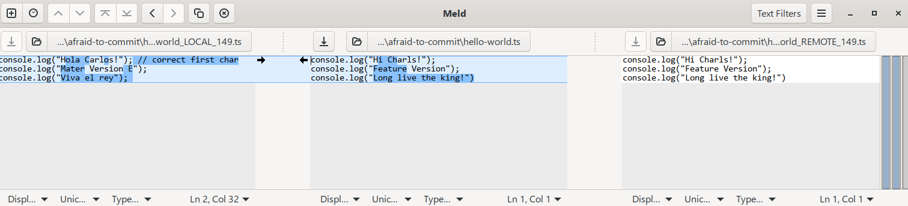

Accept left:

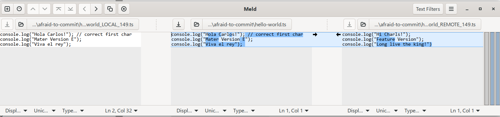

Examples:

Choose feature version (right) and adjust:
```typescript
console.log("Hi Charls!");
nsole.log("Master Version F");
console.log("Long live the king!")
```
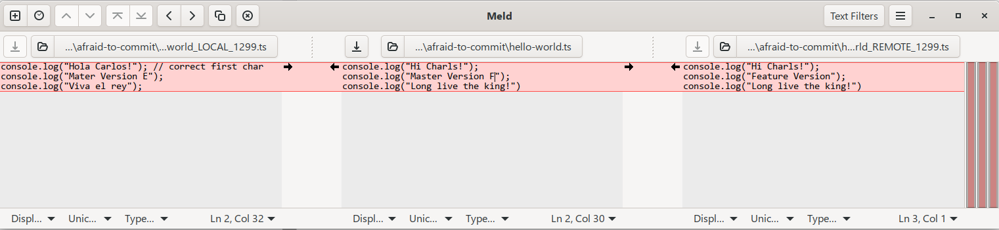

Or combine both sides and adjust:
```typescript
console.log("Hi Charls!");
nsole.log("Master Version F");
console.log("Long live the king!")
```

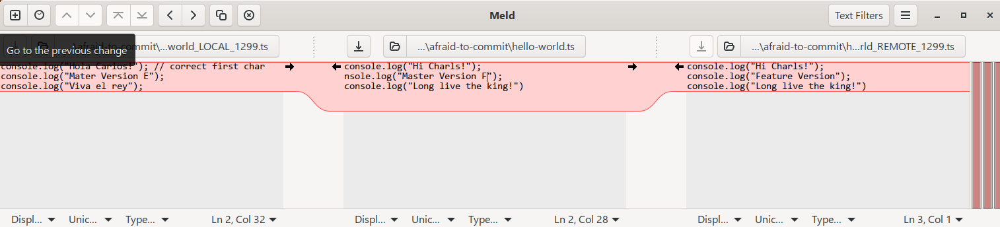

Save the target file.

Line 1 and 3 are from the right. While line 2 is from the left.

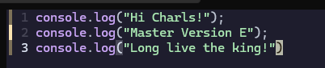

Close Meld.

***

# 7. Complete Merge

Check status after conflict resolution:
```bash
git status
```

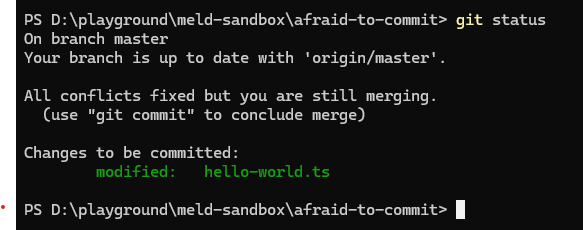

Add this point, you can still abort the merge::

```text
git merge --abort
```

Stage resolved file:
```bash
git add hello-world.ts
```

Finish merge:
```bash
git commit -m "F"
```

Git creates a merge commit (Version F).

Graph:
```text
A---B---E---M
     \       \
      C-------D
```
M = Merge commit


***

# 8. Rebase Conflict Tutorial

Imagine:

```text
main
 |
 A---B---C

feature
 |
 A---B---D---E
```

Update feature:

```bash
git checkout feature
git rebase main
```

Git tries:

```text
Replay D onto C
Replay E onto C
```

Conflict appears:

```text
CONFLICT
```

***

# 9. What Happens During Rebase

Git stops:

```text
Applying: Feature change
```

Status:

```bash
git status
```

Output:

```text
You are currently rebasing
```

***

# 10. Open Meld During Rebase

Launch:

```bash
git mergetool
```

Resolve visually.

Save.

Close Meld.

***

# 11. Continue Rebase

Stage:

```bash
git add app.ts
```

Continue:

```bash
git rebase --continue
```

Git proceeds to next commit.

If another conflict appears:

```text
Resolve
git add
git rebase --continue
```

Repeat.

***

# 12. Abort Rebase

If things get messy:

```bash
git rebase --abort
```

Everything returns to original state.

***

# 13. Skip Current Commit

Sometimes a commit is no longer needed:

```bash
git rebase --skip
```

Git ignores current commit and continues.

Use carefully.

***

# 14. Difference Between Merge and Rebase Conflict Resolution

## Merge

Command:

```bash
git merge feature
```

History:

```text
A---B---C
     \   \
      D---M
```

Preserves branch history.

***

## Rebase

Command:

```bash
git rebase main
```

History:

```text
A---B---C---D'---E'
```

Cleaner linear history.

Conflict resolution process is nearly identical:

```text
Resolve
git add
Continue
```

Only final command differs:

```bash
git commit
```

vs

```bash
git rebase --continue
```

***

# 15. Useful Status Commands

Show current conflict:

```bash
git status
```

Show conflicted files:

```bash
git diff --name-only --diff-filter=U
```

View graph:

```bash
git log --oneline --graph --all
```

***

# 16. Daily Workflow Example

## Updating Feature Branch

```bash
git checkout feature

git fetch origin

git rebase origin/main
```

Conflict?

```bash
git mergetool
git add .
git rebase --continue
```

Repeat until complete.

Push:

```bash
git push --force-with-lease
```

Because rebase rewrites history.

***

# 17. PowerShell Cheat Sheet

```powershell
git status

git mergetool

git add .

git commit

git rebase --continue

git rebase --abort

git rebase --skip

git log --oneline --graph --all
```

***

# Recommended Learning Path

1. Learn normal merges first.

2. Practice resolving conflicts in Meld.

3. Learn interactive rebase (`git rebase -i`).

4. Practice rebasing feature branches daily.

5. Use `git log --graph --all` after every operation to visualize what happened.

A good next step is a **Git + Meld Conflict Resolution Bootcamp** with hands-on exercises that intentionally create increasingly difficult merge and rebase conflicts and walk through resolving them step by step.
