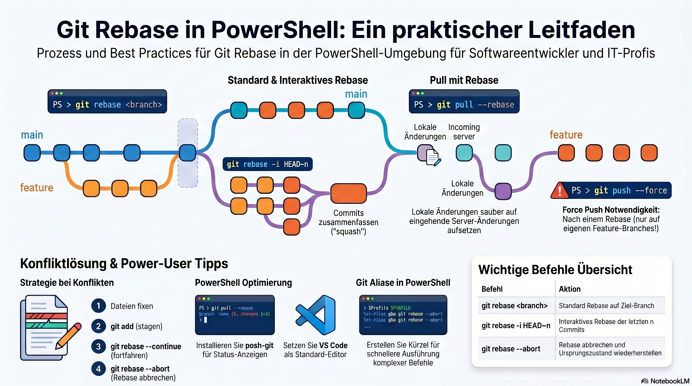

# How to Git rebase using PowerShell?

Using Git in PowerShell is virtually identical to using it in any other terminal (like Bash or CMD). Below is a guide on the most common ways to use `git rebase`.

### 1. Basic Rebase (Onto another branch)

This is used to move your current branch's work on top of the latest version of another branch (usually `main` or `master` or `dev`).

```powershell
# 1. Switch to your feature branch
git checkout feature-branch

# 2. Rebase onto main
git rebase main
# 2. Rebase onto dev
git rebase dev
```
Follow the white rabbit 🐇: [Standard Rebase](./Atoms/Git_standard_rebase.md)

### 2. Interactive Rebase (Clean up commits)

This is the most popular way to "squash" 🎾 multiple commits into one or rename commit messages before merging.

```powershell
# Rebase the last 3 commits
git rebase -i HEAD~3
```
When you run this, Git will open your default text editor (e.g., Notepad, VS Code, or Vim). You change the word `pick` to `squash` (or `s`) for the commits you want to combine.

Follow the white rabbit 🐇:

### 3. Pulling with Rebase

Instead of creating a "merge commit" every time you pull from the server, you can rebase your local changes on top of the incoming changes:

```powershell
git pull --rebase origin main
git pull --rebase origin dev
```
---

### 4. Handling Conflicts

If a conflict occurs during a rebase, PowerShell will show a message stating which files are broken.

1.  Open the files and fix the conflicts.
2.  Stage the fixed files:
    ```powershell
    git add <file-name>
    ```
3.  Continue the rebase:
    ```powershell
    git rebase --continue
    ```
    *(If you get stuck and want to give up, use `git rebase --abort`)*.

Follow the white rabbit 🐇: [Conflict Resolution](./Atoms/Git_rebase_conflict_resolution.md)

---

### 5. Pushing after a Rebase
Because `rebase` rewrites history, a standard `git push` will be rejected by the server. You must "force" it.

**Warning:** Only do this on your own feature branch. Never do this on a shared branch like `main`.

```powershell
# The "safer" way to force push
git push --force-with-lease
```

---

### PowerShell Tips for Git

#### 1. Use posh-git
If you use PowerShell regularly, install **posh-git**. It provides excellent tab-completion for branch names and shows your branch status (how many commits ahead/behind) directly in your prompt.

```powershell
# Install via PowerShell Gallery
Install-Module posh-git -Scope CurrentUser
Add-PoshGitToProfile
```

#### 2. Set your Default Editor
If `git rebase -i` opens an editor you don't like (like Vim), you can change it to VS Code:
```powershell
git config --global core.editor "code --wait"
```

#### 3. Common Shortcuts (Aliases)
You can add these to your PowerShell Profile (`$PROFILE`) to work faster:
```powershell
function g-rbm { git rebase main }
function g-rbd { git rebase dev }
function g-ri { git rebase -i "HEAD~$args" }
```
Then you could just type `g-ri 5` to start an interactive rebase of the last 5 commits.