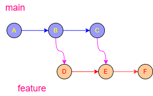
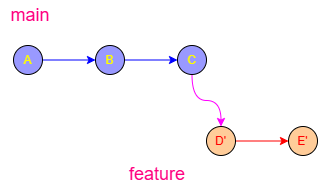

# What is a Git rebase?

At its simplest, **Rebase** is the process of moving or combining a sequence of commits to a new base commit.

In terms of workflow: **Rebase is the alternative to Merging.**

---

### 1. The Visual Difference: Merge vs. Rebase

Imagine you created a `feature` branch from `main`. While you were working, someone else added new commits to `main`. Now your branch is "out of date."

#### The Merge Approach

When you merge `main` into `feature`, Git creates a new **"Merge Commit."** 
*   **Result:** Your history looks like a series of loops. It preserves the exact chronological history of when things happened.
*   **Visual:**
    ```text
    A---B---C (main)
         \   \
          D---E---F (feature)
    ```



#### The Rebase Approach

When you rebase `feature` onto `main`, Git finds the point where the branches diverged, takes your commits (D and E), and **re-plays** them on top of the latest commit of `main` (C).
*   **Result:** A perfectly straight line. It looks like you started your work today, even if you started it last week.
*   **Visual:**
    ```text
    A---B---C (main)
             \
              D'---E' (feature)
    ```


---

### 2. Why use Rebase instead of Merge?

1.  **Clean History:** You avoid the "clutter" of hundreds of merge commits (e.g., *"Merge branch 'main' into feature-xyz"*). This makes using `git log` much easier to read.
2.  **Ease of Debugging:** If a bug is introduced, a linear history makes it much easier to use `git bisect` to find exactly which commit broke the code.
3.  **Project Housekeeping:** Using **Interactive Rebase** (`git rebase -i`), you can "squash" five small, messy commits (like *"fixed typo"*, *"forgot file"*) into one clean, professional-looking commit before sharing your work with the team.

---

### 3. How it works internally

When you run `git rebase main`:
1.  Git goes to the common ancestor of both branches.
2.  It temporarily "hides" your commits from the current branch.
3.  It resets your current branch to look exactly like the `main` branch.
4.  It applies your "hidden" commits one by one on top of the new base.

---

### 4. The "Golden Rule" of Rebasing

There is one major risk with rebasing: **It rewrites history.** Because Git creates *new* commits (with new ID hashes) during a rebase, you should follow this rule:

>[!IMPORTANT]
> **Never rebase branches that have been pushed to a public/shared repository.**

If you rebase a branch that other people are working on, you will break their local versions of the project because the commit IDs they have no longer match yours. 

**Use Rebase for:** Your local feature branches before you merge them into the main project.
**Use Merge for:** Public branches or when you want a permanent record of how/when branches were combined.

---

### Summary
*   **Merge** is "Safe" and additive. It says: *"Join these two histories together."*
*   **Rebase** is "Clean" and transformative. It says: *"Move my work so it looks like it was built on top of the latest version of the project."*