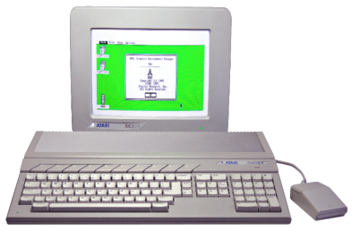
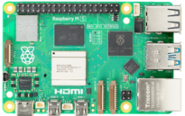
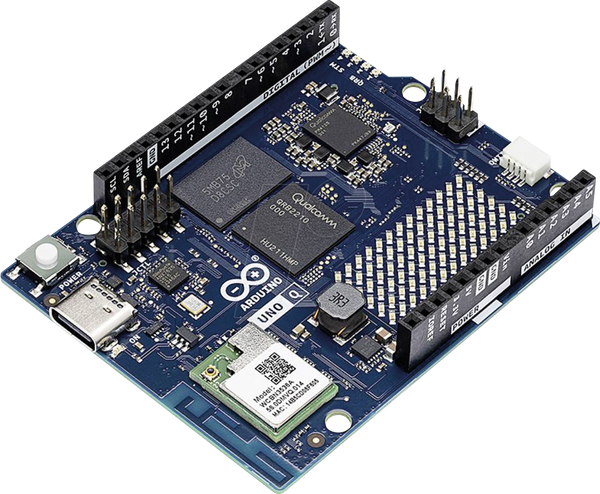
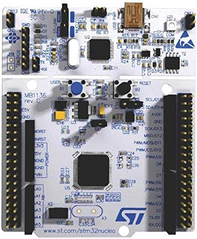
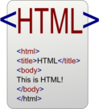

#  Metaprojekt Zettelkasten 🗂️ 

The Information you find here comprise: ["The story of my life".](https://youtu.be/W-TE_Ys4iwM?list=RDW-TE_Ys4iwM)

This landing page is flooded with tons of links, so feel free to follow the white rabbit into this fascinating wonderland of coding. 🐇

### The Zettelkasten Method.

In the picture above you can see the original [Zettelkasten](https://zettelkasten.de/overview/) invented by [Niklas Luhmann](https://de.wikipedia.org/wiki/Niklas_Luhmann).

The Zettelkasten-Method is a notetaking system of five types of notes:

1. Fleeting notes: "Collect Information"
2. Literature notes: "Where does the information come from?"
3. Permanent notes: "Keep Valuable Information"
4. Index notes: "Create a Zettel in your Zettelkasten with a Number."
5. Keyword notes: "How to find the information again?"

The Note-taking Process:

### My personal history

In my life the computer experience started with Comodore 64 and Atari 1024:

1. Comodore 64 

2. Atari 1024 

However, Times have changed, nowadays the [Raspberry PI](https://www.raspberrypi.com/), [Arduino](https://www.arduino.cc/), [ESP32](https://www.espressif.com/en/products/socs/esp32), and [STM32](https://www.st.com) connect to this good old time.

1. Raspbery 
2. Arduino  
3. ESP32 
4. STM32 

### Using Markdown

1. Mardown Guide
2. Github Alerts

### 🪖 Project Overview

The Metaproject [**Zettelkasten**](C:\Learning\WebDev\Bootcamp\Zettelkasten\Tools\Zettelkasten.md) collects all the information dicovered for learning [**React**](https://react.dev/) and [**Angular**](https://angular.dev/). 

The Project [**React Bootcamp**](./React/What.is-the-react-boot-camp.md) collects and documents the information for the [React](https://react.dev/) ecosystem.

The Project [**Angular Bootcamp**](./Angular/AngularBootCamp.md) collects and documents the information for the [Angular](https://angular.dev/) framework. 

## 🏕️ Teilprojekt React Bootcamp

To follow along with the boot camp it is enough to download the zip archive of the Zettelkasten and the React boot camp archive.
However, to dive deeper, feel free to create your own Zettelkasten and React boot camp repository on GitHub.
To interact with [GitHub](https://github.com/) or GitLab you need to exchange your SSH key.

### 🔑 SSH-Key Configuration using GitBash for GitHub

To push code to [GitHub](https://github.com/) **securely**, you typically create an **SSH key** and add it to your [GitHub](https://github.com/) account. This avoids typing your username/password every time.

Here’s the clean, modern way to do it: [SSH-Key generation and configuration](./Tools/SSH-Key-configuration)

### Zettelkasten 📝

Zettekasten is a method and system for learning and collecting information: [Zettelkasten](./Tools/Zettelkasten.md)

### Tools 🛠️

1. [Zettlr](https://www.zettlr.com/)
2. [Gimp](https://www.gimp.org/)
3. [ImageMagick](https://imagemagick.org/#gsc.tab=0)
4. [Git](https://git-scm.com/)
5. [GitBash](https://git-scm.com/install/windows)
6. [PowerShell](https://github.com/powershell/powershell), [Releases](https://github.com/powershell/powershell/releases). PowerShell is maintained on [GitHub](https://github.com/).
7. [Neovim](https://neovim.io/)
8. [LvChad](https://nvchad.com/)
9. [Visual Studio Code](https://code.visualstudio.com/)
10. [Eclipse](https://eclipseide.org/)
   
### Useful Links 🔗

1. In case you need a rabbit: [Open Clip Art](https://openclipart.org/#google_vignette)
2. Fetch some data in csv format:  [World Religon Data](https://correlatesofwar.org/data-sets/world-religion-data/)

### Let's take a coffee break ☕

Coffee breaks are extreamly important when it comes to learning.

Why not watching a [YouTube](https://www.youtube.com/) video from Nana, she perfectly understands the coding terminology and jargon.
[JS Crash Course](https://youtu.be/FtaQSdrl7YA)

### Welcome to the Workshop Workout ⛹

1. Aufstehen und [Hände](https://youtu.be/2G6pHQJEbWQ) ausschütteln.
2. Schulter kreisen lassen.
3. Arme kreisen lassen.
4. Arme pendeln lassen.
5. Arme pendeln lassen und Oberkörper dreht sich nach den Seiten
6. Walk in Place
7. High knees
8. Calf Raises, ein Bein hinter das ander geschlungen und mit dem anderen auf die Zehnspitzen.
9. Standing diagonal leg raises
10. [Squat](https://www.youtube.com/shorts/MoyeW6_eYok?feature=share) Kniebeugen.
11. [Reverse Lunges](https://www.youtube.com/watch?v=xrPteyQLGAo) von der Tischkante aus.
12. [Streaching](https://www.youtube.com/shorts/rlMwCYa02d4?feature=share) Arme strecken, eine Hand streckt sich, die ander greift ums Handgelenk

### PowerShell  ⚡

1. [Let's jump right into it](./PowerShell/Learning_the_PowerShell.md)
2. [How to learn PowerShell? Part 1](./PowerShell/HowToLearnPowerShell.md)
3. [How to learn PowerShell? Part 2](./PowerShell/How_to_learn_power_shell.md)
4. [How to query the Star Wars API using the PowerShell?](./PowerShell/PowerShell_query_the_star_wars_api.md)

### HTTP 🌐 and Node.js 📡

1. [Star Wars API](https://swapi.dev/)
2. [Curl](https://youtu.be/IEV1yXgbJbY) on [YouTube](https://www.youtube.com/)
3. [Curl for Windows](https://curl.se/windows/) Follow the white rabbit it's a zip archive 🐇
4. [Curl Tutorial](https://curl.se/docs/tutorial.html)
5. [Everyting Curl](https://everything.curl.dev/)
6. [swapi](https://swapi.info/)
7. [Downloading Node.js](https://nodejs.org/en/download) Follow the white rabbit it's a zip archive 🐇
8. [Node.js](https://nodejs.org/en)
9. [Let's jump right into it](./Node.js/Learning_Node.js.md)
10. [Learning Node.js](https://nodejs.org/learn/)
11. [Let's get our hands dirty](https://www.freecodecamp.org/news/get-started-with-nodejs/)

### 🟧 HTML

1. [MDN HTML](https://developer.mozilla.org/en-US/docs/Web/HTML)
2. [HTML Template](https://www.freecodecamp.org/news/html-starter-template-a-basic-html5-boilerplate-for-index-html/)
3. [Ultimate Colors - Free Icons](https://www.streamlinehq.com/icons/ultimate-colos-free)
4. [Material Icons](https://mui.com/material-ui/material-icons/)

### 🟦 CSS

### 🟦 Tailwind

1. If you feel playful and for some prototyping you can use [Play Tailwind](https://play.tailwindcss.com/nI1CW63Nu2)
2. 

### 🟨 JavaScript 🤠

1. [Let's jump in.](./JavaScript/Java_Script_Esentials.md)
2. [Deno](https://deno.com/)
3. [Deno Docs](https://docs.deno.com/runtime/)
4. [Oak](https://oakserver.org/)
5. [The Modern JavaScript Tutorial](https://javascript.info/)
6. Regular Expressions

### Vanilla JavaScript

1. [Let's jump right into it](./Vanilla-JavaScript/Learning-Vanilla-JavaScript.md)

### TypeScript 👷

1. The Typescript landing page: [TypeScript](https://www.typescriptlang.org/)
2. If you feel playful again, just [play TypeScript ](https://www.typescriptlang.org/play)

### React

### React Hooks

### React Router

### Material-UI 

1. The comunity [material.co](https://materialui.co)
2. Browse icons: [brows icons](https://fonts.google.com/icons)
3. Download: [Downlod a zip archive](https://github.com/google/material-design-icons/releases)

### Next.js

1. [Next.js React Framework Course](https://youtu.be/KjY94sAKLlw)
2. 

## Teilprojekt Angular Bootcamp

1. [Angular Hub](./Angular/Learning_Angular_Hub.md)
2. [Angular Home](https://angular.dev/)

## Teilproject Spring Boot Bootcamp
### PostgresML

### MongoDB

### GraphQL
