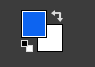
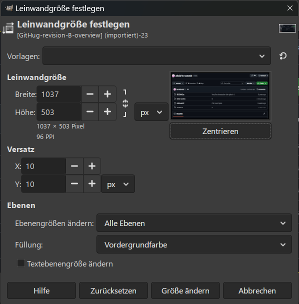

# How to add a light blue frame 🖼️ around an image?

To add a light blue frame around a PNG image in GIMP, 
you need to _expand the canvas, add a new layer, and fill it with color_.

## Canvas Expansion Method

You do not need to duplicate layers for this. GIMP can do it automatically.

1. Open your screenshot in GIMP.

2. 🎨 Add a background color: Click your Foreground Color box (the top colored square on your toolbar), choose your blue color, and click OK.

1. Open Canvas Size: Go to the top menu and select Image ➡️  Canvas Size...
        Bild ➡️ Leinwandgröße
2. Add 10 pixels: In the width and height boxes, add 20 to the current numbers (5 pixels for the left/right, 5 pixels for the top/bottom).

   * _Example: If it says 1000, change it to 1020_.

       

3. ⚠️ Center the image: Click the Center button right below the dimensions.

4. Set the background: Look at the bottom of that window for Resize layers. Change it to All layers.

5. 🖌️Fill with blue: Change the Fill with dropdown menu to Foreground color (your blue).

6. Apply: Click the Resize button.

The screenshot will now have a perfect 5-pixel blue frame around it.

