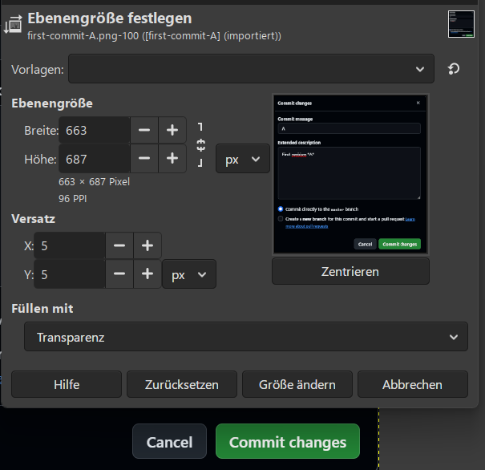
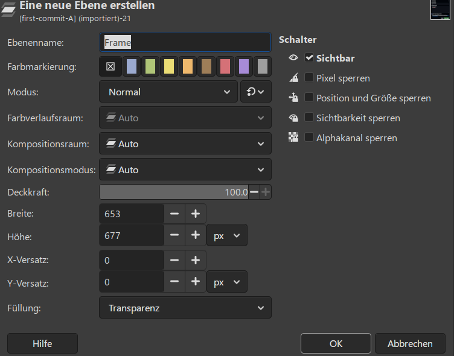
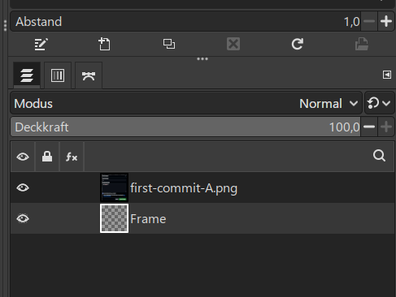

# How to add a light blue frame 🖼️ around an image?

To add a light blue frame around a PNG image in GIMP, 
you need to _expand the canvas, add a new layer, and fill it with color_.

## 1. Open and Prepare Your Image 📷

* Open your PNG file in GIMP.
* Go to Layer ➡️ Layer to Image Size.
    * Ebene ➡️ Ebenen auf Bildgröße

## 2. Expand the Canvas 🎨

* Go to Image ➡️ Canvas Size.
    * Ebene ➡️ Ebenengröße ...
* Increase the Width and Height by your desired border thickness (e.g., add 10 pixels to each).
* Click the Center button «Zentrieren» to automatically position your image in the middle.
* Click Resize
    * Schaltfläche: Größe ändern

    

## 3. Create the Frame Layer

* Go to Layer  ➡️ New Layer.
* Name it "Frame" and select Transparency for the fill type.
* Click OK.
* Drag this new layer _below_ your original image layer in the Layers panel. 

## 4. Color the Frame Light Blue 🖌️

* Click on your Foreground Color square (the top color box in the toolbox).
* Choose a light blue color and click OK.
* Click on the Bucket Fill Tool (or press `Shift + B`).
* Ensure "Fill whole selection" is checked in the tool options.
* Click anywhere on the transparent canvas background outside your image.

## 5. Export Your Final Image 🚚

* Go to File ➡️ Export As.
* Name your file and keep the `.png` extension to preserve any remaining transparency.
* Click Export.

If you want to customize this further, tell me:

* Do you want the frame to have rounded corners?
* Do you need a multi-colored or gradient border?
* Should the frame overlap the image edges or sit entirely outside it?

I can provide the exact adjustments for any style you prefer.
