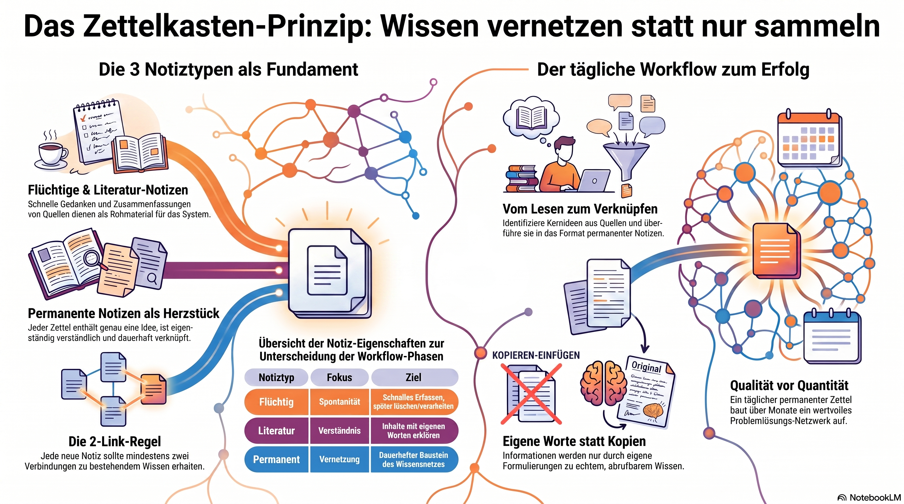

# Zettelkasten-Tutorial – Wissen aufbauen statt nur Notizen sammeln

Das **Zettelkasten-System** wurde von dem deutschen Soziologen Niklas Luhmann entwickelt. Mit dieser Methode kannst Du Wissen langfristig organisieren, Zusammenhänge erkennen und neue Ideen entwickeln.

## 1. Was ist ein Zettelkasten?

Ein Zettelkasten besteht aus vielen kleinen, miteinander verknüpften Notizen ("Zettel").

Jeder Zettel enthält:

* **genau eine Idee oder einen Gedanken**

* eine **eindeutige Kennung**

* **Verweise auf andere Zettel**

* eigene Formulierungen statt bloßer Kopien

Der Schwerpunkt liegt nicht auf dem Sammeln von Informationen, sondern auf dem **Verknüpfen von Wissen**.

***

## 2. Die drei wichtigsten Notiztypen

### A. Flüchtige Notizen (Fleeting Notes)

Kurze Gedanken, die spontan entstehen.

Beispiele:

```text
- Angular Signals könnten RxJS in manchen Fällen ersetzen.
- Interessant: Git Rebase erzeugt lineare Historie.
- Idee für Blogartikel über Deno Deploy.
```

Eigenschaften:

* schnell erfassen

* unstrukturiert

* später verarbeiten oder löschen

***

### B. Literatur-Notizen (Literature Notes)

Notizen beim Lesen eines Buches, Artikels oder Tutorials.

Beispiel:

```text
Quelle:
"Learning Git", Kapitel 5

Kernaussage:
Ein Rebase verschiebt Commits auf eine neue Basis.

Eigene Zusammenfassung:
Rebase schreibt die Historie um.
```

Wichtig:

Nicht ganze Textabschnitte kopieren.

Stattdessen:

> "Wie würde ich das einem Kollegen erklären?"

***

### C. Permanente Notizen (Permanent Notes)

Das Herzstück des Zettelkastens.

Jede permanente Notiz:

* enthält genau eine Idee

* ist in eigenen Worten geschrieben

* kann allein verstanden werden

* verweist auf andere Notizen

Beispiel:

```text
ID: 202606251030

Titel:
Git Rebase erzeugt eine lineare Historie

Inhalt:
Git Rebase verschiebt Commits auf einen neuen
Ausgangspunkt. Dadurch entsteht eine lineare
Commit-Historie ohne Merge-Commits.

Verknüpfungen:
→ 202606251100 Merge vs Rebase
→ 202606251120 Konfliktauflösung
```

***

## 3. Grundprinzipien

### Prinzip 1: Eine Idee pro Zettel

❌ Schlecht:

```text
Git, Angular, CSS und Deno
```

✅ Gut:

```text
Eine Notiz über Git Rebase
Eine Notiz über Angular Signals
Eine Notiz über CSS Grid
```

***

### Prinzip 2: In eigenen Worten schreiben

Nicht:

```text
"Signals are reactive primitives..."
```

Sondern:

```text
Angular Signals speichern Werte und informieren
automatisch alle abhängigen Komponenten über Änderungen.
```

***

### Prinzip 3: Viele Verbindungen erstellen

Ein Zettel ohne Links ist nur eine isolierte Notiz.

Beispiel:

```text
Git Rebase
    ↕
Merge Strategien
    ↕
Konfliktlösung
    ↕
CI/CD Workflows
```

Je mehr Verbindungen entstehen, desto wertvoller wird der Kasten.

***

## 4. Beispiel eines kleinen Zettelkastens

```text
202606251000 Git Merge

Git Merge verbindet zwei Entwicklungszweige
durch einen Merge-Commit.

Links:
→ 202606251010 Rebase
```

```text
202606251010 Git Rebase

Rebase verschiebt Commits und erzeugt
eine lineare Historie.

Links:
→ 202606251000 Merge
→ 202606251020 Konflikte
```

```text
202606251020 Konfliktlösung

Konflikte entstehen, wenn dieselben Dateien
parallel verändert wurden.

Links:
→ 202606251000 Merge
→ 202606251010 Rebase
```

***

## 5. Arbeitsablauf (Workflow)

### Täglich

### Schritt 1

Etwas lesen:

* Buch

* Artikel

* Tutorial

* Dokumentation

↓

### Schritt 2

Literatur-Notizen erstellen.

↓

### Schritt 3

Die wichtigsten Ideen identifizieren.

↓

### Schritt 4

Für jede Idee eine permanente Notiz anlegen.

↓

### Schritt 5

Verbindungen zu vorhandenen Notizen erstellen.

***

## 6. Digitale Werkzeuge

Beliebte Programme:

* [Obsidian](https://obsidian.md/?utm_source=chatgpt.com)

* [Logseq](https://logseq.com/?utm_source=chatgpt.com)

* [Zettlr](https://www.zettlr.com/?utm_source=chatgpt.com)

* [Joplin](https://joplinapp.org/?utm_source=chatgpt.com)

Für Einsteiger ist **Obsidian** besonders beliebt, da Links zwischen Notizen sehr einfach erstellt werden können.

***

## 7. Beispiel für Softwareentwicklung

Wenn Du gerade Themen wie **Angular**, **TypeScript**, **Git** und **Deno** lernst, könntest Du Notizen wie diese anlegen:

```text
TypeScript
├── Klassen
├── Interfaces
├── Generics
├── Decorators

Angular
├── Komponenten
├── Dependency Injection
├── Signals
└── RxJS

Git
├── Branches
├── Merge
├── Rebase
└── Konflikte

Deno
├── Berechtigungen
├── Module
├── Testing
└── Deploy
```

Viele Querverbindungen sind möglich:

```text
Angular Dependency Injection
    ↔ TypeScript Decorators

Angular Signals
    ↔ RxJS Observables

Deno Testing
    ↔ CI/CD Pipelines
```

***

## 8. Einfache Regeln für den Anfang

1. Schreibe täglich mindestens einen permanenten Zettel.

2. Verwende eigene Worte.

3. Eine Idee pro Zettel.

4. Erstelle mindestens zwei Links pro Notiz.

5. Überarbeite und erweitere ältere Notizen regelmäßig.

6. Qualität ist wichtiger als Quantität.

Ein Zettelkasten wird mit der Zeit immer wertvoller. Nach einigen Monaten entsteht ein persönliches Wissensnetzwerk, das Dich beim Lernen, Schreiben und Problemlösen unterstützt.
