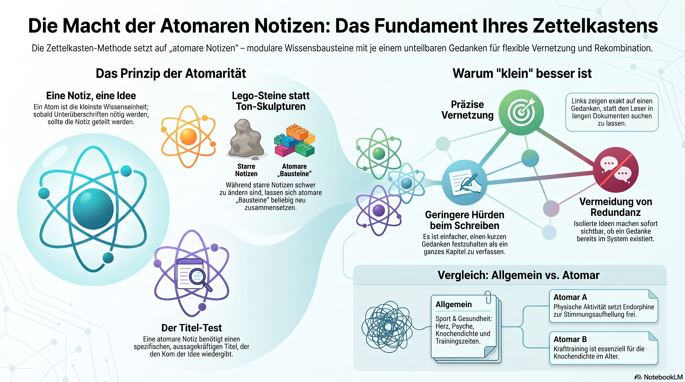

In the Zettelkasten method, **Atomic Notes** refers to the principle that a single note should contain **one idea and one idea only.** 

The term comes from the Greek word *atomos*, meaning "indivisible." In your Zettelkasten, an atomic note is the smallest building block of your knowledge.

Here is a breakdown of why atomicity is the "secret sauce" of a successful Zettelkasten.

---

### 1. The Core Concept: "One Note, One Idea"
An atomic note is not defined by its length, but by its **topic**. 
*   It might be a single sentence or three paragraphs. 
*   However, if you find yourself using a sub-heading to switch to a new topic, you are likely no longer being atomic. You should split that note into two.

### 2. Why be "Atomic"? (The Benefits)
The reason we don't just write long "meganotes" or "summary documents" is for **connectivity**.

*   **Precision Linking:** If a note contains five different ideas, and you link to it from another note, your "future self" won't know which of the five ideas you were referencing. If a note is atomic, the link is 100% specific.
*   **Recombination:** Atomic notes are like Lego bricks. Because they are small and discrete, you can snap them together in different ways to create different "buildings" (essays, projects, or books). 
*   **Lower Friction:** It is much easier to write one clear thought than it is to write a comprehensive chapter. It allows your knowledge base to grow incrementally.
*   **Avoiding Overlap:** When ideas are separated into atoms, it’s easier to see if you’ve already recorded a thought, preventing your system from becoming cluttered with repetitive information.

### 3. Comparison: General Note vs. Atomic Note

**The "General" Note (Too Broad):**
> **Title:** Exercise and Health
> **Content:** Exercise is good for the heart. It also helps with mental health by releasing endorphins. You should aim for 150 minutes a week. Weightlifting is also important for bone density.

**The "Atomic" Notes (Better):**
*   **Note 1:** Cardiovascular exercise strengthens the heart muscle.
*   **Note 2:** Physical activity triggers endorphin release to improve mood.
*   **Note 3:** Resistance training is essential for maintaining bone density as we age.

*Now, you can link Note 2 to a note about "Depression" and Note 3 to a note about "Longevity" without dragging the unrelated "heart" info along with it.*

### 4. How to Tell if a Note is Atomic
Ask yourself these three questions:
1.  **Can I give this note a specific, declarative title?** (If the title is "General Thoughts on Biology," it’s not atomic. If the title is "Mitochondria are the powerhouses of the cell," it is.)
2.  **Does this note make sense if read entirely on its own?**
3.  **If I link to this note, will I know exactly what idea I'm pointing at?**

### 5. The "Lego" Analogy
Think of a traditional notebook like a **clay sculpture**. You can add to it, but once it dries, it's one solid mass. If you want to use a piece of it for a different project, you have to break the whole thing.

An atomic Zettelkasten is like a **box of Legos**. Each note is a single brick. Today, those bricks might form a "castle" (a research paper on History). Tomorrow, you can take those same bricks and use them to build a "spaceship" (a blog post on Philosophy). 

**Atomicity is what makes your notes "reusable."**