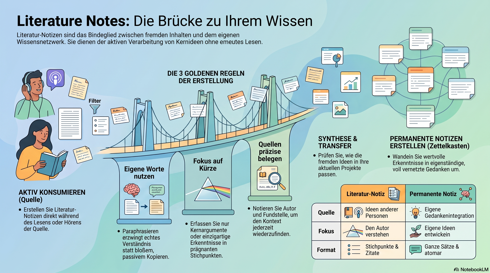

In the Zettelkasten method, **Literature Notes** are the notes you take while consuming content—reading a book, listening to a podcast, or watching a documentary. 

If Fleeting Notes are for your *own* random thoughts, Literature Notes are for **other people's ideas.**

---

### 1. The Main Purpose
The goal of a Literature Note is to capture the essence of what an author is saying so you don't have to read the entire book or article again. It acts as a bridge between the source material and your own personal knowledge base.

### 2. The Three "Golden Rules"
To be effective, Literature Notes must follow these three principles:
1.  **Use Your Own Words:** Never just copy and paste. Paraphrasing forces you to understand the material. If you can’t write it in your own words, you haven't understood it yet.
2.  **Be Brief:** Don't rewrite the book. Capture the core argument, a specific data point, or a unique insight.
3.  **Cite the Source:** Always include the bibliographic information (Author, Title, Page Number, or URL). This is vital for academic integrity and for finding the context later.

### 3. What do they look like?
Literature notes are usually kept together in one place for each source. For example, if you are reading a book, you might have one page of "Literature Notes" for that entire book.
*   They are more organized than fleeting notes but less formal than permanent notes.
*   They are often written as bullet points.
*   They focus on **what the author is saying**, not necessarily what you think about it (that comes later).

### 4. Avoiding the "Collector’s Fallacy"
Many people fall into the trap of highlighting everything or saving dozens of bookmarks. This feels like learning, but it isn't. 
*   **Highlighting is passive.** 
*   **Literature Note-taking is active.** 
By writing Literature Notes, you are "filtering" the information through your own brain, which is the first step toward true retention.

### 5. The Workflow: From Literature to Permanent
In the Zettelkasten workflow, Literature Notes are a **temporary middle step**.
1.  **Read/Listen:** Take Literature Notes as you go.
2.  **Review:** Later, look at those notes.
3.  **Synthesize:** Ask yourself: *"How does this idea fit into my current projects or interests?"*
4.  **Create:** Turn the most valuable Literature Notes into **Permanent Notes** (one idea per note, fully integrated into your system).

### Summary Comparison
| Feature | Fleeting Note | Literature Note | Permanent Note |
| :--- | :--- | :--- | :--- |
| **Source** | Your brain (random) | Someone else's work | Your brain (integrated) |
| **Focus** | Capturing a spark | Understanding the author | Developing an idea |
| **Format** | Scraps/Quick apps | Bullet points + Citations | Full sentences/Atomic |
| **Context** | Often lost quickly | Tied to the source | Tied to other notes |

**Pro Tip:** Think of Literature Notes as a "Translation." You are translating the author's complex language into your own "mental dialect" so your future self can understand it instantly.