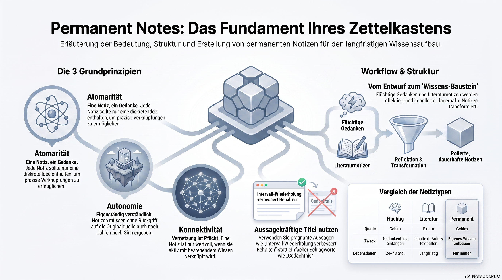

**Permanent Notes** are the most important part of the Zettelkasten. They are the final, "polished" building blocks of your knowledge base. 

While Fleeting Notes are reminders and Literature Notes are summaries of others' work, **Permanent Notes are your own ideas, fully developed and ready to last a lifetime.**

Here is the breakdown of what makes a note "Permanent."

---

### 1. The Core Principles
To be a true Permanent Note, it must follow these four rules:

*   **Atomicity (The "One Note, One Idea" Rule):** A permanent note should contain only one discrete idea. This makes it easier to link ideas together later. If a note covers three different topics, it becomes difficult to connect it accurately to other thoughts.
*   **Autonomy (Self-Sufficiency):** The note must be understandable on its own. You should not have to go back to the original book or your literature notes to understand what the note means.
*   **Written for your "Future Self":** Write in full, clear sentences. Avoid shorthand or cryptic abbreviations. Imagine you are reading this note 10 years from now and have forgotten the context—would it still make sense?
*   **Connectivity:** A Permanent Note is useless if it lives in a vacuum. It *must* be linked to other notes already in your system.

### 2. The Content: What goes inside?
A Permanent Note is not a summary of what you read; it is your **interpretation, critique, or extension** of an idea. It usually answers questions like:
*   How does this idea relate to what I already know?
*   What does this idea mean for my current project?
*   Does this idea contradict or support another note I have?

### 3. The Anatomy of a Permanent Note
While every system is different, a standard Permanent Note usually contains:
1.  **A Clear Title:** Often a "statement" (e.g., *"Spacing repetitions improves long-term retention"* rather than just *"Memory"*).
2.  **The Body:** Your idea explained in full sentences.
3.  **References:** A link back to the Literature Note or source it came from (so you can check the facts later).
4.  **Links:** Explicit links to other "Permanent Notes" (e.g., *"See also: The Forgetting Curve"*).

### 4. The Workflow: How they are born
Permanent notes are never written "from scratch." They are the result of a process:
1.  You have a **Fleeting Note** (a random thought) or a **Literature Note** (something you read).
2.  You think about that note and how it fits into your life/work.
3.  You write a **Permanent Note** that expresses that thought clearly.
4.  You **delete** the Fleeting Note and **file away** the Literature Note.

### 5. Why are they called "Permanent"?
They are called "Permanent" not because they can never be changed, but because **they are intended to stay in your system forever.** 
*   You don't throw them away.
*   You don't "archive" them.
*   You treat them as a growing "web" of thought that you will navigate for the rest of your life.

---

### The Final Comparison: The Complete Workflow

| Note Type | Source | Purpose | Lifespan |
| :--- | :--- | :--- | :--- |
| **Fleeting** | Your brain (quick) | Capture a spark before it's gone | 24–48 hours (Trash) |
| **Literature** | External (books/web) | Record what an author said | Long-term (Reference) |
| **Permanent** | Your brain (reflective) | **Build your own knowledge** | **Forever (The Slip-box)** |

**The Goal:** You aren't just "taking notes"; you are **building a partner for your thinking.** When you have 500+ Permanent Notes all linked together, you don't have to "start from a blank page" when writing a paper or starting a project—you simply look at your Permanent Notes and see what the "web" is telling you.