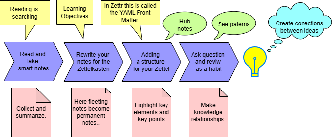

# Zettelkasten-Method

The Zettelkasten-Method is a notetaking system of five types of notes:

1. Fleeting notes: "Collect Information"
2. Literature notes: "Where does the information come from?"
3. Permanent notes: "Keep Valuable Information"
4. Index notes: "Create a Zettel in your Zettelkasten with a Number."
5. Keyword notes: "How to find the information again?"

The Note-taking Process:

### Zettelkasten Links 📝

Zettekasten is a method and system for learning and collecting information: [Zettelkasten](./Tools/Zettelkasten.md)

#### Useful YouTube Links for the Zettelkasten Method

1. Zettelkasten Method Explained: [A Beginner's Guide](https://youtu.be/GpV47rUYk8I)
2. How To Take Smart Notes: [Atomic Notes](https://youtu.be/5O46Rqh5zHE)
3. Why Zettelkasten Is the only [Note-Taking System](https://youtu.be/eFcdH93oFD8) You’ll Ever Need
4. Want is a Simplified Zettelkasten? [For Beginners](https://youtu.be/w15joVA4pIc)
5. How I created and use my analog Zettelkasten? [Step-by-step guide](https://youtu.be/xF6Rfhztz6o)
6. A revolutionary way to take notes: [Visual Notes and the Zettelkasten System](https://youtu.be/c9vPNSSQvHk)
7. 
